# RAG 系统完整讲义：从基础概念到生产优化

> **讲义说明**：本讲义由 JavaGuide（作者 Guide）的 6 篇 RAG 系列文章按逻辑整合而成，围绕"企业知识库问答系统"这一主题，覆盖 RAG 从原理认知、工程构建、存储选型、持续维护到进阶优化与评估的完整链路。正文文字、表格、代码、图表均按原文完整保留，图片引用自本目录 `images/` 文件夹，Mermaid 图表以源码形式嵌入（Obsidian / Typora 等可直接渲染）。
>
> 六章对应原文：RAG 基础概念、RAG 文档处理与切分、RAG 向量索引与数据库、RAG 知识库更新、GraphRAG、RAG 优化。

---

## 如何阅读本讲义

### 学习路径

建议按顺序阅读，也可以按角色跳读：

- **入门读者**：顺序通读第一部分 → 第六部分，建立 RAG 全貌。
- **工程落地者**：重点读第二、三、四部分（索引构建与运维），第六部分作为调优手册。
- **面试准备**：每部分末尾有该主题的面试题，附录 B 汇总了全部面试题。

### RAG 全链路地图

下面的图展示了六部分内容在 RAG 系统中的逻辑关系：

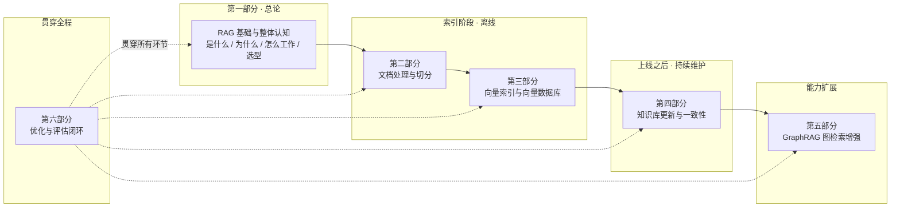
```mermaid
flowchart LR
    subgraph 认知层["第一部分 · 总论"]
        P1["RAG 基础与整体认知<br/>是什么 / 为什么 / 怎么工作 / 选型"]
    end
    subgraph 构建层["索引阶段 · 离线"]
        P2["第二部分<br/>文档处理与切分"]
        P3["第三部分<br/>向量索引与向量数据库"]
    end
    subgraph 运维层["上线之后 · 持续维护"]
        P4["第四部分<br/>知识库更新与一致性"]
    end
    subgraph 进阶层["能力扩展"]
        P5["第五部分<br/>GraphRAG 图检索增强"]
    end
    subgraph 方法论["贯穿全程"]
        P6["第六部分<br/>优化与评估闭环"]
    end

    P1 --> P2 --> P3 --> P4
    P4 --> P5
    P6 -. 贯穿所有环节 .-> P1
    P6 -.-> P2
    P6 -.-> P3
    P6 -.-> P4
    P6 -.-> P5
```

### 各章定位速查

| 章 | 内容 | 在 RAG 链路中的位置 | 解决的核心问题 |
|---|---|---|---|
| 第一部分 | RAG 基础概念 | 全局总论 | RAG 是什么？为什么用它？如何取舍？ |
| 第二部分 | 文档处理与切分 | 索引阶段 · 数据准备 | 文档如何变成可检索的 Chunk？ |
| 第三部分 | 向量索引与数据库 | 索引阶段 · 存储检索 | 海量向量如何低延迟检索？ |
| 第四部分 | 知识库更新 | 运维 · 数据保鲜 | 文档变了，索引如何跟上？ |
| 第五部分 | GraphRAG | 进阶扩展 | 多跳关系与全局归纳怎么做？ |
| 第六部分 | RAG 优化 | 方法论 · 兜底 | 答错了，怎么定位和修复？ |

### 配套资源

- 全部配图位于 `images/` 目录（共 27 张，随讲义按对应位置插入）。
- 各章末尾保留原文参考资料；附录 D 汇总全部原文链接，可对照溯源。

---

## 第一部分 RAG 基础与整体认知

> 本章整理自：[JavaGuide - RAG 基础概念：检索、生成与工程取舍](https://javaguide.cn/ai/rag/rag-basis.html)

### 导读

做企业知识库问答时，很多团队的第一反应都是：把文档全塞给大模型，让它自己读。

文档少的时候，这招确实能跑。一旦知识库涨到几十万字，问题很快就出来了：每次请求都可能撞 Token 上限，刚更新的内容模型也不一定知道。更现实一点，企业文档还要考虑权限、溯源、成本和延迟，不能靠"全塞进去"硬扛。

RAG 会在模型回答前从知识库中检索相关内容，再把这些内容交给模型，让回答尽量落在可核对的证据上。检索、上下文组织和生成任一环节出错，最终答案都可能偏离原文。

### 什么是 RAG？

**RAG（Retrieval-Augmented Generation，检索增强生成）** 就是把信息检索和大语言模型绑在一起用。系统先从知识库里检索出和当前问题相关的片段，知识库可以是数据库、文档集合，也可以是企业内部系统。然后把这些片段和原始问题一起喂给 LLM，让模型基于检索内容回答，而不是只靠训练时记住的知识。

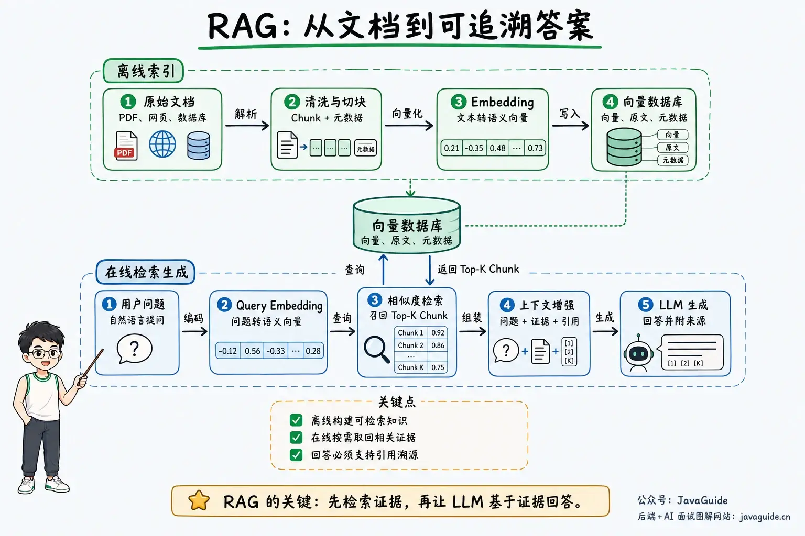

### 为什么需要 RAG？

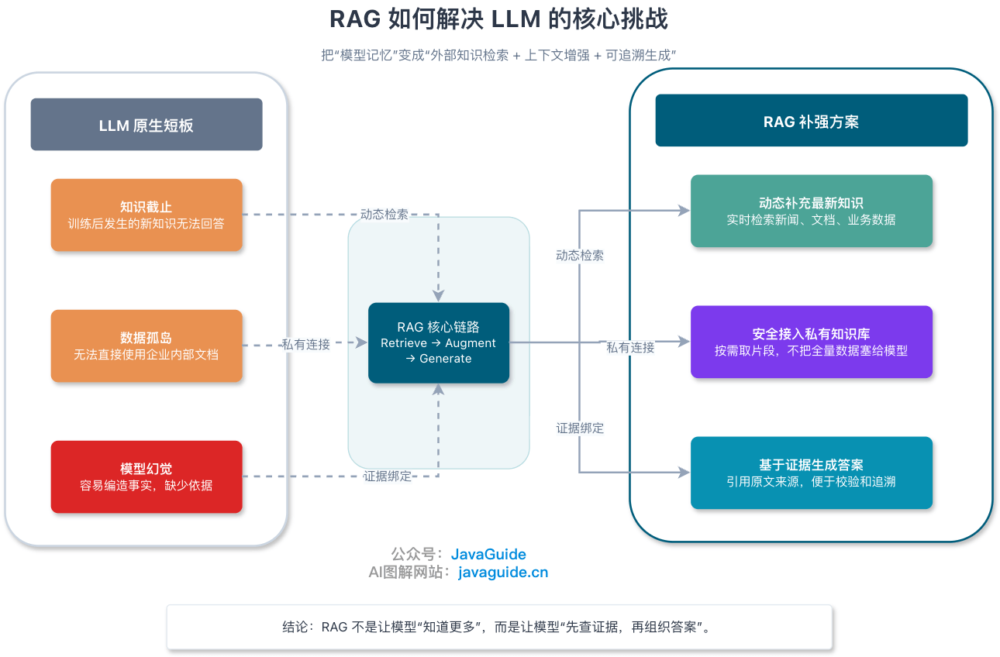

LLM 训练数据再大，也绕不开几个问题。RAG 正好可以在这些地方进行弥补。

**第一是知识时效性。**

预训练模型的知识会停在训练数据截止时间点。训练后发生的新事件、新政策、新产品文档，模型默认是不知道的，除非通过联网、工具调用或外部知识注入来补。RAG 的做法是动态检索外部知识源，把最新的相关内容直接送给 LLM，让它不用只依赖参数里的旧知识。

**第二是私有数据访问。**

企业内部的产品文档、知识库、客户数据，不可能让公开 LLM 随便访问。RAG 在用户提问时只提取和问题相关的片段给 LLM，不需要暴露全部数据，模型也能基于企业自己的知识回答。

**第三是幻觉问题。**

LLM 编造事实这件事大家都遇到过。RAG 通过提供明确参考文本，让模型尽量基于证据回答，确实能降低幻觉概率。但别指望它彻底消除幻觉。检索错误、上下文噪声、引用错配、模型不遵循指令，都可能导致错误答案。生产级 RAG 通常还要配引用校验、答案评估、拒答机制和人工反馈闭环。

### RAG 的常见用途有哪些？

RAG 最适合"答案依赖外部资料，并且资料会变化或很长"的场景。它先从知识库里检索相关内容，再让大模型基于检索结果生成回答，减少胡编，同时提高可追溯性。

常见场景包括这些：

- 客服机器人：基于产品知识库做问答、排障、流程引导，比如"如何退换货""某型号设备报错码怎么处理"。
- 研发 / 运维 Copilot：检索代码库、接口文档、告警手册，辅助定位问题和生成修复建议。
- 医疗助手：检索指南、药品说明、院内规范后生成辅助建议，但不做最终诊断，比如"某药禁忌是什么""依据指南解释检查指标含义"。
- 法律咨询：基于法规条文、案例、合同模板检索，生成条款解释和风险提示。
- 教育辅导：从教材、讲义、题库中检索知识点，生成讲解和例题步骤。
- 企业内部助手：连接制度、SOP、会议纪要、技术文档，做检索、总结、对比。
- 投研、合规、审计、销售方案支持：处理报告、披露、内控、产品手册、标书模板等资料。

### 为什么有些企业还是宁愿用传统搜索而不是 RAG？

不是所有问题都值得上 RAG。很多企业保留传统搜索，不是因为不知道 RAG 好用，而是用户需求本来就没到"生成答案"这一步。

如果用户只是想找一份制度原文、某个接口文档、一个合同模板，搜索框反而更直接。输入关键词，返回文档列表，用户自己点开确认，链路短、成本低、结果也更可控。RAG 则要先检索，再组织上下文，最后交给 LLM 生成答案。只要经过生成，就会多出延迟、Token 成本和总结偏差的风险。

所以选传统搜索还是 RAG，先看用户到底想要什么：是"帮我找到材料"，还是"帮我读完材料并给出结论"。

| 维度 | 传统搜索（搜索框） | RAG（检索 + 生成） |
|---|---|---|
| 用户目标 | 找到文档、页面、附件 | 直接得到可读答案、总结或对比结论 |
| 延迟与成本 | 通常较低，容易扩展 | 更高，需要检索和 LLM 推理 |
| 可控性 / 可审计 | 强，直接给原文链接 | 弱一些，可能误解或总结偏差，需要引用与评测 |
| 风险 | 低，主要是召回排序问题 | 更高，包括幻觉、引用错误、越权泄露 |
| 数据治理 | 相对成熟，ACL、字段过滤都好做 | 更复杂，需要检索过滤、上下文脱敏、日志治理 |
| 适用场景 | 编号、标题、关键词检索，找模板、找制度原文 | 客服解答、技术排障、制度解读、跨文档总结对比 |
| 最佳实践 | ES / BM25 + 权限过滤 | 混合检索 + 重排 + 引用溯源 + 权限过滤 + 评测闭环 |

实际落地时，很多企业会同时保留两套入口：**简单查找走搜索，复杂问答走 RAG**。这个组合通常比"所有问题都交给 RAG"更稳，也更省钱。

### RAG 工作原理了解吗？

RAG 的工程链路通常分两个阶段：离线索引和在线检索生成。索引阶段把原始文档处理成可检索的数据结构；在线阶段在用户提问时完成查询理解、检索召回、上下文构建和答案生成。

索引和检索阶段的简化流程图如下：

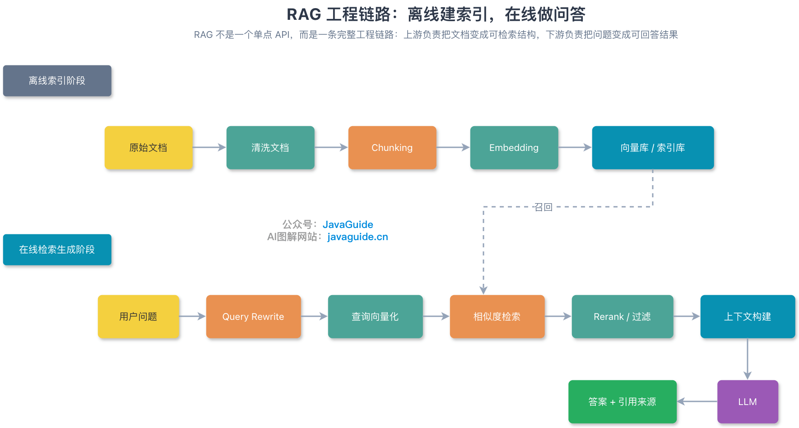

索引阶段主要做这些事：

1. 输入文档：文本文件、PDF、网页、数据库记录都可以，只要有内容。
2. 清理文档：去掉 HTML 标签、特殊字符等噪声。
3. 增强文档：补充元数据，比如时间戳、分类标签，为后续检索提供过滤维度。
4. 文档拆分（Chunking）：用文本分割器把文档切成较小片段。这一步要兼顾语义完整性、Embedding 模型输入长度、生成模型上下文窗口和召回粒度。Chunk 太大容易引入噪声，太小又可能丢上下文。拆分策略会直接影响召回质量，详细可以看本讲义第二部分（文档处理篇）。
5. 向量化表示（Embedding Generation）：通过嵌入模型将文本片段映射为语义向量，也就是高维稠密向量。常见嵌入模型包括 OpenAI 的 text-embedding-3-small / text-embedding-3-large，以及 Hugging Face 上的开源模型。
6. 存储到向量存储或索引系统：把嵌入向量、原始内容和对应元数据存入向量存储或向量索引系统，比如 Milvus、pgvector、Elasticsearch / OpenSearch 向量检索，或基于 Faiss 构建本地向量索引。向量数据库选型、索引算法和 pgvector 实践可以看本讲义第三部分（向量库篇）。

索引过程通常离线完成。比如团队每周跑一次定时任务，把新增和变更的文档重新索引一遍。如果是用户上传文档这类动态场景，索引也可以在线完成，直接集成到主应用里。

检索是在线进行的。用户提问之后，系统通常会走下面这些步骤：

1. 接收请求：拿到用户的自然语言查询。有些系统会先做查询改写或扩充，让后续检索更容易命中。
2. 查询向量化：用嵌入模型把查询也转成向量，这样才能和文档向量在同一个空间里比较。
3. 信息检索（R）：在向量库里做相似性搜索，把和查询向量最相关的文档片段捞出来。
4. 上下文增强（A）：把检索片段、原始问题、系统指令和引用要求组织成 Prompt，交给 LLM。
5. 输出生成（G）：LLM 输出自然语言回复，同时附上参考资料链接。
6. 结果反馈（可选）：用户不满意时可以反馈，系统再调整 Prompt 或检索策略。有些实现也支持多轮对话来逐步完善回答。

检索效果不稳定时，问题往往出在查询改写、召回策略、排序或上下文质量上。优化方向可以看本讲义第六部分（优化篇）。

### Embedding 是什么？

Embedding 就是把文本变成一串数字。更准确地说，它会把文本映射到一个高维稠密向量空间里，让语义接近的文本在向量空间中距离更近。

比如这三句话：

- "如何申请退款？"
- "退款流程是什么？"
- "订单怎么取消并退钱？"

它们字面不一样，但语义接近。好的 Embedding 模型会把它们映射到相近位置，向量检索才能把相关 Chunk 找出来。

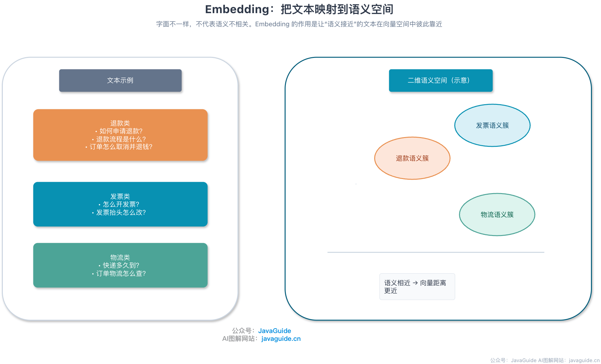

Embedding 维度常见的有 768、1024、1536、3072 等。维度是模型设计和训练方式的一部分，不能脱离模型直接得出"维度越高，语义效果越好"的结论；较高维度通常会增加存储、索引和相似度计算成本。以 OpenAI Embedding 为例，`text-embedding-3-small` 默认输出 1536 维，`text-embedding-3-large` 默认输出 3072 维，并支持通过 `dimensions` 参数降低输出维度。实际选型要在业务评测集上比较召回质量、延迟和存储开销。

常见 Embedding 模型可以分成两类：

| 类型 | 代表模型 | 适合场景 |
|---|---|---|
| 闭源 API | OpenAI `text-embedding-3-small` / `text-embedding-3-large`、Cohere Embed、Jina Embeddings API | 追求开箱即用、多语言效果、少运维 |
| 开源模型 | BGE 系列、GTE 系列、E5 系列、Jina Embeddings 开源模型 | 数据不能出内网、需要私有化部署、希望控制成本 |

选 Embedding 模型时，别只看榜单排名。MTEB（Massive Text Embedding Benchmark）可以作为参考，但最后还是要用自己的业务问题评测召回率、相关性和延迟。

Embedding 模型也不是"实时理解世界"的东西。它主要负责把文本映射到向量空间，能力重点是语义匹配。如果遇到非常新的术语、梗、产品名或领域缩写，仍然要通过业务语料评测确认召回效果。

### 向量相似度怎么计算？

文本变成向量之后，检索系统还要判断哪个向量和查询最接近。常见相似度或距离度量有三种。

| 度量方式 | 含义 | 特点 |
|---|---|---|
| 余弦相似度（Cosine Similarity） | 看两个向量方向是否一致 | 对向量长度不敏感，RAG 场景最常用 |
| 内积（Inner Product / Dot Product） | 看两个向量对应维度乘积之和 | 如果向量已经 L2 归一化，内积和余弦相似度在排序结果上通常等价 |
| 欧氏距离（L2 Distance） | 看两个点在空间中的绝对距离 | 对向量幅度更敏感，适合模型或索引明确按 L2 训练 / 优化的场景 |

面试里如果被问"为什么用余弦相似度"，可以这样答：RAG 关注的是语义方向是否接近，而不是向量长度本身；余弦相似度对长度不敏感，更适合文本语义检索。实际项目里还要和 Embedding 模型推荐的距离度量、向量库索引类型保持一致，否则可能导致索引无法命中或召回效果下降。

### RAG 与传统搜索引擎的区别是什么？

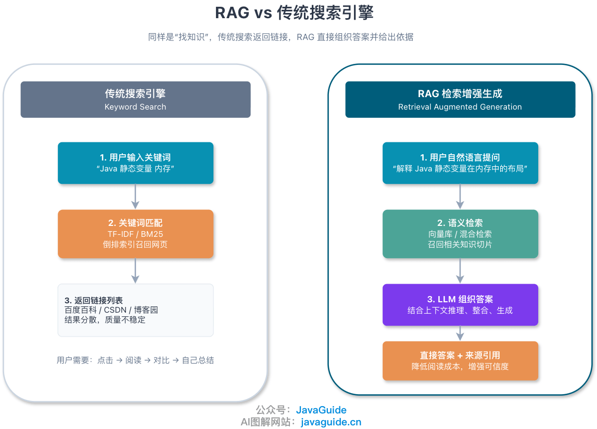

RAG 和传统搜索都在"找信息"，但拿到信息之后做的事不一样。

传统搜索拿到候选文档后，按相关性排好序，直接把结果列表给用户。每个结果彼此独立，用户自己点开、自己判断。它更像一个排序器。

RAG 会把检索到的多个知识片段一起放进 LLM 上下文，让模型做跨文档归纳和信息整合，最后生成一个直接能读的答案。它更像一个信息综合器。

几个差异比较关键：

1. 检索机制：传统搜索主要靠倒排索引和关键词匹配，BM25 是经典算法；现代搜索系统也会加语义召回和重排。RAG 的检索方式更灵活，向量检索、BM25、混合检索、图检索、数据库查询都可以用，关键是检索结果要进入 LLM 上下文参与答案生成。
2. 结果形态：搜索给文档列表，用户还要二次阅读；RAG 给答案，并尽量标出引用来源。
3. 数据范围：传统搜索擅长全网爬虫和大规模索引；RAG 更常用于企业内部知识库和垂直领域，让 LLM 低成本获得特定领域知识补充。
4. 成本和延迟：搜索响应快，成本可控；RAG 多了 LLM 推理，延迟和成本都会上去。

### RAG 和微调怎么选？

"为什么不直接微调？"是 RAG 面试里很高频的问题。

可以这样区分：RAG 解决的是模型不知道新知识或私有知识的问题，微调更适合解决模型不会按你的方式说话或做事的问题。

打个比方。你有一本很厚的员工手册，经常要查里面的规定。RAG 的思路是随查随用，把手册放在外面，每次回答前先翻一下。微调的思路是把手册背下来，让模型把这些知识内化进去。手册三天两头改版时，RAG 换个索引就行；微调要重新准备数据、训练和评测，成本完全不一样。

| 维度 | RAG | 微调（Fine-tuning） |
|---|---|---|
| 知识更新 | 更新知识库或向量索引即可 | 通常需要重新准备数据并训练 |
| 数据安全 | 知识保留在外部库，按需检索 | 训练样本中的模式和部分知识会固化到微调模型参数中，敏感数据进入训练流程前需要额外评估合规和数据治理要求 |
| 幻觉控制 | 可引用原文，便于溯源和校验 | 模型仍可能编造，且引用来源不天然可见 |
| 成本结构 | 检索成本 + 输入 Token 成本 + 向量库成本 | 数据标注、训练 GPU、评测和版本管理成本 |
| 适合场景 | 知识密集型问答、企业知识库、法规制度、产品文档、实时信息 | 风格适配、格式控制、领域术语对齐、固定任务行为优化 |
| 主要风险 | 检索不到、召回噪声、权限过滤复杂 | 数据过拟合、知识过期、训练和回滚成本高 |

二者也可以结合。先用微调让模型更懂领域术语、输出格式和任务边界，再用 RAG 提供实时知识和可追溯证据。这类组合在客服、法律、医疗、金融投研等场景里很常见。

面试时可以这样收尾：知识变动频繁、需要引用来源，优先 RAG；输出风格和任务行为不稳定，考虑微调；既要懂领域表达又要查实时知识，可以两者结合。

不过这里有个现实限制：两者结合意味着两套系统都要维护，成本不低。团队资源有限时，先把 RAG 做稳，再考虑是否引入微调，通常更务实。

### 长上下文窗口会取代 RAG 吗？

不会。

长上下文窗口确实让很多任务变简单了。比如把一整份报告丢进去，让模型从头读到尾，这类单文档深度分析很适合用长上下文。但它不等于可以把全部知识库都塞给模型。上下文越长，输入 Token 成本、首字延迟和推理噪声都会上升，效果未必更好。

长上下文适合的场景很明确：单篇长文档深度分析，一个代码仓库或一个项目目录的集中理解，长对话历史总结，或者一次性材料不多但需要完整阅读的任务。

知识库规模一大，长上下文就不够用了。企业知识库、客服工单、日志、合同库动辄百万到亿级文档片段，不可能每次都全塞进去。就算塞得进去，成本和延迟也扛不住。更麻烦的是，上下文里塞太多无关片段，模型反而更容易被噪声干扰，生成看起来完整但事实不稳的答案。"Lost in the Middle"问题说的就是这个，关键信息放在长上下文中间位置时更容易被忽略。

企业知识库还绕不开权限隔离。长上下文和 RAG 都不会自动完成鉴权，权限检查必须由应用层实施。常见做法是在检索前或检索时按租户、角色和文档 ACL 过滤，只把用户有权访问的内容放进模型上下文；即使采用长上下文，也可以先鉴权再装载材料。RAG 的优势在于它天然有一个检索入口，便于把权限过滤和召回放在同一条链路里。

还有一点经常被忽视：可追溯性。RAG 可以明确返回引用片段，审计时能溯源。长上下文把大量内容混在一起交给模型，用户很难判断回答到底基于哪段材料。

### RAG 有哪些演进阶段？

RAG 这两年一直在迭代，大致可以分成三个阶段。

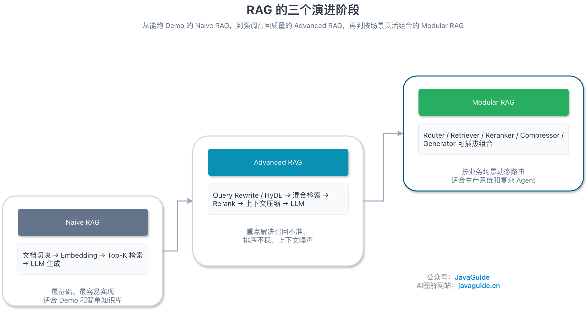

| 阶段 | 典型链路 | 特点 |
|---|---|---|
| Naive RAG | 文档切块 → Embedding → Top-K 检索 → LLM 生成 | 最基础、最容易实现，适合 Demo 和简单知识库 |
| Advanced RAG | Query Rewrite / HyDE → 混合检索 → Rerank → 上下文压缩 → LLM 生成 | 重点解决召回不准、上下文噪声和排序不稳 |
| Modular RAG | 检索器、重排器、压缩器、路由器、生成器等模块可插拔组合 | 按业务场景动态路由，适合生产系统和复杂 Agent |

Naive RAG 是起点，能跑通 Demo，但离生产通常还有距离。Advanced RAG 开始处理召回质量、噪声过滤和排序问题。Modular RAG 把各环节拆成可替换模块，更适合复杂场景。具体优化策略可以继续看本讲义第六部分。

### RAG 的核心优势和局限性是？

先说优势。

**RAG 最大的好处是知识更新成本低。** 微调要重新准备数据、训练模型、评测效果，RAG 通常只需要更新知识库和索引。新闻、法规、产品文档这类经常变化的数据，用 RAG 维护起来会轻很多。

**它也能减少幻觉，并且方便追溯来源。** RAG 让模型从"凭记忆回答"变成"基于检索证据回答"。每个回答都可以挂到具体文档片段上，这在金融合规、医疗辅助、法律检索这些对准确性要求高的场景里很重要。当然，这不代表 RAG 就不会出错，检索错了、引用错了，答案一样会翻车。

**数据隔离也更容易做。** 你可以在检索层实现多租户隔离和访问控制（ACL），确保用户只能看到自己权限范围内的数据。相比把敏感数据放进微调训练集，RAG 这套架构更适合做权限和合规治理。

**换领域的成本也低。** 不需要针对每个领域重新训练模型，把领域知识库建好、索引跑通，就能先用起来。

再看局限。RAG 不是银弹，坑也不少。

**检索质量决定上限。** GIGO 原则在这里特别明显：如果 Embedding 表达不准，或者分块策略把关键信息切丢了，召回内容和问题本身无关，下游 LLM 再强也救不回来。

**上下文也不是越长越好。** 虽然有些模型的 Context Window 已经扩展到百万级，但塞太多无关片段进去，模型注意力会被稀释，逻辑推理会被干扰，Token 开销也会跟着上升。

**延迟是另一个硬问题。** 完整链路要经过查询改写、向量化、相似度检索、重排序、上下文构建、LLM 生成，每一步都会增加耗时。对响应时间敏感的场景，不能只看答案质量，也要认真算延迟账。

**工程复杂度也不低。** 你要维护向量数据库，处理文档增量索引，持续优化检索策略，还要做权限过滤、引用溯源和评测闭环。相比直接调用 LLM API，RAG 的运维负担明显更重。

**Token 成本同样要算清楚。** RAG 省了训练成本，但每次请求都要带上下文，输入 Token 往往比普通对话高不少。文档片段塞得越多，账单和延迟都会一起涨。

### 第一部分小结

RAG 说白了，就是先从知识库里找相关内容，再让 LLM 基于找到的内容回答。它的价值不是让模型"更神"，而是把回答拉回到可检索、可引用、可审计的证据上。

几个关键点可以重点留意下：

1. RAG 主要解决的是 LLM 知识过时、碰不到私有数据、容易幻觉这几个问题。传统搜索给的是文档列表，RAG 给的是直接可读的答案；一个更像排序器，一个更像信息综合器。
2. 知识变动频繁、需要引用来源时，优先考虑 RAG；如果要让模型按固定风格和格式输出，再考虑微调。
3. 长上下文适合少量材料的深度分析，但企业级海量知识库、权限隔离和成本控制，还是要靠 RAG 这类检索链路来兜底。

它的局限也要意识到。检索质量决定上限，上下文噪声会干扰生成，延迟、工程复杂度、Token 成本都是真实存在的。

Demo 跑通不代表生产可用，RAG 最难的部分往往不是"接一个向量库"，而是持续评估和优化召回质量。

### 第一部分面试题

- 什么是 RAG？为什么需要 RAG？
- RAG 和传统搜索引擎有什么区别？
- RAG 和微调怎么选？什么时候用 RAG，什么时候微调，什么时候两者结合？
- RAG 系统中 Embedding 模型怎么选？为什么？
- 余弦相似度、内积和欧氏距离有什么区别？
- RAG 的幻觉问题怎么解决？RAG 一定不会产生幻觉吗？
- 什么是 Lost in the Middle 问题？怎么应对？
- 长上下文窗口是否会取代 RAG？
- RAG 系统的评估指标有哪些？
- RAG 的优势和局限性是什么？
- 什么场景适合用 RAG？什么场景不适合？

---

## 第二部分 文档处理与切分策略

> 本章整理自：[JavaGuide - RAG 文档处理与切分策略](https://javaguide.cn/ai/rag/rag-document-processing.html)

### 导读

第一部分建立了 RAG 的整体认知，从这一部分开始进入**索引阶段（离线）**的工程实现。RAG 检索前要先把 PDF、Word、Excel 或扫描件转换成可检索内容。多栏 PDF 的阅读顺序、表格的行列关系、标题层级和 OCR 错误如果在这一步处理错了，后续更换 Embedding 模型或向量数据库也无法恢复丢失的信息。

本章会依次说明文档上传、解析、切分、校验和多模态入库的做法与限制。

> **术语约定**：本章中 "Chunking" 与"切分"、"Embedding" 与"嵌入"、"Chunk" 与"块" 含义相同，统一使用中文表述以保持可读性。

### 文档从上传到入库要经过哪些环节？

在说具体策略之前，先把链路画清楚。文档从上传到进入向量库，中间要经过至少六个环节：

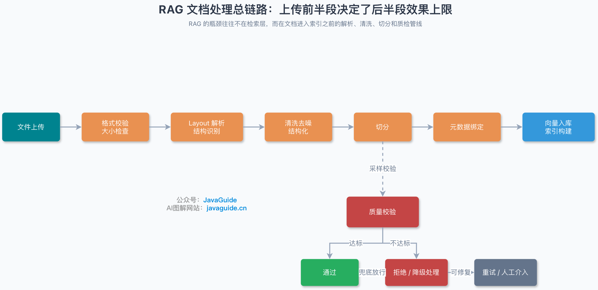

这张图里有个容易忽略的点：质量校验不应该只发生在入库之后。在 Chunking 阶段做完采样校验，能提前发现问题，避免把低质量数据大批量写入向量库。

> 注：本图简化展示了 Chunking 阶段的校验，完整的分层校验策略见后文"如何设计分层校验策略"章节，涵盖格式校验、解析校验和 Chunking 校验三层。

每个环节的核心风险：

| 环节 | 典型问题 | 最终影响 |
|---|---|---|
| 文件上传 | 格式伪造、大小超限、编码混乱 | 解析器崩溃或静默失败 |
| 格式校验 | 扩展名和实际 MIME 类型不符 | 选错解析器 |
| Layout 解析 | PDF 多栏、表格合并单元格、页眉页脚 | 结构丢失、上下文错位 |
| 清洗去噪 | 乱码、特殊字符、重复空行、目录残留 | 噪声入索引、Embedding 失真 |
| Chunking | 语义截断、上下文断裂、块太大或太小 | 召回不准、答案残缺 |
| Metadata | 没保存来源、页码、版本、权限 | 无法过滤、无法引用 |
| 入库 | 向量维度不一致、Token 超限 | 检索失败、索引损坏 |

Embedding 模型和向量库只能处理输入给它们的内容。多栏 PDF 的阅读顺序错乱、表格列关系丢失或 OCR 错字一旦进入索引，后续检索无法从向量中还原原始结构。

### 如何选择合适的 Chunking 策略？

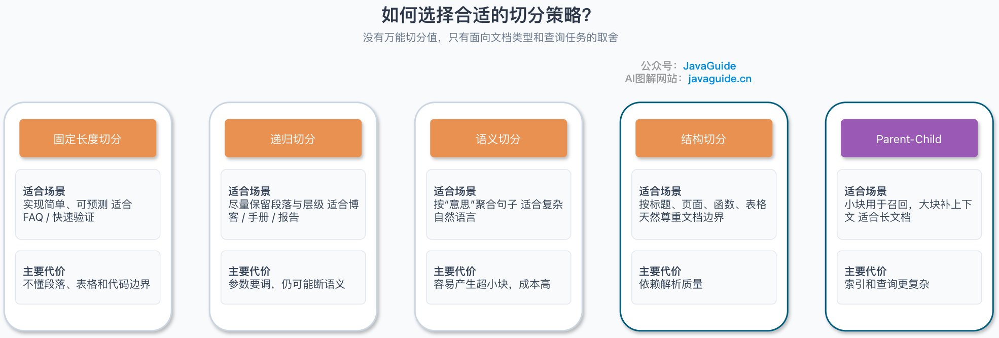

#### 固定长度切分：够用但不完美

固定长度切分只需要设定块大小和重叠量。例如，每 1000 个 Token 切一块，相邻块之间重叠 200 Token。

这种方式实现简单、行为可预测，在短文档和 FAQ 类场景下效果不差。但它的硬伤也很明显：它不懂什么是段落、什么是表格、什么是代码块。

把固定长度切分作为评测基线后，才能判断递归切分带来的收益是否覆盖额外复杂度。比较时应固定文档集和问题集，同时观察召回率、上下文完整性和索引成本；其他知识库上的百分点差异不能直接套用。

举个例子，一段政策文档里写着：

> "除以下情况外，均可申请七天无理由退货：（一）定制商品；（二）鲜活易腐商品；（三）在线下载的数字化商品..."

如果这个列表刚好跨在 1000 Token 的边界上，前一块可能只有"除以下情况外，均可申请七天无理由退货"，后一块只有"（一）定制商品..."。单独看哪个都不完整，模型很容易断章取义。

这类边界问题正是固定长度方案需要与其他策略对比的原因。

#### 递归字符切分：保留层级结构

递归切分（Recursive Character Splitting）按一组优先级分隔符逐层尝试：先保留段落，段落仍超长再按句子处理，最后才使用空格等更细的边界。这样产生的块仍受目标大小约束，但会优先保留章节、段落和句子的边界。

标题层级不完整、段落长度差异明显的文档可以纳入这类方案的评测范围，例如技术博客、产品手册和研究报告。是否采用仍取决于它在当前问题集上的结果。

LangChain 的 `RecursiveCharacterTextSplitter` 是这种思路的典型实现。对于 Python 代码这类结构化内容，使用约 100 Token 的块大小和约 15 Token 的重叠，能在上下文精度和召回率之间取得不错的平衡。注意：此参数针对代码文档优化，通用文本文档建议使用 400-512 Token。

#### 语义切分：按意义分，但有代价

语义切分先计算句子或段落之间的相似度，再把连续、相近的内容归入同一块，而不是直接遵循字符数或标题边界。

它需要额外生成句子或段落的 Embedding。没有最小块约束时，某些主题转折处只会留下一个或两个句子的块，检索命中后仍不足以支持回答。

阈值与 `min_chunk_size` 会改变块大小分布。可从 200-400 Token 的候选范围开始，随后检查最小值、均值、分位数和过小块占比，并由本地评测确定参数。

#### 按文档结构切：天然语义边界

金融报告、法律文档等材料中，页面往往对应一个可阅读的版式单元。NVIDIA 的一组测试中，Page-Level Chunking（按页面切分）在这两类文档上的平均准确率为 0.648，方差也最低；这说明页面边界可以作为待验证的切分边界。

不过别盲目迷信页面级切分。这个优势相对于 Token 切分其实只有 0.3-4.5 个百分点，而且在 FinanceBench 数据集上，1024-token 切分反而比页面级更优（0.579 vs 0.566）。NVIDIA 测试的文档类型（金融报告、法律文档）是分页本身就携带语义的场景——如果你的 PDF 是 Word 随便导出的那种，页面级切分不会带来额外收益。另外，查询类型也影响最优策略：事实型查询适合 256-512 Token 的小块，分析型查询适合 1024+ Token 或页面级切分。

下表列出不同文档类型可用于起步评测的切分方式：

| 文档类型 | 推荐切分方式 | 实现工具 |
|---|---|---|
| Markdown | 按标题层级（H1/H2/H3）切 | `MarkdownHeaderTextSplitter` |
| HTML | 按标签层级切（h1~h6、p、div） | `HTMLHeaderTextSplitter` |
| PDF | 按页或章节切 | `chunk_by_title`、`chunk_by_page` |
| 代码 | 按函数、类、包切 | `PythonCodeTextSplitter` |
| 论文 | 按章节、段落、表格切 | Layout-aware Parser |

#### Parent-Child Chunk：召回和上下文的折中

向量检索需要足够小的单元来区分相近主题，生成模型又需要更完整的上下文。Parent-Child Chunk 将这两个对象分开处理。

例如，可将约 300 Token 的子块写入向量索引，并记录它所属的约 1200 Token 父段落。查询先命中子块，再按关联读取父段落作为上下文。父子块的大小、关联查询的延迟和存储成本都需要与召回结果一起评估。

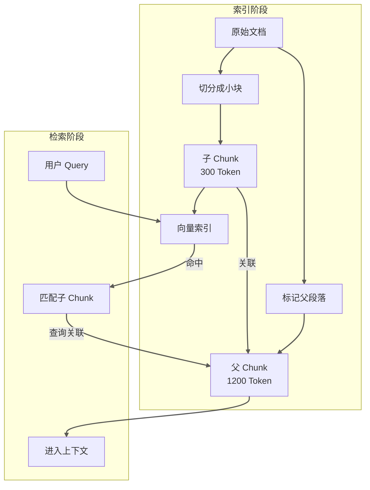
```mermaid
flowchart TB
    subgraph 索引阶段
        Doc[原始文档] --> Split[切分成小块]
        Doc --> Parent[标记父段落]
        Split --> ChildChunk[子 Chunk<br/>300 Token]
        Parent --> ParentChunk[父 Chunk<br/>1200 Token]
        ChildChunk --> VecIndex[向量索引]
        ChildChunk -->|关联| ParentChunk
    end

    subgraph 检索阶段
        Query[用户 Query] --> VecIndex
        VecIndex -->|命中| MatchedChild[匹配子 Chunk]
        MatchedChild -->|查询关联| ParentChunk
        ParentChunk --> Context[进入上下文]
    end

    linkStyle default stroke-width:2px,stroke:#333333,opacity:0.8
```

这种模式在长文档、教程、政策解读、故障手册等场景下效果明显。缺点是索引存储量会增加（每个子 Chunk 都要关联父 Chunk），检索时多一次关联查询。

#### 重叠控制：边界问题的解法

不管用哪种切分策略，块边界都是个麻烦。连续两页讲的是同一件事，上一页结尾和下一页开头被页码硬切开了，检索时两块都缺一半。

重叠（Overlap）是应对这个问题的常用手段，但重叠也不是越大越好。太小了边界处语义断裂，太大了重复内容过多，浪费向量空间还增加检索噪声。它应当作为评测参数，而不是固定值。

一项针对 30 个隆鼻术后问题的研究报告称，自适应切分的回答准确率为 87%，固定大小切分为 50%（p = 0.001）。这个结果来自特定医疗问题、知识库和 Gemini 1.0 Pro，只能说明该实验中自适应切分更好，不能外推为通用 RAG 的预期收益。详见[原始研究](https://pubmed.ncbi.nlm.nih.gov/41301150/)。

通用文本可以从 512 Token、50-100 Token 重叠开始建立基线；代码优先按函数和类切分，法规合同按条、款、项保留法律效力单元，表格尽量保持完整。这里的数值是调参起点，不是生产默认值。

### 什么是语义丢失，为什么会发生？

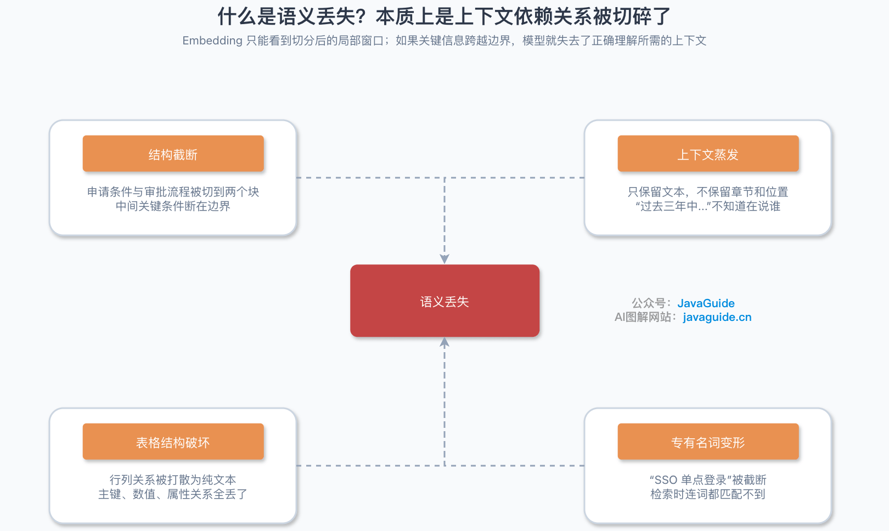

语义丢失指原始文档中的关键信息在解析、清洗、切分或入库过程中被削弱或丢失。

#### 语义丢失的典型场景

**第一种：结构截断。** 一个完整的业务逻辑被拆到两个 Chunk 里。第一个 Chunk 讲"申请条件"，第二个 Chunk 讲"审批流程"，但中间那个关键条件"如果满足 X，则需要额外提供 Y 材料"被切在边界上，成了两个 Chunk 都有的"残缺信息"。

**第二种：上下文蒸发。** Chunk 只保留了文本内容，但丢失了它在文档里的位置信息。模型读到"在过去三年中..."时不知道这是在讲"某供应商的风险评估"还是"某客户的历史交易"，因为这些背景在切分时被丢了。

**第三种：表格结构破坏。** 一个多行多列的表格被解析成混乱的文本，列与列之间的语义关系（谁是主键、谁是从属、谁是数值）完全丢失。

**第四种：专有名词变形。** 文档里写的是"SSO 单点登录"，切分后变成了"SSO 单点..."，embedding 时专有名词被截断，检索时根本匹配不到。

#### 为什么会丢失语义

Embedding 请求只接收当前 Chunk。原文中跨段、跨页的条件、指代和表格关系若没有被保留到同一块或关联元数据中，向量表示就缺少这部分信息。

因此，页面本身构成语义单元时，按页切分可能优于更细的切分：它保留了同一页面内原本相互依赖的内容。这一判断仍应放到具体文档和查询类型中验证。

#### 应对策略

一种做法是增加检索入口：除正文外，再为 Chunk 生成摘要或可能回答的问题。用户问"钱怎么退"，文档写的是"退款申请路径"，两段文本会被同一个 Embedding 模型映射到同一向量空间，但距离和排序未必足以让原文进入 Top-K。增加问题变体可能改善这类表达差异，收益仍需用评测集确认。

另一个被低估的手段是保留层级元数据。在 Metadata 里记录章节路径、父子标题、段落编号等信息，检索时可以按层级过滤，生成时也能补回上下文。这块成本低但收益大，很多团队却忽略了。

如果预算允许，可以试试 Late Chunking。这是一种比较新的做法：先把完整文档通过 Transformer 编码一次，让每个 Token 的 embedding 都包含全文注意力，然后再在 embedding 空间做切分和池化。好处是每个 Chunk 的向量都保留了完整的文档上下文，缺点是计算成本高，适合文档量不大但对精度要求极高的场景。

还有一种思路是用另一个 LLM 来分析文档结构，让它告诉你该怎么切（Contextual Chunking）。这种方式成本也高，但对复杂文档结构（比如嵌套表格、混合图文）的处理能力确实更强。

### 如何处理结构丢失问题？

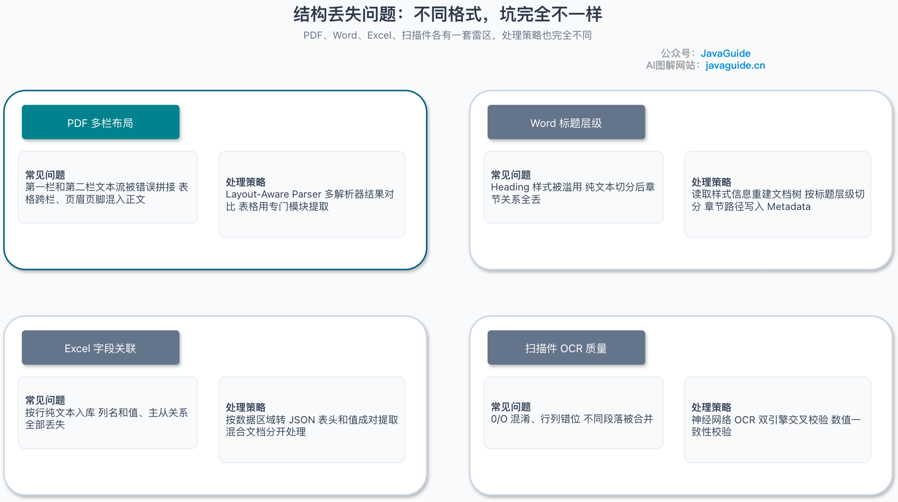

结构丢失是语义丢失的一个子集，但它的场景更具体，影响也更直接。

#### PDF 多栏布局

很多 PDF 使用双栏或多栏排版，但底层文本对象的存储顺序未必等于阅读顺序。解析器如果只按对象顺序提取，可能把左栏结论接到右栏论据前面，得到顺序错乱的文本。

这类文档可以评估 Layout-Aware Parser。解析器会结合文本的物理位置（x、y 坐标）、字体大小和段落间距推断阅读顺序，LlamaParse、Docling、Marker-PDF 都提供了相关能力。

高价值文档可以用两种解析器处理并比较输出。差异较大的页面应进入人工审核或降级流程；两份输出一致也不代表一定正确，仍要抽查阅读顺序、表格结构和页码引用。

还有一个容易翻车的场景：财务报表里的合并单元格。跨列的表头、跨行的数值项，如果只按文本流解析，结构会完全乱掉。这类文档别硬撑，直接上专门的表格提取工具（如 Docling 的 TableFormer 模块）。

#### Word 标题层级

Word 文档的结构通常靠标题样式体现（Heading 1、Heading 2、正文），但样式未必可靠：有的文档用加大字体的普通段落当标题，有的把正文套成 Heading 3，甚至整篇都使用 Heading 1。解析时需要同时检查样式、字体和段落位置，不能只信样式名称。

如果直接按纯文本切分，标题层级会丢失。可以用 `python-docx` 或其他支持 Word 样式的解析器读取样式信息，按标题层级重建文档树。切分后把章节路径写入 Metadata，供检索和生成使用。

```
# 读取 Word 文档并保留标题层级
from docx import Document

def extract_sections(doc_path):
    """
    按 Word 文档标题层级提取章节内容
    """
    doc = Document(doc_path)
    current_heading = None
    current_content = []

    for para in doc.paragraphs:
        if para.style.name.startswith("Heading"):
            # 保存上一个标题下的内容
            if current_heading and current_content:
                yield {
                    "heading": current_heading,
                    "content": "\n".join(current_content),
                }
            current_heading = para.text
            current_content = []
        else:
            if para.text.strip():
                current_content.append(para.text)

    # 处理最后一个章节
    if current_heading and current_content:
        yield {
            "heading": current_heading,
            "content": "\n".join(current_content),
        }
```

#### Excel 字段关联

Excel 的字段关系可能由表头、合并单元格、颜色和公式共同表达，单独读取单元格并不能得到完整记录。

例如，把每个单元格独立写入索引，会切断字段名、数值和同一行记录之间的关联。应先确定数据区域与表头，再决定生成何种检索对象。

正确的做法取决于 Excel 的用途：

- 数据表格（财务报表、统计报表）：按行或按数据区域提取为结构化 JSON，每行作为一条记录。
- 配置表格（参数表、映射表）：把表头和值配对提取，保留字段名。
- 混合文档（既有说明文字又有表格）：文字部分按段落处理，表格部分按结构化数据处理。

#### 扫描件的 OCR 质量

扫描件通过 OCR 转成数字文本，质量取决于扫描分辨率、字体、版面、语言和纸张背景。处理链路应默认 OCR 结果可能出错，并为关键字段设置校验。

OCR 结果需要分别检查字符、表格和段落三个层面。数字 0 与字母 O、繁简体等字符误识别会影响产品编号、身份证号等关键字段；表格线识别不准会使行列错位；不同段落被合并后，原有上下文也会消失。

OCR 引擎要按语言、版面类型、部署方式和实测准确率选择，Tesseract 4.x+、Google Document AI、AWS Textract 都可以作为候选。关键文档可使用双引擎对比：不一致的位置优先人工复核，但一致也不等于正确。数值密集型文档还要增加业务一致性校验，例如列求和能否对上总计、编号是否符合校验规则。

### 如何设计分层校验策略？

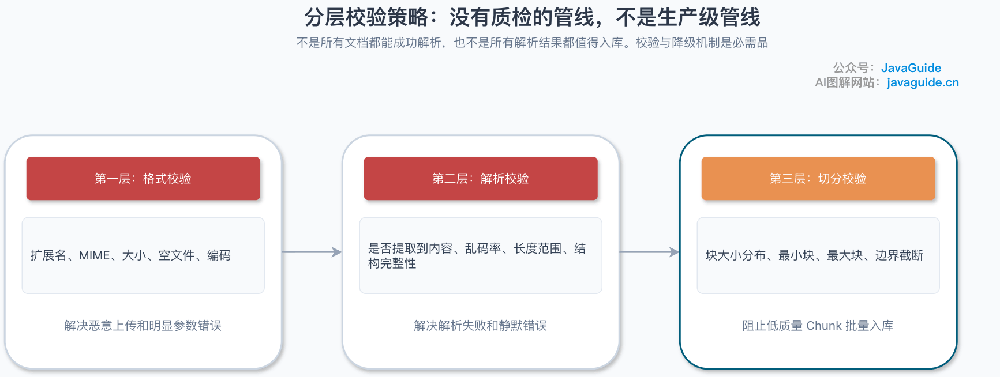

不是所有文档都能成功解析，也不是所有解析结果都能用。RAG 管线必须有降级处理机制，否则低质量数据会污染整个知识库。

#### 校验分层

校验可以分成三道关卡，每道处理不同问题。

先是格式校验。文件上传后立刻检查扩展名、MIME 类型、文件大小。这一层解决的是"恶意上传"和"参数错误"问题，拦截成本最低，效果最快。

```
public class DocumentValidationException extends RuntimeException {
    private final ValidationErrorType errorType;
    private final String fileName;
    private final Object rejectedValue;

    public enum ValidationErrorType {
        FILE_TOO_LARGE,           // 文件大小超限
        UNSUPPORTED_FORMAT,       // 不支持的格式
        MIME_TYPE_MISMATCH,       // 扩展名与实际类型不符
        CORRUPTED_FILE,           // 文件损坏
        EMPTY_FILE,               // 空文件
        ENCODING_ERROR            // 编码错误
    }
}
```

解析完成后，需要检查是否成功提取内容、内容长度是否处于合理范围，以及是否存在明显乱码。

```
public class ParseResultValidator {

    public ValidationResult validate(DocumentParseResult parseResult) {
        List<String> errors = new ArrayList<>();

        // 空内容检查
        if (parseResult.getContent().isEmpty()) {
            errors.add("解析结果为空");
        }

        // 乱码率检查
        double garbledRate = calculateGarbledRate(parseResult.getContent());
        if (garbledRate > 0.05) {  // 超过 5% 乱码
            errors.add("乱码率过高: " + String.format("%.2f%%", garbledRate * 100));
        }

        // 内容长度异常检查
        int contentLength = parseResult.getContent().length();
        if (contentLength < 100) {
            errors.add("内容过短，可能解析失败");
        }
        if (contentLength > 10_000_000) {  // 超过 10MB 文本
            errors.add("内容过长，需要分片处理");
        }

        // 结构完整性检查（如果有结构信息）
        if (parseResult.hasStructure()) {
            validateStructure(parseResult.getStructure())
                .forEach(errors::add);
        }

        return new ValidationResult(errors);
    }
}
```

最后一道是 Chunking 校验。切分完成后抽样检查 Chunk 质量：块大小分布是否合理、边界是否在合理位置、是否有明显的截断问题。

```
public class ChunkingQualityReport {
    private final int totalChunks;
    private final int totalCharacters;
    private final double averageChunkSize;
    private final int minChunkSize;
    private final int maxChunkSize;
    private final double chunkSizeStdDev;

    // 警告项
    private final List<String> warnings = new ArrayList<>();
    private final List<String> errors = new ArrayList<>();

    public boolean isAcceptable() {
        // Chunk 大小标准差过大说明分布不均匀
        if (chunkSizeStdDev > averageChunkSize * 0.5) {
            warnings.add("Chunk 大小分布不均匀，标准差过大");
        }

        // 最小块过小可能是切分异常
        if (minChunkSize < 50) {
            errors.add("存在过小的 Chunk，可能切分异常");
        }

        // 最大块过大可能截断失败
        if (maxChunkSize > 5000) {
            warnings.add("存在过大的 Chunk，可能超出模型上下文");
        }

        return errors.isEmpty();
    }
}
```

#### 降级处理策略

| 校验失败类型 | 处理策略 |
|---|---|
| 空文件 | 拒绝入库，记录异常日志，通知上传者 |
| 格式不支持 | 拒绝入库，建议转换格式 |
| 解析失败 | 进入人工处理队列，或使用备用解析器重试 |
| 乱码率高 | 尝试 OCR 或格式转换，仍失败则降级为纯文本 |
| Chunking 异常 | 改用固定长度切分作为兜底方案 |
| 部分解析成功 | 提取可解析部分入库，对不可解析部分打标签 |

降级的目标是保留可确认正确的内容，而不是悄悄吞掉失败页面。一份 100 页的 PDF 如果有 10 页解析失败，可以只在业务允许不完整索引时接收其余页面，同时记录缺页范围、阻止系统对缺失部分作完整性承诺，并进入重试或人工复核；合同、法规等要求完整性的材料应暂缓发布。

### 如何处理多模态内容？

传统 RAG 只处理文本，但真实世界的文档里还有大量图片、表格、图表。如果这些内容被忽略，知识库就是不完整的。

#### 图片内容：三种处理路径

图片在文档里的作用有两类：信息载体（截图、流程图、照片）和装饰性内容（页眉、logo、水印）。处理策略完全不同。

一种做法是用 CLIP 向量化 + 原始图片回传。用支持图文对齐的 CLIP 模型把图片转成向量，检索时命中图片向量后，再从对象存储拉取原图并交给多模态 LLM。CLIP 更擅长自然图片，对包含密集文字、坐标轴和复杂表格的截图或图表，需要单独评测。

另一种思路是用 MLLM 描述 + 文本检索。不用 CLIP 向量化图片，而是用多模态大模型生成图片的文本描述，把描述文本和原始图片一起存储。检索时匹配文本，命中后再用原始图片做生成增强。对截图、流程图和仪表盘，这种做法可能比通用 CLIP 表示包含更多文字和结构信息，但模型描述也可能漏字段或读错数值，需要抽样评测。

多向量索引（Multi-Vector Retriever）会先用 MLLM 生成图片的结构化摘要（如 "This is a flowchart showing the order processing pipeline..."），摘要进入文本向量索引，原图存入 docstore。检索时先命中摘要，再通过 `doc_id` 关联原图，交给多模态 LLM 生成。

```
# LangChain 多向量检索示例
from langchain_classic.retrievers.multi_vector import MultiVectorRetriever
from langchain_core.stores import InMemoryByteStore

# 摘要向量存储
vectorstore = Chroma(collection_name="summaries", embedding_function=OpenAIEmbeddings())

# 原始文档存储
docstore = InMemoryByteStore()

retriever = MultiVectorRetriever(
    vectorstore=vectorstore,
    byte_store=docstore,
    id_key="doc_id",
    search_kwargs={"k": 5}
)
# 注意：InMemoryByteStore 仅用于演示，生产环境应替换为持久化存储（如 Redis、MongoDB、S3 等）
```

#### 表格内容：结构化抽取是核心

表格是 RAG 里的老大难问题。传统 PDF 解析会把表格转成混乱的文本，列与列之间的关系完全丢失。

最基础的做法是表格解析 + Markdown 化。用专门的表格解析工具（LlamaParse、Docling、TableFormer）提取表格结构，转成 Markdown 表格格式。Markdown 表格至少保留了行列关系，LLM 能更好地理解。

```
| 产品名称 | Q1 销量 | Q2 销量 | 环比增长 |
| -------- | ------- | ------- | -------- |
| 手机 A   | 10,000  | 12,000  | +20%     |
| 手机 B   | 8,000   | 7,500   | -6.25%   |
```

如果表格是数值型的（比如财务报表），转成结构化 JSON 格式更利于数值检索和计算。可以用自然语言查询表格内容："Which product had the highest growth in Q2?"

```
{
  "table_name": "Sales Quarterly Report",
  "headers": ["Product", "Q1 Sales", "Q2 Sales", "Growth Rate"],
  "rows": [
    { "product": "Phone A", "q1": 10000, "q2": 12000, "growth": "20%" },
    { "product": "Phone B", "q1": 8000, "q2": 7500, "growth": "-6.25%" }
  ]
}
```

表格描述应包含所在章节、标题、单位和时间范围，使检索端能区分名称相同但业务范围不同的表格。是否保留这些字段，应通过检索评测确认，而不是只看描述是否更完整。

比如同样是销售数据表，在"华东区年度总结"章节下的描述应该是：

> "华东区 2024 年度各产品线销量汇总表，展示了手机 A 和手机 B 在 Q1/Q2 的销售数据及环比增长率，用于分析产品市场表现和制定下季度策略。"

哪种描述更适合当前知识库，需要在相同问题集上比较。

#### 图表内容：Caption 和上下文同样重要

图表不能只按图片处理。标题、坐标轴、图例、单位、数据来源和所属章节共同限定了数据含义；缺少其中任何一项，都可能把同一组数值解释错。

Caption 应写清对象、时间范围、度量单位和可验证的图中信息。例如，"折线图展示 2020-2024 年公司季度营收趋势，Q4 2024 营收达到峰值 12.5 亿元"比 "Revenue chart" 多出了检索和生成所需的限定条件。图表附近的正文通常包含作者解读，也应保留关联关系。

#### 完整的多模态 RAG 链路

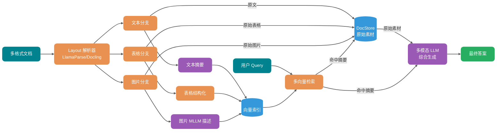
```mermaid
flowchart LR
    %% ========== 配色声明 ==========
    classDef input fill:#00838F,color:#FFFFFF,stroke:none,rx:10,ry:10
    classDef process fill:#E99151,color:#FFFFFF,stroke:none,rx:10,ry:10
    classDef storage fill:#3498DB,color:#FFFFFF,stroke:none,rx:10,ry:10
    classDef llm fill:#9B59B6,color:#FFFFFF,stroke:none,rx:10,ry:10
    classDef success fill:#27AE60,color:#FFFFFF,stroke:none,rx:10,ry:10

    %% ========== 节点声明 ==========
    Doc[多格式文档]:::input
    Parser[Layout 解析器<br/>LlamaParse/Docling]:::process
    TextBranch[文本分支]:::process
    TableBranch[表格分支]:::process
    ImageBranch[图片分支]:::process

    TextSum[文本摘要]:::llm
    TableSum[表格结构化]:::process
    ImageSum[图片 MLLM 描述]:::llm

    VecIndex[(向量索引)]:::storage
    DocStore[(DocStore<br/>原始素材)]:::storage

    Query[用户 Query]:::input
    Retrieve[多向量检索]:::process
    Synthesize[多模态 LLM<br/>综合生成]:::llm
    Answer[最终答案]:::success

    Doc --> Parser
    Parser --> TextBranch
    Parser --> TableBranch
    Parser --> ImageBranch

    TextBranch --> TextSum --> VecIndex
    TextBranch -->|原文| DocStore
    TableBranch --> TableSum --> VecIndex
    TableBranch -->|原始表格| DocStore
    ImageBranch --> ImageSum --> VecIndex
    ImageBranch -->|原始图片| DocStore

    Query --> Retrieve
    VecIndex --> Retrieve
    Retrieve -->|命中摘要| DocStore
    DocStore -->|原始素材| Synthesize
    Retrieve -->|命中摘要| Synthesize
    Synthesize --> Answer

    linkStyle default stroke-width:2px,stroke:#333333,opacity:0.8
```

这套链路的思路是：摘要用于检索，原文用于生成。向量索引里存的是结构化摘要（或描述），而原始的多模态内容存在 docstore 里，检索命中的时候再取出来交给多模态 LLM 综合。

### 如何从零搭建文档处理管线？

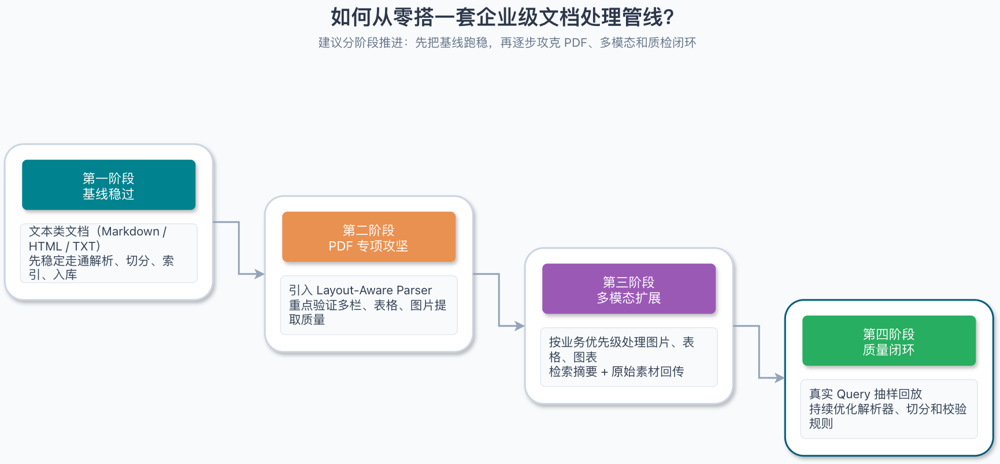

格式覆盖范围可以按风险递增。先验证 Markdown、HTML、TXT 的解析、切分、索引和入库，再扩展到 PDF、多栏页面、表格和图像。每新增一种格式，都应检查标题层级、Chunk 大小分布和 Metadata 是否符合预期。

PDF 的表格、图表和多栏依赖 Layout-Aware Parser（如 LlamaParse 或 Docling）。验证样本要覆盖实际会出现的版式；样本数量取决于版式种类和出错风险，而不是某个固定数目。

图片和表格占比较高的材料（如财务报告、产品手册）需要尽早纳入多模态处理。以文本为主的知识库可以后置这部分工作，但入库前仍应抽样检查：用真实 Query 比较解析前后的内容保真度、召回结果和答案引用。

### 第二部分小结

上线前至少抽查解析后的阅读顺序、表格行列、标题层级、页码引用和 OCR 关键字段；同时记录 Chunk 大小分布、来源、版本、权限与章节路径。解析器或切分策略变更后，应使用同一批问题重新评测召回和答案引用，不能只检查任务是否执行成功。

验收时应确认解析结果仍可被追溯和正确理解：阅读顺序与表格结构没有损坏，Chunk 保留了回答所需的上下文，Metadata 可以定位来源、版本、权限和章节路径，图片与图表的关键信息没有被跳过。

这些检查应持续放在解析器、切分策略和模型版本变更之后。检索层的效果取决于它接收到的数据，而不是单靠更换 Embedding 模型补救。

### 第二部分面试题

- 文档处理管线分哪些环节？每个环节最容易出什么问题？
- 固定长度切分、递归切分、语义切分、按结构切分的区别和适用场景？
- Parent-Child Chunk 解决了什么问题？有什么代价？
- 什么是语义丢失？常见场景有哪些？怎么应对？
- PDF 多栏布局、Word 标题层级、Excel 字段关联分别怎么处理？
- OCR 质量怎么保证？
- 分层校验策略怎么设计？降级处理怎么做？
- 多模态内容（图片、表格、图表）怎么进 RAG？

### 第二部分参考资料

- Databricks: Mastering Chunking Strategies for RAG
- Firecrawl: Best Chunking Strategies for RAG in 2026
- Premiere AI: RAG Chunking Strategies 2026 Benchmark Guide
- Weaviate: Chunking Strategies to Improve LLM RAG Pipeline Performance
- Omdena: Document Parsing for RAG - A Complete Guide for 2026
- DataCamp: Multimodal RAG - A Hands-On Guide
- LangChain: Multi-Vector Retriever for RAG on Tables, Text, and Images
- Procycons: PDF Data Extraction Benchmark 2025
- LlamaIndex: Mastering PDF Parsing

---

## 第三部分 向量索引与向量数据库

> 本章整理自：[JavaGuide - RAG 向量索引算法和向量数据库](https://javaguide.cn/ai/rag/rag-vector-store.html)

### 导读

第二部分解决了"文档如何变成高质量 Chunk"，这一部分解决**海量 Chunk 向量如何低延迟地检索**。把 Embedding 存进普通字段并逐条计算距离，数据量小时可以作为精确检索基线。数据规模、并发或延迟要求上升后，全表扫描的计算开销会随向量数量线性增长，此时需要评估 ANN 索引或专门的向量检索系统。

本章从距离度量和索引算法讲起，再结合 PostgreSQL + pgvector 说明 HNSW、IVFFLAT 的参数、过滤行为和选型方法。

### Embedding 和向量检索是什么关系？

向量数据库并不是直接理解文本。它存储和检索的是 Embedding。

Embedding 的过程是：把一段文本交给 Embedding 模型，模型输出一个固定维度的稠密向量。可以粗略理解成"文本语义坐标"。两段文本语义越接近，它们在向量空间里的距离通常也越近。

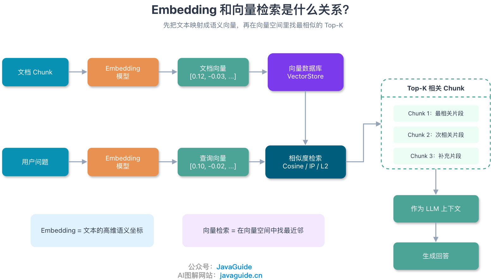

RAG 的向量检索链路可以简化成这样：

```
文档 Chunk -> Embedding 模型 -> 文档向量 -> 写入向量数据库
用户问题 -> Embedding 模型 -> 查询向量 -> 检索最相似的 Top-K 文档向量
```

基础概念可以看本讲义第一部分（RAG 基础篇）。本章重点放在后半段：这些向量怎么高效存储、索引和检索。

### RAG 场景为什么需要向量数据库？

向量语义检索是 RAG 常用的召回方式之一。系统把文档和用户问题都转成高维向量，再找出最相似的 Top-K 片段，作为 LLM 的上下文。RAG 也可以使用 BM25、SQL、图查询或外部 API 检索，具体方式取决于数据形态。

所以 RAG 场景里真正要解决的，不只是"能不能存 Embedding"，而是能不能在大规模高维向量里，低延迟找出最相关的 Top-K。

传统关系型数据库可以存向量，也可以通过函数或 SQL 表达式计算相似度。但如果没有专门的向量索引，通常只能全表扫描，很难支撑生产级低延迟检索。当 Chunk 数量达到几十万、百万甚至更高时，就需要引入向量数据库、向量搜索引擎，或者 PostgreSQL + pgvector 这类带向量索引能力的数据库扩展。

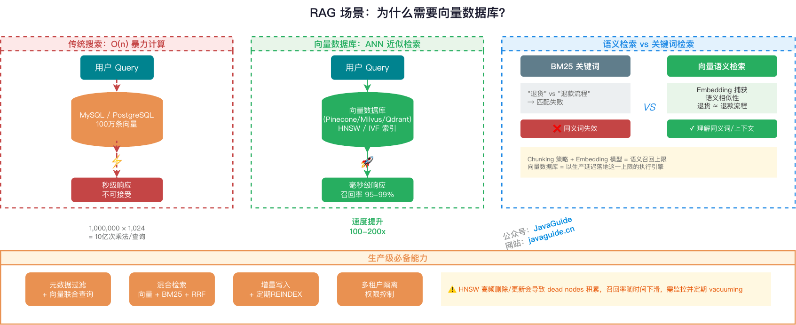

#### 高维向量相似度搜索

Embedding 通常是 768 到 3072 维的稠密向量。没有向量索引时，即使数据库能计算余弦相似度、内积或欧氏距离，也很难在大规模数据上快速完成 Top-K 检索。

暴力搜索就是遍历全表计算距离，复杂度是 O(n)。以 100 万条 1024 维向量为例，单次查询大约要做：

```
1,000,000 × 1,024 次乘法运算
```

实际延迟很容易到秒级，具体取决于硬件和实现。对实时问答系统来说，秒级延迟基本不可接受。

ANN（Approximate Nearest Neighbor，近似最近邻）检索就是为了解这个问题。向量数据库通过图导航、空间划分、量化等方式减少距离计算次数，不再每次都把所有向量算一遍。

ANN 的价值不在于永远返回 100% 精确的最近邻，而是在召回率、延迟和资源消耗之间做工程取舍。在合适的索引参数和硬件条件下，ANN 通常能把百万级向量检索从秒级暴力扫描优化到几十毫秒甚至更低。不过具体效果必须拿业务数据、Top-K、过滤条件、并发和召回率目标来测，不能只看理论复杂度。

| 指标 | 暴力搜索 | ANN 索引检索 |
|---|---|---|
| 检索方式 | 全量计算距离 | 只搜索候选集 |
| 召回率 | 理论 100% | 取决于索引类型和参数 |
| 延迟 | 数据量越大越慢 | 通常低很多 |
| 代价 | 计算开销高 | 需要构建索引，占用额外内存或磁盘 |

上表只是数量级描述。实际性能和硬件规格、并发负载、数据分布、过滤条件、Top-K、索引参数（如 `ef_search`、`nprobe`）都有关系。选型和调参时，建议参考 [ann-benchmarks.com](https://ann-benchmarks.com)，更重要的是在自己的业务环境里验证。

#### 大规模数据承载能力

向量数据库通常会提供持久化、增量更新、分片和索引构建等能力。传统数据库也能把向量当字段存储；是否需要独立向量数据库，要结合现有技术栈、向量维度、过滤条件、QPS、延迟和召回目标测试。缺少向量索引时，数据量增长会直接增加精确扫描成本。

#### 语义检索和关键词检索有什么不同？

关键词检索和向量语义搜索解决的是两类问题。

| 检索方式 | 原理 | 局限性 |
|---|---|---|
| BM25 关键词 | 字面匹配，基于词频统计 | 遇到同义词或改写容易失效，比如"退货"和"退款流程" |
| 向量语义搜索 | Embedding 捕获语义相似性 | 能处理同义词、上下文和隐含意图，但依赖 Embedding 质量 |

文档切分策略和 Embedding 模型共同决定语义召回的理论上限，向量数据库负责在可接受延迟内把这个上限兑现出来。

生产级 RAG 通常还需要几类能力：

- 元数据过滤，比如 WHERE category='Java' AND version>='v2'，和向量相似度联合查询。
- 混合检索（Hybrid Search），把向量、BM25 和 RRF 融合起来。
- 动态更新，支持增量写入。但高频更新和删除会让向量索引出现膨胀、无效数据累积、召回或延迟波动，需要结合 VACUUM、REINDEX、执行计划和业务评测集持续观察。
- 权限和多租户隔离，这是企业级 RAG 的基本要求。

### 向量相似度和距离度量怎么选？

向量数据库做的不是关键词匹配，而是计算查询向量和文档向量之间的距离或相似度。RAG 场景常见的是余弦距离、内积和欧氏距离。

以 pgvector 为例，三种常用写法如下：

| 度量方式 | pgvector 运算符 | operator class | 特点 | 适合场景 |
|---|---|---|---|---|
| 欧氏距离（L2 Distance） | `<->` | `vector_l2_ops` | 衡量向量空间中的绝对距离，值越小越相似 | 模型或索引明确按 L2 优化 |
| 内积（Inner Product） | `<#>` | `vector_ip_ops` | pgvector 返回负内积，值越小越相似 | 向量已归一化、追求计算效率 |
| 余弦距离（Cosine Distance） | `<=>` | `vector_cosine_ops` | 对向量长度不敏感，值越小越相似；余弦相似度可用 `1 - distance` 计算 | 文本语义检索、RAG 最常用 |

面试里如果被问"为什么 RAG 常用余弦相似度"，可以这样答：文本语义检索更关心方向是否接近，而不是向量长度本身；余弦距离对长度不敏感，更适合判断语义相似。如果 Embedding 模型输出已经归一化，内积和余弦在排序上通常等价，内积计算会更直接。

具体用哪个，不要凭感觉选。要看 Embedding 模型是否归一化、官方推荐的 metric，以及向量库索引是否支持对应 operator class。

实践里最容易踩的坑是：查询运算符必须和索引 operator class 一致。比如索引用的是 `vector_cosine_ops`，查询也要用 `<=>`，否则 PostgreSQL 可能无法使用这个向量索引。

### 什么是向量索引算法？

向量索引算法要解决的问题是：在大量高维向量中，怎么快速找到和查询向量最相似的几个。

没有索引时，只能把数据库里的所有向量都比较一遍，这就是暴力搜索。百万、亿级数据下，这个延迟不可接受。

向量索引的目标，是提前把数据组织好，让查询时可以跳过绝大部分不相关向量，只在一个小得多的候选集里做精确比较。

用生活化一点的比喻：

- 没有索引：在整个城市挨家挨户找一个人。
- 有索引：先定位城区，再定位街道，再定位楼栋。

实践里，向量索引算法大致可以分成两类。

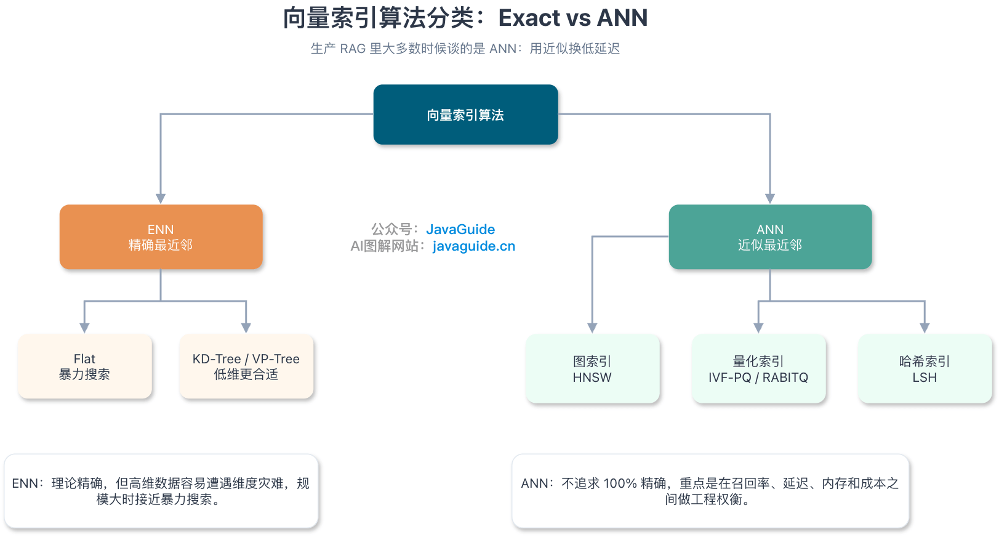

多数时候我们谈向量索引，谈的是 ANN 算法。索引带来的收益与数据分布、硬件、Top-K、过滤条件和召回目标有关，不能用一个固定倍数概括。调参时应同时记录查询延迟、资源占用和召回率。

#### 精确最近邻（Exact Nearest Neighbor，ENN）

ENN 的目标是 100% 找到最相似的向量。KD-Tree、VP-Tree 这类传统空间树结构都属于这个方向。

问题在于，KD-Tree、VP-Tree 等空间树在低维数据上更有优势；维度升高后，剪枝效果往往下降，查询可能接近暴力扫描。退化程度取决于数据分布和实现，不能用固定维度作为分界线。

#### 近似最近邻（Approximate Nearest Neighbor，ANN）

ANN 是现代向量检索的主流。它接受一个工程取舍：不保证 100% 找到绝对最近邻，而是以很高概率找到足够相似的结果，用一点召回损失换取几个数量级的速度提升。

常见 ANN 算法主要有三类：

- 基于图的算法，比如 HNSW。它把向量组织成多层网络图，查询时像导航一样在图上走。HNSW 通常能在查询速度和召回率之间取得比较好的平衡，是目前综合表现很强的一类算法。
- 基于量化的算法，比如 IVF-PQ。它通过聚类和压缩技术，把海量向量压缩成更小的数据，降低内存占用，更适合超大规模场景。
- 基于哈希的算法，比如 LSH。它通过特殊哈希函数，让相似向量有较大概率落入同一个桶，从而缩小搜索范围。

### 有哪些向量索引算法？

在 RAG 应用里，索引算法会直接影响召回率、响应延迟和资源消耗。

这里先区分两个层级：

| 层级 | 示例 | 说明 |
|---|---|---|
| 向量数据库 | Milvus、Qdrant、pgvector | 负责向量存储、检索和管理的完整系统 |
| 其支持的索引算法 | HNSW、IVF-PQ、IVFFLAT、Flat | 决定检索性能与召回率的内部实现 |

主流索引算法可以先看这张表：

| 算法名称 | 原理机制 | 核心优势 | 主要劣势 | 更稳的适用描述 |
|---|---|---|---|---|
| Flat（暴力搜索） | 遍历所有向量计算距离 | 100% 准确无损 | 数据量大时查询很慢 | 小规模、低 QPS、离线评测、召回基准 |
| HNSW（图索引） | 分层导航的小世界图 | 查询快，召回率高 | 内存消耗大，构建耗时 | 中大规模、高召回、低延迟场景；百万级常见，千万级需重点评估内存 |
| IVFFLAT（倒排聚类） | 聚类 + 倒排索引桶 | 内存效率较好，构建较快 | 需前置训练，召回率略低 | 更关注内存和构建速度，可接受一定召回损失 |
| IVF-PQ（乘积量化） | 聚类 + 向量极致压缩 | 支持海量数据，开销低 | 精度损失较大 | 超大规模、内存敏感、可接受量化误差 |
| IVF_RABITQ | 聚类 + 随机旋转比特量化 | 内存占用低，召回率优于传统 PQ | 较新算法，生态支持仍在演进 | 超大规模、内存敏感、可接受量化误差 |

关于 IVF_RABITQ 简单补一句。它是 2024 年提出的新一代量化算法，核心思路是 Random Rotation（随机旋转）+ Bit Quantization（比特量化）。相比传统 PQ 把向量切成子向量再分别聚类，RABITQ 会先对向量做随机旋转，让各维度分布更均匀，再把每个维度量化为 1 bit，只保留符号位。这样可以在保持较高召回率的同时显著压缩内存，并且距离计算可以用位运算加速。Milvus 2.6.x 中已经提供 `IVF_RABITQ` 索引类型。

### 你的项目使用的什么向量索引算法？

这里以 [《SpringAI 智能面试平台+RAG 知识库》](https://javaguide.cn/zhuanlan/interview-guide.html)项目为例。

项目里用的是 PostgreSQL 的 pgvector 扩展，并配置了 HNSW 索引。

为什么选 HNSW？因为在当前业务规模下，它在检索速度、召回率和工程复杂度之间比较均衡。

可以把 HNSW 理解成一个多层高速公路网络。

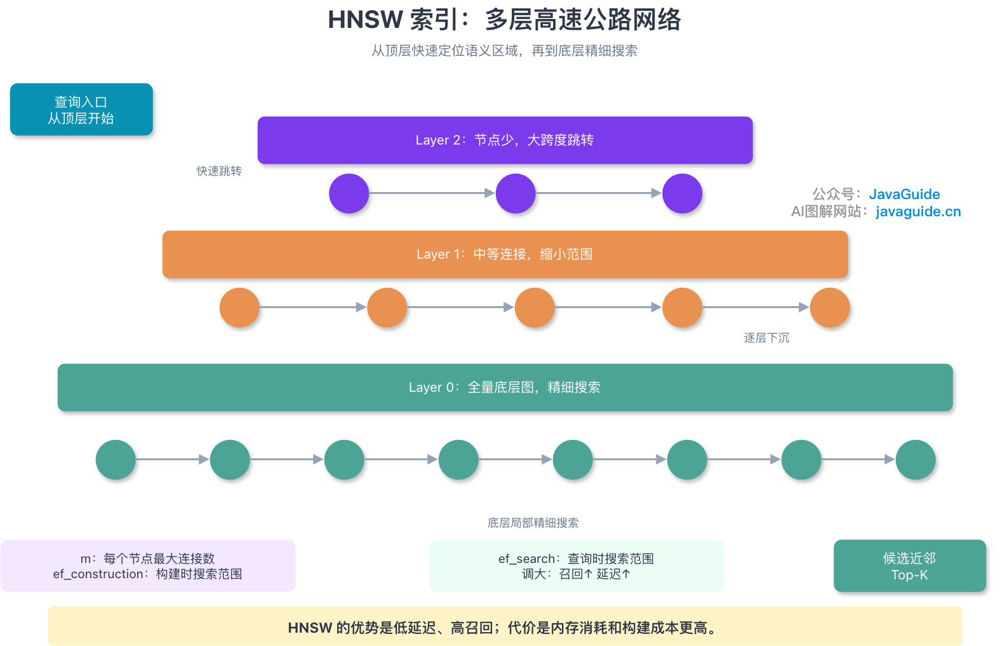

HNSW 的核心机制有三点。

第一是层次化构建。节点的最高层级由公式 `level = floor(-ln(random()) * mL)` 决定，其中 `mL` 是层级乘数。这会让越高层的节点数量指数级递减，形成类似金字塔的结构。

第二是贪心搜索。检索从顶层开始，每层都移动到距离查询点最近的邻居节点。

第三是由粗到精。上层负责快速定位语义区域，下层负责更精细地查找候选近邻。

这种查找方式能快速定位候选近邻，不需要像暴力搜索那样比较每个点。

HNSW 属于 ANN 算法，目标是在速度和召回之间取舍，不保证 100% 召回。参数调整可以改变召回率与延迟，是否满足要求要看业务评测集和最终答案质量。

HNSW 常见调优参数有三个：

- m：每个节点的最大连接数。m 越大，图越密，召回率越高，但构建时间和内存消耗也会上去。
- ef_construction：索引构建时的搜索范围。值越大，索引质量越好，但构建越慢。
- ef_search：查询时的搜索范围。这个运行时参数最重要，直接影响查询速度和召回率。

pgvector 的 HNSW 默认参数是 `m = 16`、`ef_construction = 64`、`ef_search = 40`。可以按下面这个方向调：

| 参数 | 常见范围 | 调大后的影响 | 调优建议 |
|---|---|---|---|
| `m` | 8-64 | 图更密，召回率更高，但内存和构建时间增加 | 先用默认值，召回不够再调到 24 或 32 |
| `ef_construction` | 64-256+ | 索引质量更好，但构建更慢 | 离线构建能接受更慢时再调大 |
| `ef_search` | 40-200+ | 查询召回更高，但延迟增加 | 最适合在线调参，用评测集找召回率和延迟平衡点 |

一个实用做法是先固定 `m` 和 `ef_construction` 建好索引，再通过会话参数调 `ef_search`：

```
SET hnsw.ef_search = 100;
```

然后用 `EXPLAIN ANALYZE` 确认是否命中索引，再用一批人工标注问题对比不同 `ef_search` 下的召回率、延迟和最终答案质量。`ef_search` 不需要无限调大，达到业务可接受召回后就该停下来，不然只是用延迟和 CPU 换一点很小的收益。

扩展性也要提前想。HNSW 很吃内存。如果未来数据规模增长到千万甚至亿级，或者写入吞吐要求更高，HNSW 的内存占用和构建成本可能会变成瓶颈。

这时可以考虑 IVFFLAT。IVFFLAT 基于倒排索引思想，把向量空间聚类成多个桶，从而缩小搜索范围。也可以引入 Milvus 这类专业向量数据库，它们在分布式和大规模场景下更成熟。

还有一个容易忽略的点：过滤条件。

pgvector 的 HNSW 索引遇到 `WHERE` 过滤条件时，要重点看执行计划。近似索引通常会先按向量距离找候选，再应用过滤条件。如果过滤条件很严格，最终结果可能少于 Top-K 预期，某些查询形态下甚至会退化成更慢的扫描。

比如查询"返回 10 条相似文档中 `category='Java'` 的记录"，如果候选集中只有 3 条满足条件，那就只能返回 3 条。

常见处理方式有几种：

1. 增大候选集：设置更大的 ef_search 或 LIMIT，让更多候选进入过滤阶段。
2. 预过滤（Pre-filtering）：先按元数据过滤，再做向量搜索，但可能导致索引失效，退化为暴力搜索。
3. 部分索引（Partial Index）：PostgreSQL 支持带条件的 HNSW 索引，比如 CREATE INDEX ... WHERE category = 'Java'，但需要为常见过滤条件创建独立索引。
4. 迭代索引扫描（Iterative Index Scan）：pgvector 0.8.0+ 支持过滤后结果不足时继续扫描更多索引，缓解"先 ANN 后过滤导致 Top-K 不足"的问题。但它仍然需要配合 hnsw.max_scan_tuples、ivfflat.max_probes 等参数控制成本。

### HNSW 索引和 IVFFLAT 索引有什么区别？

这两者的核心区别很简单：HNSW 靠图的连通性找邻居，IVFFLAT 靠聚类缩小搜索范围。

HNSW 会构建多层图结构。查询时像在高速公路上走，先在上层做大跨度跳跃，再到底层做局部精细搜索。它的优点是查询快，召回率通常较高且稳定；缺点是内存消耗大，除了原始向量，还要存大量节点连接关系，索引构建通常也更慢。

IVFFLAT 用 K-Means 把向量空间切成多个桶。查询时先找最近的几个桶，只在桶内做暴力搜索。它的优点是内存更友好，结构简单，构建通常更快；缺点是在相同召回目标下，查询性能和稳定性通常不如 HNSW。如果数据分布变化明显，还可能需要重新训练聚类中心。

| 特性 | HNSW（图索引） | IVFFLAT（倒排聚类） |
|---|---|---|
| 底层原理 | 层次化小世界图结构 | 聚类 + 倒排桶结构 |
| 查询速度 | 通常更快，召回更稳定 | 取决于 `lists` 和 `probes` |
| 内存消耗 | 较高，原始向量 + 图连接指针 | 通常低于 HNSW |
| 构建速度 | 较慢，需要逐个节点插入 | 通常更快，但需要聚类训练 |
| 数据动态性 | 增量添加方便，大量更新 / 删除后需观察索引健康 | 数据分布变化明显时可能需要重建索引 |
| 适用场景 | 中大规模、高召回、低延迟场景 | 更关注内存和构建速度，可接受一定召回损失 |

怎么选？

追求低延迟和高召回，并且服务器内存足够，优先 HNSW。更关注内存、构建速度，能接受一定召回损失，并愿意调 `lists` / `probes`，可以考虑 IVFFLAT。

### 有哪些向量数据库？

向量数据库选型没有银弹，适合项目的才是好方案。

#### 传统数据库扩展

代表方案包括 PostgreSQL + pgvector，以及 MongoDB Atlas Vector Search。

这类方案的优势是技术栈统一，不需要额外引入一套数据库系统；向量数据和业务数据可以在同一事务里管理；团队已有 SQL 经验可以复用；也方便把 SQL 过滤条件和向量搜索组合起来。

它适合项目初期或中小型项目。尤其是业务数据和向量数据需要强一致性、能在同一个事务里管理时，PostgreSQL + pgvector 的优势很明显。对已经在用 PostgreSQL 的团队来说，学习和运维成本都低。

#### 搜索引擎演进

代表方案是 Elasticsearch 和 OpenSearch。

这类方案的优势是混合搜索能力强，可以把 BM25 关键词检索和向量语义搜索结合起来。它也保留了传统搜索引擎在长文本、分词、高亮、聚合分析上的优势，并且分布式架构成熟。

如果你的业务本来就依赖关键词检索，比如电商搜索、文档检索、复杂过滤和聚合分析，或者团队已经有 ES 技术栈，那么复用 ES / OpenSearch 的向量能力会比较自然。

#### 原生专业向量数据库

代表方案包括 Milvus、Weaviate、Qdrant。

Milvus 功能比较全面，社区也大；Weaviate 内置 AI 模块，支持 GraphQL 查询，易用性不错；Qdrant 用 Rust 编写，内存效率高，过滤能力也比较强。

这类数据库专门为向量检索优化，通常支持多种索引算法，比如 HNSW、IVF、LSH 等，在分区、多租户、动态更新、距离度量方面也更专业。

当向量规模达到亿级甚至更高，或者对 QPS 和延迟要求很苛刻时，原生向量数据库通常会比 pgvector 更合适。代价也很明确：多一套系统，就多一套运维、监控、备份和学习成本。

#### 云托管向量数据库服务

代表方案包括 Pinecone、Zilliz Cloud、Weaviate Cloud 等。

它们的优势是运维负担低，上线快，通常提供自动扩缩容和高可用 SLA。预算充足、团队不想自运维时，这类方案很有吸引力。

不过"托管"不等于不用管。索引参数、召回评测、权限隔离、成本监控还是要自己负责。

### 向量数据库怎么选？

可以先按下面这张图粗略判断：

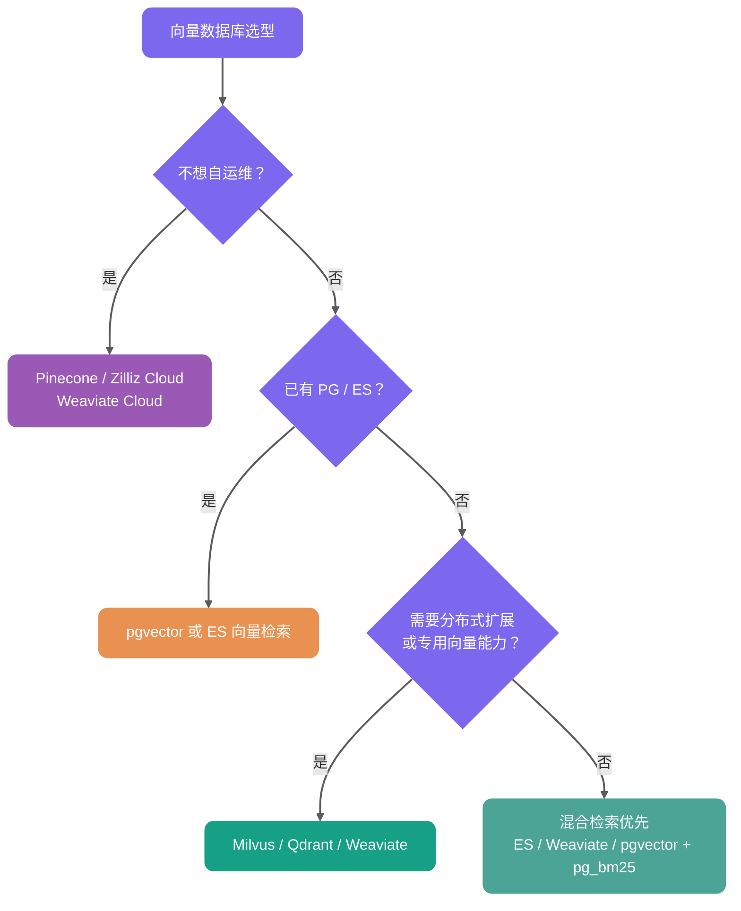
```mermaid
flowchart TB
    classDef gateway fill:#7B68EE,color:#FFFFFF,stroke:none,rx:10,ry:10
    classDef primaryDB fill:#E99151,color:#FFFFFF,stroke:none,rx:10,ry:10
    classDef search fill:#16A085,color:#FFFFFF,stroke:none,rx:10,ry:10
    classDef infra fill:#9B59B6,color:#FFFFFF,stroke:none,rx:10,ry:10
    classDef success fill:#4CA497,color:#FFFFFF,stroke:none,rx:10,ry:10

    Start["向量数据库选型"]:::gateway
    Ops{"不想自运维？"}:::gateway
    Cloud["Pinecone / Zilliz Cloud<br/>Weaviate Cloud"]:::infra
    Existing{"已有 PG / ES？"}:::gateway
    ExistingStack["pgvector 或 ES 向量检索"]:::primaryDB
    Scale{"需要分布式扩展<br/>或专用向量能力？"}:::gateway
    Pro["Milvus / Qdrant / Weaviate"]:::search
    Hybrid["混合检索优先<br/>ES / Weaviate / pgvector + pg_bm25"]:::success

    Start --> Ops
    Ops -->|是| Cloud
    Ops -->|否| Existing
    Existing -->|是| ExistingStack
    Existing -->|否| Scale
    Scale -->|是| Pro
    Scale -->|否| Hybrid

    linkStyle default stroke-width:2px,stroke:#333333,opacity:0.8
```

选型时先看现有技术栈和业务约束：

- 已有 PostgreSQL，并且单机资源、写入吞吐、过滤查询和延迟能够满足评测目标，可以先用 pgvector。
- 已有 Elasticsearch / OpenSearch，且业务强依赖关键词、分词、高亮和聚合，可以复用其向量检索并组合 BM25。
- 需要分布式扩展、独立资源隔离、多租户或更多专用索引能力时，再评估 Milvus、Qdrant、Weaviate。
- 团队不准备自建集群时，可以比较 Pinecone、Zilliz Cloud、Weaviate Cloud 的价格、数据驻留和 SLA。

数据条数只能用于估算容量，不能单独决定产品。相同的一百万条向量，在维度、过滤比例、QPS、Top-K 和硬件不同的情况下，结果会相差很大。

### 你为什么选择 PostgreSQL + pgvector？

这里以 [《SpringAI 智能面试平台+RAG 知识库》](https://javaguide.cn/zhuanlan/interview-guide.html)项目为例。这个项目需要同时存结构化数据，比如简历、面试记录，也要存向量数据，也就是文档 Embedding。

方案对比如下：

| 方案 | 优点 | 主要代价 | 更适合的条件 |
|---|---|---|---|
| PostgreSQL + pgvector | 一套数据库管理，运维简单 | 向量负载会与业务查询争资源 | 已使用 PostgreSQL，实测延迟、召回和容量满足要求 |
| PostgreSQL + Milvus | 业务数据与向量负载分离 | 多一个组件，运维复杂度增加 | 需要独立扩展向量检索，同时保留 PostgreSQL 事务数据 |
| Pinecone / Zilliz Cloud | 托管服务，减少集群运维 | 成本、数据驻留和供应商依赖 | 团队更看重上线速度，并能接受对应合规与成本约束 |

选择 pgvector 的理由主要有几个。

第一，架构简单。不引入额外组件，部署和运维复杂度低。

第二，性能够用。HNSW 索引的速度和召回率能满足当前业务要求。

第三，事务一致性好。向量数据和业务数据在同一个数据库里，天然支持事务。

第四，SQL 查询方便。可以结合 `WHERE` 条件过滤，但要注意过滤条件可能影响向量索引命中，所以必须检查执行计划。

```
-- pgvector 余弦相似度搜索示例
-- <=> 是余弦距离运算符（0 = 完全相同，2 = 完全相反）
-- 余弦相似度 = 1 - 余弦距离
SELECT content, 1 - (embedding <=> $1) as cosine_similarity
FROM vector_store
WHERE metadata->>'category' = 'Java'
ORDER BY embedding <=> $1  -- 按距离升序，越小越相似
LIMIT 5;

-- ⚠️ 关键前提：查询时使用的距离运算符必须与创建 HNSW 索引时指定的
-- operator class（例如 vector_cosine_ops）严格保持一致，否则查询将
-- 无法命中索引，直接退化为全表扫描。
-- 验证方式：EXPLAIN ANALYZE 检查执行计划是否包含 Index Scan。
```

### pgvector 实践细节有哪些？

pgvector 的核心不是"能不能存向量"，而是索引、距离度量和查询语句必须配套。

#### HNSW 索引创建示例

```
-- embedding 类型示例：vector(1536)
CREATE INDEX idx_document_embedding_hnsw
ON document_chunk
USING hnsw (embedding vector_cosine_ops)
WITH (m = 16, ef_construction = 64);
```

如果查询用的是 `<=>` 余弦距离，索引就要使用 `vector_cosine_ops`。如果查询用 `<->`，索引就要改成 `vector_l2_ops`。

#### IVFFLAT 索引创建示例

```
CREATE INDEX idx_document_embedding_ivfflat
ON document_chunk
USING ivfflat (embedding vector_cosine_ops)
WITH (lists = 100);

-- 查询时控制扫描多少个聚类桶
SET ivfflat.probes = 10;
```

IVFFLAT 需要先有一定数据量再建索引，因为它要先聚类。pgvector 文档给出的起步建议是：数据不超过 100 万行时可先取 `rows / 1000`，超过 100 万行时可先取 `sqrt(rows)`；这只是初始值，仍要用业务数据调优。`probes` 越大，通常召回率越高，查询也越慢。

#### 索引维护

大量删除或更新后，向量索引可能出现膨胀、无效数据累积，甚至召回和延迟波动。可以在业务低峰期做 `VACUUM`、`REINDEX`，同时观察执行计划和业务评测集。

`VACUUM` 仍然重要，但它不是万能的召回率修复工具。向量索引的健康状况，要通过查询延迟、召回率评测和执行计划一起看。

每次调整距离运算符、operator class、过滤条件或索引参数后，都要用 `EXPLAIN ANALYZE` 检查是否命中索引。

#### 版本特性

- pgvector 0.5+ 支持 HNSW 索引。
- pgvector 0.7+ 增加了 halfvec、sparsevec、bit 等类型和更多距离能力，适合进一步压缩存储或处理稀疏向量。
- pgvector 0.8.0+ 支持 iterative index scans，可以在过滤后结果不足时继续扫描更多索引，缓解 Top-K 不足问题。生产环境建议固定版本，升级前跑回归评测。

### 为什么不选择 MySQL 搭配向量数据库？

PostgreSQL 在这类场景里最大的优势，是扩展能力强。开发者可以在不改数据库内核的情况下，通过扩展补齐很多能力。

比如：

- AI 向量检索：pgvector 扩展，和 PostgreSQL 原生生态结合紧密，支持 ACID、JOIN、备份恢复和 SQL 过滤，适合中小规模、希望简化技术栈的 RAG 项目。
- 全文搜索：内置 tsvector 能满足基础需求，更高级的可以考虑 pg_bm25。
- 时序数据：TimescaleDB。
- 地理信息：PostGIS。

这种"一套 PG 承担多种基础能力"的模式，对中小规模项目很友好。先用 PostgreSQL 简化技术栈，等数据规模、QPS、多租户隔离要求继续上升，再拆出 Elasticsearch、Milvus、Qdrant、Weaviate 等专业组件，会更稳。

MySQL 这边要分版本看。MySQL 8.x 系列，包括 8.4 LTS，没有官方 `VECTOR` 数据类型。MySQL 9.x 已经引入 `VECTOR` 数据类型和相关函数，但从官方能力看，它更偏向向量存储和基础函数支持，还不是成熟的生产级 ANN 检索方案。

如果项目已经深度绑定 MySQL，可以继续用 MySQL 存业务数据，再搭配 pgvector、Milvus、Qdrant、Weaviate、Elasticsearch / OpenSearch 等外部向量检索组件。没必要为了 RAG 强行把所有东西塞进 MySQL。

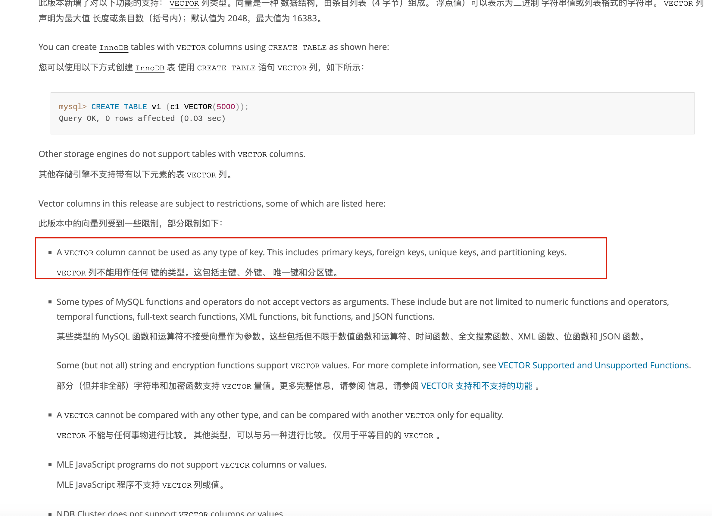

关于 MySQL 和 PostgreSQL 的详细对比，可以参考：[MySQL vs PostgreSQL，如何选择？](https://mp.weixin.qq.com/s/APWD-PzTcTqGUuibAw7GGw)

### 第三部分小结

向量存储和向量索引是 RAG 系统绕不开的基础设施。选型选错了，后面很容易变成"检索慢、召回差、成本高"。

没有专门向量索引时，大规模高维向量 Top-K 检索通常只能全表扫描。ANN 索引通过牺牲一点精确性，在召回率、延迟和资源消耗之间做工程取舍。

主流索引算法里，Flat 是暴力搜索，适合小规模、低 QPS、离线评测和召回基准；HNSW 是图索引，查询快、召回高，但内存消耗大；IVFFLAT 是倒排聚类，内存更友好、构建较快，但需要调参并接受一定召回损失；IVF-PQ 通过乘积量化支持海量数据，但会带来精度损失。

HNSW 更适合低延迟和高召回，IVFFLAT 更适合内存和构建成本敏感的场景。数据库选型上，PostgreSQL + pgvector 适合中小规模，Milvus、Qdrant、Weaviate 更适合大规模或专业向量检索，Pinecone、Zilliz Cloud 适合低运维场景。

动手时建议先把 HNSW 的图结构、IVF 的聚类原理理解清楚，再用 pgvector 或 Milvus 搭一个最小 Demo，比较不同索引参数下的召回率和延迟。`ef_search`、`nprobe` 这些参数不要凭感觉调，最好拿真实业务问题做评测。

### 第三部分面试题

- 什么是 Embedding？为什么需要把文本转成向量？
- RAG 场景为什么需要向量数据库？
- 余弦相似度和欧氏距离有什么区别？RAG 场景下用哪个？
- ANN 算法为什么可以接受不是 100% 精确的结果？
- 有哪些向量索引算法？各自优缺点是什么？
- HNSW 和 IVFFLAT 有什么区别？
- HNSW 的 ef_search 参数怎么调？调大和调小分别会怎样？
- 向量数据库和传统数据库最核心的区别是什么？
- 如果向量数据从 100 万增长到 1 亿，架构上需要做什么调整？
- pgvector 的 HNSW 索引在什么情况下会失效或退化为更慢的扫描？
- 为什么选择 PostgreSQL + pgvector？

---

## 第四部分 知识库更新与一致性

> 本章整理自：[JavaGuide - RAG 知识库文档更新策略](https://javaguide.cn/ai/rag/rag-knowledge-update.html)

### 导读

前三部分把 RAG 从原理讲到了索引构建，这一部分解决的是**系统上线之后的问题**：文档更新了，索引如何跟上？很多团队在第一个企业知识库 RAG 系统上线后会碰到一个很真实的问题：文档明明更新了，回答还是老样子。

这时候先别急着怪 LLM。更常见的原因是知识库没有同步更新，或者更新链路只做了"写入新内容"，没有处理旧版本、权限、索引一致性这些细节。

文档变更频繁之后，问题会更明显：每次都全量重建索引，成本和耗时扛不住；只更新变化部分，又怕漏掉旧块；只插入新向量，不清理旧版本，过期内容还会继续被召回；换了 Embedding 模型，历史数据到底要不要全部重索引，也绕不开。

知识库更新要同时处理版本、权限和多个索引之间的一致性。本章沿着新增、修改、删除三类事件，说明增量同步、全量重建、灰度、回滚和监控怎么配合。

### 知识库更新要解决哪些问题？

在讲具体方案之前，先把目标说清楚。

更新完成后，检索结果要与当前文档一致，不能越权；同步失败时还要能定位到具体文档和写入端，并能恢复到上一版索引。

**动态性**指的是，文档变了，索引要能跟上。这个"及时"不一定都是秒级，可能是分钟级，也可能是天级，取决于业务对实时性的要求。内部制度库也许一天同步一次就够，客服知识库和合规条款就可能需要更快。

**准确性**指的是，更新后召回的内容要和当前文档一致，不能文档已经改了，模型还在引用旧版本。这个问题一旦发生，用户感知会很明显。

**一致性**更麻烦。同一个文档有不同版本，向量库、元数据库、全文检索又是不同系统，任何一端漏写或延迟，都可能导致结果不一致。

**可回滚**是为了出故障时能快速切回上一个健康状态，而不是靠人工临时修数据。**可观测**则要求更新过程能监控，更新结果能评估，失败原因能追到具体环节。

这些目标看起来像常识，但很多项目只做了第一步"更新"，后面几步全靠运气。结果就是文档改了十版，回答还停在第一版；删了一篇敏感文档，过了几个月还能被召回出来。

### 为什么 Embedding 模型必须保持一致？

这一点要单独拎出来讲：索引时用的 Embedding 模型，必须和查询时用的模型一致。

Embedding 模型会把文本转成向量，不同模型的向量空间并不通用。同一句话用 OpenAI 的 `text-embedding-3-small` 编码，和用 sentence-transformers 的 `all-MiniLM-L6-v2` 编码，得到的向量没有可比性。如果索引用模型 A，查询用模型 B，就等于在两个不同空间里算相似度。

具体表现还要看向量维度。如果维度不同，通常无法放进同一个索引，很多向量库会直接拒绝插入或查询。如果维度相同但模型不同，相似度分数也不具备可比性，召回结果不能信。它不是简单的"随机"，而是整个排序基础已经坏了。

生产里最容易忽视的有两个场景。

**第一个是模型升级。** 业务方觉得新模型效果更好，想从 `text-embedding-3-small` 切到 `text-embedding-3-large`。这意味着历史数据必须重新编码、重新入索引。工程上可以用双索引并行和灰度切流降低风险，但重建这一步绕不过去。

**第二个是本地模型和 API 模型混用。** 测试环境用本地 sentence-transformers，生产环境用 OpenAI API。这种差异在团队协作里特别常见，测试看起来正常，上线后召回率直接腰斩。

比较稳的做法是把 Embedding 模型信息写进元数据，每次查询时都校验模型版本。不匹配时，要么拒绝查询，要么打警告日志并降级到更保守的召回策略。

| 字段 | 说明 | 示例 |
|---|---|---|
| `embedding_model` | 模型名称 | `text-embedding-3-large` |
| `embedding_model_version` | 模型版本 | `2025-01-15` |
| `embedding_dimension` | 向量维度 | `3072` |

当 Embedding 模型需要升级时，建议按下面的流程走：

1. 在新索引中用新模型重建所有数据。
2. 新旧索引并行运行一段时间，对比召回率和回答质量。
3. 确认新索引稳定后，通过索引别名把流量切到新索引。
4. 保留旧索引一段时间，用于快速回滚。
5. 确认没有问题后，再删除旧索引。

这个思路和数据库蓝绿部署很像：不要原地改，先建一套新的，验证通过后再切。

### 如何设计支持更新的元数据体系？

好的元数据设计，是增量更新和回滚的前提。很多 RAG 系统跑着跑着会"失忆"，不是因为不知道文档内容，而是不知道这条向量对应哪个文档、哪个版本、什么时候入库、权限是什么。

每个 Chunk 至少应该带上这些元数据：

```
{
  "doc_id": "doc-uuid-001",
  "chunk_id": "chunk-uuid-001",
  "content_hash": "sha256:abc123...",
  "version_id": 3,
  "chunk_strategy": "semantic",
  "chunk_size": 512,
  "chunk_overlap": 50,
  "source_id": "confluence-page-123",
  "source_type": "confluence",
  "title": "订单中心接口文档",
  "section_path": "技术文档 / 订单系统 / 接口规范",
  "page": 5,
  "tenant_id": "tenant-001",
  "acl": ["role:admin", "team:order-team"],
  "created_at": "2025-03-01T10:00:00Z",
  "updated_at": "2025-04-15T14:30:00Z",
  "embedding_model": "text-embedding-3-large",
  "embedding_model_version": "2025-01-15",
  "embedding_dimension": 3072,
  "is_deleted": false
}
```

切分策略也要版本化。切分方式、重叠率、解析方式一旦变化，影响不比 Embedding 模型小，也应该触发重建或双索引灰度。记录 `chunk_strategy`、`chunk_size`、`chunk_overlap` 这些字段，后面做评估和回滚才有依据。

`content_hash` 是增量更新的核心。它不是文件哈希，而是文档正文或 Chunk 内容的哈希。常见算法有几种：MD5 速度快，但有碰撞风险，适合对碰撞不敏感的场景；SHA-256 碰撞风险极低，更推荐生产使用；SimHash 适合判断内容是否大致相同，常用于网页去重，但不能精确定位具体变化点。

生产环境里，`content_hash` 主要用来判断"这段文本有没有变"。入库时计算哈希，和数据库里已有记录对比。如果一致，说明内容没变，可以跳过 Embedding；如果不一致，就要重新编码。

`version_id` 记录文档修改次数。每次文档更新，`version_id` 加一。它配合 `content_hash` 使用，可以追踪变更历史，也方便回滚。

`is_deleted` 是软删除标记。只从向量库删除记录而不在元数据库保留删除状态，会让审计、恢复和跨索引同步失去依据。收到删除事件时，可以先把 `is_deleted` 设为 `true`；重新上传时创建新版本或恢复记录，并重新计算 `content_hash`；查询时默认只保留 `is_deleted = false` 的记录。

软删除不只是为了区分新旧文档，它还给审计、误删恢复、延迟物理删除、跨系统一致性留了缓冲窗口。

`tenant_id` 和 `acl` 是多租户和权限控制的基础。所有会进入模型上下文的内容都必须先通过授权检查，通常在检索前或检索时按租户、角色、资源 ACL 过滤，避免无权限文档占用 Top-K 或泄露给模型。动态权限、跨组织继承等复杂规则可以在候选召回后再次校验，但二次校验必须发生在组装模型上下文之前；返回引用前还可以再核对一次，作为防御性检查。

### 新增、修改、删除文档如何同步？

文档从源系统到向量库，中间会经过多个环节。任何一环出问题，都会导致数据不一致。

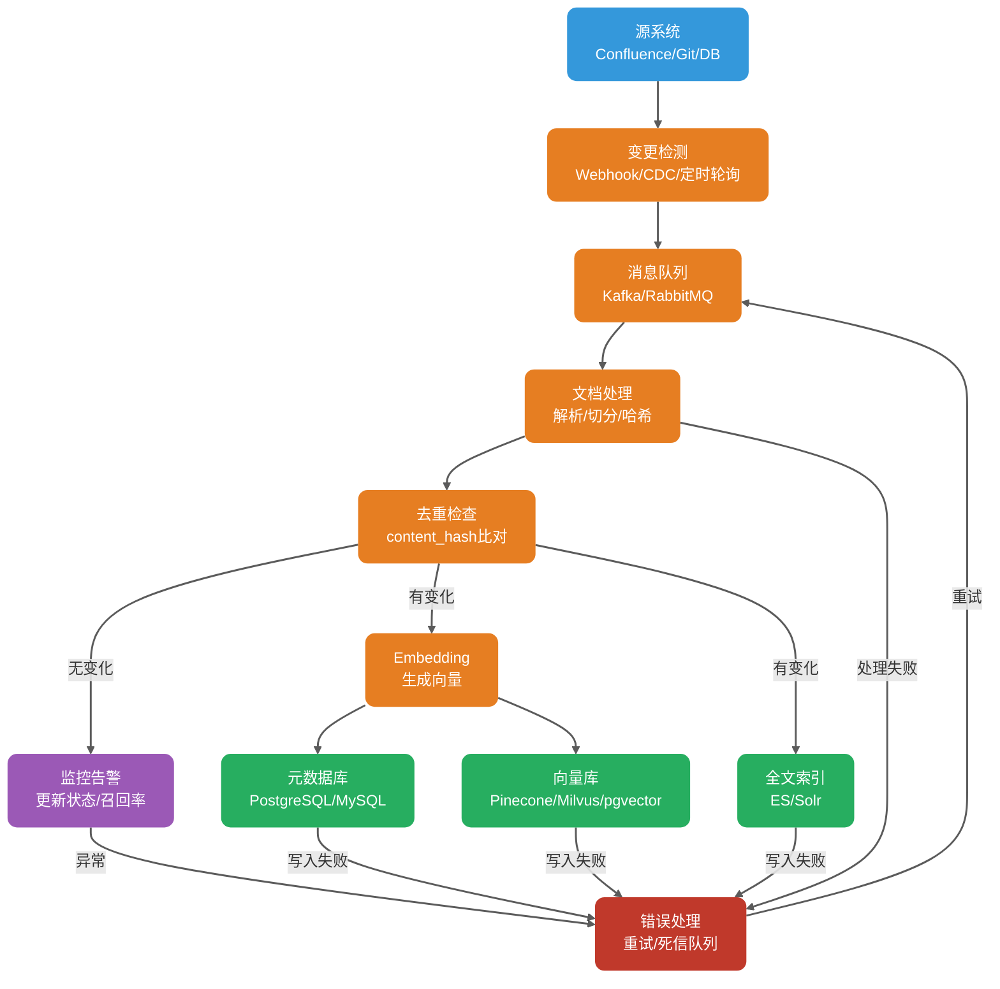
```mermaid
flowchart TD
    %% ========== 配色声明 ==========
    classDef source fill:#3498DB,color:#FFFFFF,stroke:none,rx:10,ry:10
    classDef process fill:#E67E22,color:#FFFFFF,stroke:none,rx:10,ry:10
    classDef storage fill:#27AE60,color:#FFFFFF,stroke:none,rx:10,ry:10
    classDef monitor fill:#9B59B6,color:#FFFFFF,stroke:none,rx:10,ry:10
    classDef error fill:#C0392B,color:#FFFFFF,stroke:none,rx:10,ry:10

    Source[源系统<br/>Confluence/Git/DB]:::source
    Detect[变更检测<br/>Webhook/CDC/定时轮询]:::process
    Queue[消息队列<br/>Kafka/RabbitMQ]:::process
    Process[文档处理<br/>解析/切分/哈希]:::process
    Dedup[去重检查<br/>content_hash比对]:::process
    Embed[Embedding<br/>生成向量]:::process
    Metadata[元数据库<br/>PostgreSQL/MySQL]:::storage
    Vector[向量库<br/>Pinecone/Milvus/pgvector]:::storage
    Fulltext[全文索引<br/>ES/Solr]:::storage
    Monitor[监控告警<br/>更新状态/召回率]:::monitor
    Error[错误处理<br/>重试/死信队列]:::error

    Source --> Detect
    Detect --> Queue
    Queue --> Process
    Process --> Dedup
    Dedup -->|无变化| Monitor
    Dedup -->|有变化| Embed
    Embed --> Metadata
    Metadata -->|写入失败| Error
    Embed --> Vector
    Vector -->|写入失败| Error
    Dedup -->|有变化| Fulltext
    Fulltext -->|写入失败| Error
    Process -->|处理失败| Error
    Error -->|重试| Queue
    Monitor -->|异常| Error

    linkStyle default stroke-width:2px,stroke:#333333,opacity:0.8
```

这里要特别注意部分成功。向量库、元数据库、全文索引通常不在同一个事务域，一次写三端很可能出现部分成功。更稳的做法是以元数据库作为 source of truth，记录每个 Chunk 的索引状态，比如 `index_status = 'ready' / 'partial_failed'`。后台补偿任务定期重试失败端，再通过 reconciliation 扫描差异。

#### 新增文档

新增是三类操作里最简单的。一般流程是：解析文档，提取正文、标题、层级结构；按既定策略切分 Chunk；计算每个 Chunk 的 `content_hash`；检查哈希是否已经存在；不存在时生成向量，并写入向量库、元数据库、全文索引。

幂等性很重要。新增操作必须能重复执行。即使消息队列重复投递同一条消息，或者 worker 崩溃重启后再次处理，也不应该产生重复记录。

#### 修改文档

修改比新增复杂，关键问题是旧版本数据怎么办。

需要避免查询同时看到两版内容，也要避免更新过程中暂时查不到任何版本。常见做法是先写入不可见的新版本，再原子切换活动版本：

1. 根据 doc_id 查询元数据库，记录当前活动版本和旧 chunk_id 列表。
2. 写入带新 version_id 的 Chunk、向量和全文索引，并保持 status = 'building'，不参与在线检索。
3. 校验三端写入结果后，在元数据库或索引别名中把活动版本原子切到新版。
4. 将旧版标记为删除，按保留策略异步清理。

如果向量库支持基于主键的原子更新，比如 Milvus 的 upsert，可以直接覆盖同一主键记录。但要注意，upsert 只能覆盖同一主键实体。如果文档重新切分后 Chunk 数量或 `chunk_id` 变化，仍然要按 `doc_id + version_id` 清理旧版本残留。

如果存储端不能原子替换整篇文档，就用 `active_version` 过滤、索引别名或双索引切换。直接先删旧记录再写新记录，会出现短暂的空窗；直接先写新记录但不做版本过滤，则可能同时命中新旧内容。

一个很常见的坑是只写新向量，不删旧向量。

如果文档修改 10 次后，向量库仍保留 10 个可检索版本，查询可能命中过时内容。修改流程必须停用旧版本，并按保留策略清理旧向量，否则知识库会持续失真。

#### 删除文档

删除可以分为软删除和物理删除。

软删除是把 `is_deleted` 标记设为 `true`。它便于保留变更历史和处理误删，但不适用于要求立即擦除数据的合规请求。

物理删除是从向量库、元数据库、全文索引和相关缓存中移除记录。软删除保留多久，要根据业务恢复目标、数据分类和合规要求确定，不能把固定天数当作通用默认值。

软删除方便恢复和审计，但会增加存储成本和过滤开销。物理删除更彻底，适合合规删除、敏感数据删除，但恢复成本高。生产上更常见的是"软删除 + 延迟物理删除 + 删除审计日志"。如果是敏感文档，还要清理 rerank 缓存、LLM 上下文缓存等旁路缓存。

删除还有一个隐蔽问题：权限变更后的"幽灵数据"。比如一篇文档原本所有员工可见，后来改成"仅高管可见"。如果向量库里的旧 `acl` 没更新，普通员工查询时可能仍然召回这篇文档。正确做法是权限变更触发文档重新索引，确保元数据里的 `acl` 是最新的。如果向量库支持原子更新 ACL 字段，也可以不重建向量，只更新元数据。

### 增量更新和全量重建各适合什么场景？

常见组合是用增量更新处理日常变化，在模型升级、切分策略迁移或严重数据不一致时执行全量重建。是否定期全量重建，要看索引实现、更新频率和一致性检查结果。

| 维度 | 增量更新 | 全量重建 |
|---|---|---|
| 触发条件 | 文档变更事件 | 定时任务或手动触发 |
| 覆盖范围 | 仅变化的文档 | 整个知识库 |
| 计算成本 | 低，只处理变化部分 | 高，需要处理全部数据 |
| 更新延迟 | 低，可近实时 | 高，可能需要数小时 |
| 数据一致性 | 依赖变更检测准确性 | 需基于源系统快照或版本时间戳保证与源系统一致 |
| 适用场景 | 日常变更、高频更新 | 模型升级、策略调整、故障恢复 |
| 主要风险 | 变更漏检导致数据陈旧 | 占用额外算力和存储；切换方案不完整时影响服务 |

#### 增量更新适合什么场景？

增量更新适合文档变更频率适中、对实时性有要求、知识库规模较大的场景。比如每天几十到几百次文档变更，业务能接受分钟级同步，全量重建成本又比较高。

增量更新依赖变更检测机制。常见方案有三种：

1. Webhook / 事件驱动：源系统，比如 Confluence、Git、数据库，主动提供变更通知，RAG 系统订阅并处理。延迟最低，但要求源系统支持。
2. CDC（Change Data Capture）：监听数据库 binlog 或变更日志，捕获数据变化。适合结构化数据源。
3. 定时轮询：按固定间隔，比如每 5 分钟扫描源系统，对比 updated_at 时间戳。实现简单，但有延迟，也会给源系统带来压力。

生产里更稳的是事件驱动 + 轮询兜底。事件驱动处理日常增量，轮询用来防漏检。中间加消息队列，比如 Kafka、RocketMQ，用来解耦源系统和 RAG 处理流程。

#### 全量重建适合什么场景？

全量重建通常用于这些情况：

- Embedding 模型升级。这是硬需求，绕不过去。
- Chunk 策略调整。比如从固定 500 Token 改成语义切分。可以全量重建，也可以用版本化索引逐批迁移，但同一评测和检索链路要能区分策略版本。
- 数据结构变更。比如新增或修改元数据字段。
- 严重故障恢复。增量链路长期失灵，数据已经明显陈旧。
- 定期健康维护。部分向量库在高频删除后会留下 tombstone 删除标记、索引碎片，甚至出现召回退化。具体表现和索引类型、产品实现有关，比如基于 HNSW + tombstone 清理机制的产品，最好查对应向量库文档确认。

全量重建最怕服务中断。比较稳的做法是索引别名切换：

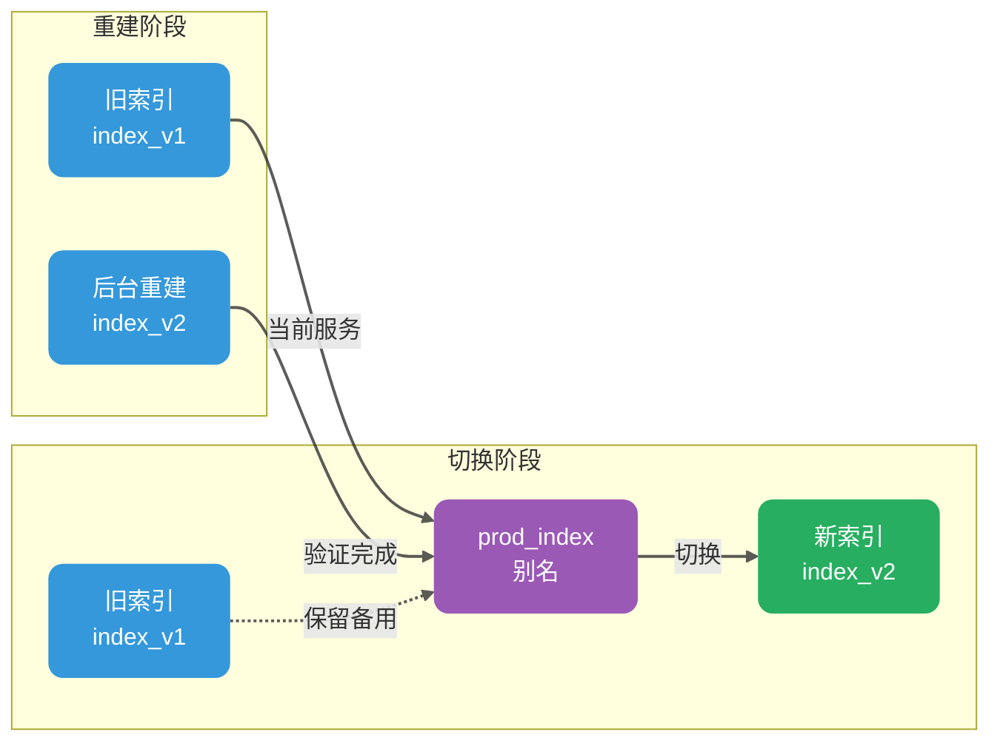
```mermaid
flowchart LR
    %% ========== 配色声明 ==========
    classDef alias fill:#9B59B6,color:#FFFFFF,stroke:none,rx:10,ry:10
    classDef index fill:#3498DB,color:#FFFFFF,stroke:none,rx:10,ry:10
    classDef active fill:#27AE60,color:#FFFFFF,stroke:none,rx:10,ry:10

    subgraph Build["重建阶段"]
        Old[旧索引<br/>index_v1]:::index
        BuildProcess[后台重建<br/>index_v2]:::index
    end

    subgraph Switch["切换阶段"]
        Alias["prod_index<br/>别名"]:::alias
        New[新索引<br/>index_v2]:::active
        Old2[旧索引<br/>index_v1]:::index
    end

    Old -->|当前服务| Alias
    BuildProcess -->|验证完成| Alias
    Alias -->|切换| New
    Old2 -.->|保留备用| Alias

    linkStyle default stroke-width:2px,stroke:#333333,opacity:0.8
```

步骤大致是：

1. 查询服务通过索引别名 prod_index 访问，旧索引是 index_v1。
2. 后台启动重建任务，构建新索引 index_v2。
3. 新索引验证通过后，把别名 prod_index 指向 index_v2。Milvus / Zilliz 的 alias 机制支持在 collection 间切换，其他向量库是否有同等能力要单独确认。
4. 保留旧索引 index_v1 一段时间，比如 7 天，用于快速回滚。
5. 确认没问题后，删除旧索引。

#### 生产环境的稳态策略

增量链路通过 Webhook 或 CDC 捕获日常变更，轮询和 reconciliation 用来发现漏写、漏删和乱序。全量重建按需触发：模型升级、索引策略迁移或一致性检查持续失败时再执行。部分系统会安排周期性重建，但周期要根据索引实现、删除比例、重建成本和一致性指标确定，不能统一按周或按月设置。

### 如何让更新链路稳定可靠？

#### 幂等更新：消息队列的好搭档

消息队列天然会有重复投递。网络抖动、consumer 崩溃重启、offset 没提交，都可能导致同一条消息被重复消费。

幂等更新的重点是去重依据。比较可靠的是基于 `doc_id + content_hash` 或 `doc_id + version_id` 做唯一约束。但要注意，并发场景下，简单"先查再写"不够安全，两条相同或乱序消息同时到达时，仍然可能互相覆盖或重复写入。

更稳的做法有几种：

1. 依赖唯一约束：以 doc_id + content_hash 或 doc_id + version_id 建唯一索引，插入时让数据库拒绝重复。
2. 乐观锁 / 分布式锁：写入新版本前先拿锁，防止并发覆盖。
3. 事务 outbox：变更事件先写入 outbox 表，再由消费者幂等处理。

下面的示例在唯一约束之外增加了索引状态。`index_status` 可以取 `pending`、`processing`、`partial_failed` 和 `ready`；`claim_token` 与 `claimed_at` 用于防止多个消费者同时处理同一条记录，并允许超时任务被接管。

```
from uuid import uuid4

def process_document_change(event):
    doc_id = event['doc_id']
    content = event['content']
    version_id = event.get('version_id', 1)
    chunk_hash = compute_hash(content)

    # 使用完整内容哈希，避免前缀相同的不同内容发生碰撞
    chunk_id = f"{doc_id}_{version_id}_{chunk_hash}"

    # 重复事件不会创建新记录；失败记录仍可从原状态继续处理
    db.execute("""
        INSERT INTO chunks (
            doc_id, chunk_id, content_hash, version_id, is_deleted, index_status
        )
        VALUES (
            :doc_id, :chunk_id, :content_hash, :version_id, false, 'pending'
        )
        ON CONFLICT (doc_id, chunk_id) DO NOTHING
    """, {
        'doc_id': doc_id,
        'chunk_id': chunk_id,
        'content_hash': chunk_hash,
        'version_id': version_id
    })

    claim_token = str(uuid4())
    claimed = db.fetch_one("""
        UPDATE chunks
        SET index_status = 'processing',
            claim_token = :claim_token,
            claimed_at = CURRENT_TIMESTAMP
        WHERE doc_id = :doc_id
          AND chunk_id = :chunk_id
          AND (
              index_status IN ('pending', 'partial_failed')
              OR (
                  index_status = 'processing'
                  AND claimed_at < CURRENT_TIMESTAMP - INTERVAL '10 minutes'
              )
          )
        RETURNING chunk_id
    """, {
        'doc_id': doc_id,
        'chunk_id': chunk_id,
        'claim_token': claim_token
    })

    # 没有抢到任务，说明记录已完成或仍由另一个消费者处理
    if claimed is None:
        logger.info(f"Doc {doc_id} is ready or being processed, skipping")
        return

    try:
        # upsert 必须以 chunk_id 为幂等键，重复执行不会产生多份向量
        embedding = embedding_model.encode(content)
        vector_db.upsert(doc_id, chunk_id, embedding, {
            'doc_id': doc_id,
            'content_hash': chunk_hash,
            'version_id': version_id,
            'updated_at': now()
        })

        db.execute("""
            UPDATE chunks
            SET index_status = 'ready',
                claim_token = NULL,
                claimed_at = NULL
            WHERE doc_id = :doc_id
              AND chunk_id = :chunk_id
              AND claim_token = :claim_token
        """, {
            'doc_id': doc_id,
            'chunk_id': chunk_id,
            'claim_token': claim_token
        })
    except Exception as e:
        db.execute("""
            UPDATE chunks
            SET index_status = 'partial_failed',
                claim_token = NULL,
                claimed_at = NULL
            WHERE doc_id = :doc_id
              AND chunk_id = :chunk_id
              AND claim_token = :claim_token
        """, {
            'doc_id': doc_id,
            'chunk_id': chunk_id,
            'claim_token': claim_token
        })
        logger.error(f"Failed to process {doc_id}: {e}")
        raise
```

唯一约束负责去重，条件更新负责原子抢占任务，`partial_failed` 则让后续重试可以继续写向量。这里使用 PostgreSQL 风格的 `RETURNING` 获取抢占结果，避免依赖不同数据库驱动行为不一致的 `rowcount`。如果业务数据库和向量数据库无法放进同一事务，向量写入必须按 `chunk_id` 幂等；即使向量已经写入、状态更新却失败，重试也可以安全地再次 `upsert`。生产环境还需要由定时任务扫描超过租约时间的 `processing` 记录。

#### 乱序事件处理

消息队列的投递顺序不一定总是符合预期。RAG 更新链路里，先收到 v3 再收到 v2 很常见。如果不处理乱序，旧版本就可能覆盖新版本。

通常要做几件事：

1. 每个文档事件携带 source_version、updated_at 或单调递增的 revision，用于判断新旧。
2. 写入前校验 event.version >= current_version，旧事件直接丢弃或写入审计日志。
3. 对同一 doc_id 做分区有序消费，比如 Kafka key 使用 doc_id，保证同一文档的消息落在同一 partition。
4. 对乱序丢弃做监控打点，方便发现源系统事件异常。

#### 失败重试和死信队列

处理链路的任何环节都可能失败：网络抖动、API 限流、向量库暂时不可用、解析器异常，都会发生。

比较稳的策略是指数退避重试 + 死信队列兜底。

```
def process_with_retry(event, max_retries=3):
    # max_retries 表示首次尝试失败后，最多再重试多少次
    for attempt in range(max_retries + 1):
        try:
            process_document_change(event)
            return  # 成功，直接返回
        except TransientError as e:
            if attempt == max_retries:
                break
            wait_time = 2 ** (attempt + 1)  # 指数退避：2s, 4s, 8s
            logger.warning(f"Attempt {attempt + 1} failed: {e}, retrying in {wait_time}s")
            time.sleep(wait_time)
        except PermanentError as e:
            # 永久性错误（如格式错误），不重试，直接打入死信队列
            logger.error(f"Permanent error, sending to DLQ: {e}")
            dlq.send(event, reason=str(e))
            return

    # 超过最大重试次数，打入死信队列并告警
    logger.error(f"Max retries exceeded for {event['doc_id']}")
    dlq.send(event, reason="max_retries_exceeded")
    alert.trigger(f"Document update failed after {max_retries} retries: {event['doc_id']}")
```

错误分类很重要。网络超时、API 限流这类瞬时错误可以重试；格式错误、字段缺失这类永久错误不应该反复重试，重试多少次都不会成功，只会浪费资源。

死信队列里的消息不能一直堆着。建议定期 Review，比如每周看一次，修复原因后再重新投递。

#### 回滚机制：出问题时的应急通道

回滚不是后悔药，而是应急通道。好的回滚机制应该让操作者能快速切回上一个健康状态。

索引别名切换的回滚最简单。别名切换后，如果新索引有问题，把别名指回旧索引即可。前提是旧索引还没删。

模型升级的回滚，要在升级前记录旧模型的 `model_name`、`model_version` 和对应索引。如果新模型表现异常，优先把模型与索引一起切回旧版本；旧索引已经清理时，才需要基于旧模型重建。

数据版本回滚可以利用 `updated_at` 和 `version_id` 字段。需要回滚到某个时间点时，从历史快照恢复。快照可以是向量库 snapshot，也可以放在独立对象存储里。

权限回滚要更谨慎。如果权限变更导致数据泄露，第一步不是慢慢修索引，而是立刻阻断影响范围：下线相关知识库或租户检索入口、禁用问题索引、强制引用前鉴权。只有无法界定影响面时，才考虑全局停服。

```
def rollback_to_version(target_version_id):
    # 查询目标版本的快照
    snapshot = get_snapshot(version_id=target_version_id)
    if not snapshot:
        raise ValueError(f"No snapshot found for version {target_version_id}")

    # 停止服务
    service.set_status('maintenance')

    # 恢复快照
    vector_db.restore(snapshot)

    # 重启服务
    service.set_status('active')

    # 发送告警
    alert.trigger(f"System rolled back to version {target_version_id}")
```

#### 灰度发布：新策略先小流量验证

知识库更新策略也要像 APP 发布一样灰度，不要一把梭。

常见灰度方式有几种：按文档数量灰度，比如先更新 10% 文档；按用户灰度，比如先让 5% 用户看到新索引结果；按问题类型灰度，比如先验证精确查询这类对索引变化更敏感的问题。

灰度期间要重点盯这些指标。下面的阈值只是示例，生产环境要基于历史基线、离线评估集和线上 A/B 结果校准，不能直接照抄。

| 指标 | 含义 | 告警阈值 |
|---|---|---|
| `retrieval_hit_rate@10` | 前 10 个召回结果中包含正确答案的比例 | 下降 > 5% |
| `avg_answer_latency` | 平均回答延迟 | 上升 > 20% |
| `citation_accuracy` | 引用准确性 | 下降 > 3% |
| `user_feedback_negative_rate` | 用户负面反馈率 | 上升 > 2% |

任何一个关键指标触发告警，都应该暂停灰度，先排查问题。别等全量上线后才发现召回质量掉了。

### 知识库更新有哪些常见坑？

#### 坑一：只插入新向量，不删除旧向量

这是最常见的问题。文档被修改 5 次，向量库里留下 5 个版本。用户查询时召回旧版本，模型基于过时信息回答。

解决思路很简单，但必须做：修改文档时同步处理旧向量。可以在写入新向量前，先根据 `doc_id` 清理旧记录。

#### 坑二：Embedding 模型混用

索引用模型 A，查询用模型 B，向量空间完全不兼容。

解决方式是把 `embedding_model` 和 `embedding_model_version` 作为必填元数据。查询前校验模型版本，不匹配就拒绝或降级。

#### 坑三：Chunk 策略变了，但历史数据不重建

从固定长度切分改成语义切分，从 500 Token 改成 800 Token，只对新文档生效，历史数据还是旧策略。这会导致一个知识库里混着多套切分逻辑，召回评估也会变得很乱。

解决方式是给 Chunk 策略加版本。可以全量重建，也可以先写入新版索引并逐批迁移旧文档，验证后再切换活动版本；不能让两套策略在没有版本标记的情况下混用。

#### 坑四：文档删除后仍被召回

软删除没做好，或者删除逻辑只处理了向量库，没处理全文索引。

删除操作必须三端一致：向量库、元数据库、全文索引都要同步处理。更稳的做法是用 outbox pattern 记录变更事件，消费者幂等执行；再通过定期 reconciliation 对比源系统、元数据库、向量库、全文索引，修复漏删、漏写和乱序事件。

#### 坑五：权限元数据不同步

文档权限从"公开"改成"仅管理员可见"，但向量库里的 `acl` 字段没更新。

权限变更必须触发文档重新索引。如果向量库支持原子更新 ACL 字段，可以只更新元数据而不重建向量，但前提是向量库有这个能力。

#### 坑六：变更检测漏检

Webhook 漏发、CDC 延迟、轮询间隔太大，都会导致文档已经变了，但索引没变。

解决方式是事件驱动 + 轮询兜底。同时建立数据新鲜度监控，定期检查源系统和向量库里的 `updated_at`。如果源系统时间比索引时间新超过阈值，就触发告警，必要时自动重新索引。

### 如何保证知识库更新的可观测性？

知识库更新链路必须有监控，否则就是盲跑。文档有没有更新、哪一步失败、失败后有没有补偿，不能靠用户投诉来发现。

关键监控指标可以从这些开始：

| 指标 | 说明 | 推荐告警阈值 |
|---|---|---|
| `index_lag_seconds` | 从文档变更到索引完成的时间 | > 5 分钟 |
| `failed_updates_total` | 失败的更新操作累计数 | > 0 持续 10 分钟 |
| `dlq_size` | 死信队列当前积压量 | > 100 |
| `retrieval_hit_rate` | 召回准确率 | 环比下降 > 5% |
| `stale_docs_count` | 陈旧文档数量，源系统已更新但索引未更新 | > 10 |
| `source_to_queue_lag_seconds` | 源系统变更到事件入队延迟 | > 1 分钟 |
| `queue_to_index_lag_seconds` | 事件入队到索引完成延迟 | > 5 分钟 |
| `index_success_rate` | 索引成功率 | < 99% |
| `partial_index_count` | 部分写入成功但未完成的文档数 | > 0 持续 30 分钟 |
| `acl_mismatch_count` | 源系统 ACL 与索引 ACL 不一致数量 | > 0 |

每次更新操作都应该记录审计日志，包括 `doc_id`、`change_type`（新增 / 修改 / 删除）、`timestamp`、`operator`（自动 / 手动）、`result`（成功 / 失败）、`error_message`。真正出问题时，这些字段能帮你快速定位是哪条记录、哪个环节、什么时候失败的。

### 上线检查

上线前要验证四件事：

1. 索引和查询使用同一套 Embedding 模型及版本；
2. 所有候选在进入模型上下文前完成鉴权；
3. 文档更新通过活动版本或别名原子切换；向量库、元数据库、全文索引和缓存的失败能够被补偿任务发现。
4. doc_id、content_hash、version_id、索引状态和审计日志应当贯穿这条链路。

### 第四部分小结

RAG 知识库更新不只是写一个定时任务重新索引。它涉及变更检测、数据一致性、幂等写入、版本控制、灰度发布、回滚机制和可观测性。

几个结论可以记住。

Embedding 模型一致性是硬规则。更换模型必须全量重建索引，不能偷懒。

元数据设计是增量更新的前提。`doc_id`、`content_hash`、`version_id`、`is_deleted` 这些字段，是幂等更新、版本追踪和回滚的基础。

删除操作必须三端一致。向量库、元数据库、全文索引都要同步处理，否则迟早会出现幽灵数据。

增量更新负责日常变化，全量重建负责周期性健康维护。两者配合起来，系统才不容易长期漂移。

索引别名切换是生产级灰度和回滚的常用做法。先建新索引，验证后切换，旧索引保留一段时间兜底。

幂等、重试、死信队列是更新链路可靠性的基本盘。可观测性则是最后一道防线：不知道更新有没有成功，就等于没更新。

RAG 知识库维护不是上线前做一次就结束，而是上线后才真正开始。

### 第四部分面试题

- 知识库更新要解决哪些问题？
- 为什么 Embedding 模型必须保持一致？模型升级怎么处理？
- 元数据体系怎么设计？`content_hash`、`version_id`、`is_deleted` 分别解决什么问题？
- 新增、修改、删除文档分别怎么同步？
- 增量更新和全量重建各适合什么场景？
- 怎么保证更新链路的幂等性？乱序事件怎么处理？
- 回滚机制有哪些？灰度发布怎么设计？
- 知识库更新有哪些常见坑？"幽灵数据"是什么？
- 知识库更新的可观测性怎么保证？

### 第四部分参考资料

- How to Update RAG Knowledge Base Without Rebuilding Everything
- RAG Knowledge Base Management: Updates & Refresh
- RAG in Practice: Versioning, Observability, and Evaluation in Production
- RAG in Production: Deployment Strategies & Practical Considerations
- 23 RAG Pitfalls and How to Fix Them
- Incremental Indexing Strategies for Large RAG Systems
- RAG Series: Embedding Versioning with pgvector

---

## 第五部分 GraphRAG：用图结构补充向量检索

> 本章整理自：[JavaGuide - GraphRAG 详解](https://javaguide.cn/ai/rag/graphrag.html)

### 导读

前四部分解决的是"把文档变成可检索的向量并持续维护"。但有一类问题，纯向量 RAG 很难回答："这几个部门过去半年反复提到的风险点是什么，它们之间有什么关联？"这类问题需要跨文档汇总部门、风险、项目、供应商和时间信息。Top-K 向量检索可以找出相似片段，但不会自动保存这些对象之间的关系。

GraphRAG 在检索链路中加入图结构，用实体、关系或主题摘要组织跨文档证据。是否值得引入，要看现有 RAG 的失败样本是否集中在多跳关系和全局归纳上。

### 什么是 RAG？


RAG（Retrieval-Augmented Generation，检索增强生成）就是把信息检索和生成式大语言模型结合起来的框架。

它的核心思想是：在让 LLM 回答问题或生成文本之前，先从数据库、文档集合、企业知识库等外部知识源中检索相关上下文，再把"原始问题 + 检索上下文"一起交给 LLM。这样可以让模型回答得更准确、更及时，也更符合特定领域知识。

传统 RAG 的检索对象通常是 Chunk，也就是一个个文本片段。它很适合回答"答案就在某几个片段里"的问题，比如制度问答、API 文档问答、知识库局部事实查询。

### 什么是 GraphRAG？

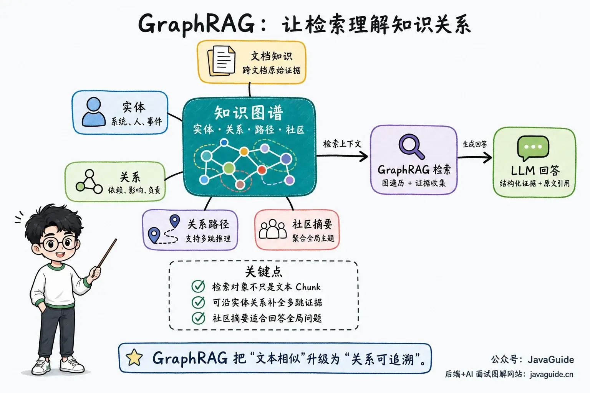

GraphRAG（Graph-based Retrieval-Augmented Generation）是一类把图结构用于检索增强的方案。系统可以把文档中的实体、关系和结构化上下文显式建模，查询时沿图关系收集证据，再交给大模型生成答案。

GraphRAG 是一个宽泛称呼，不同实现的索引和查询方式并不相同。社区摘要、Global Search、Local Search 和 DRIFT Search 主要来自 Microsoft GraphRAG 路线；以 Neo4j 为中心的实现也可以直接使用属性图、Cypher、全文和向量检索，不要求先生成社区摘要。

GraphRAG 会把节点、边、路径和社区摘要纳入检索上下文；图数据库只是承载这些数据的一种实现。

传统向量 RAG 检索的是 Chunk，也就是一个个文本片段。GraphRAG 检索的是一张"知识关系网"里的节点、边、路径、社区摘要，再结合原始文本证据回答问题。

打个比方：

- 向量 RAG 像在图书馆里按语义找几页相似内容。
- GraphRAG 像先整理出人物关系图、事件时间线和主题目录，再沿着关系线索找证据。

向量 RAG 擅长判断"这段话和我的问题像不像"，GraphRAG 更擅长理解"这些对象之间到底怎么连起来"。

### 传统向量 RAG 有什么局限性？

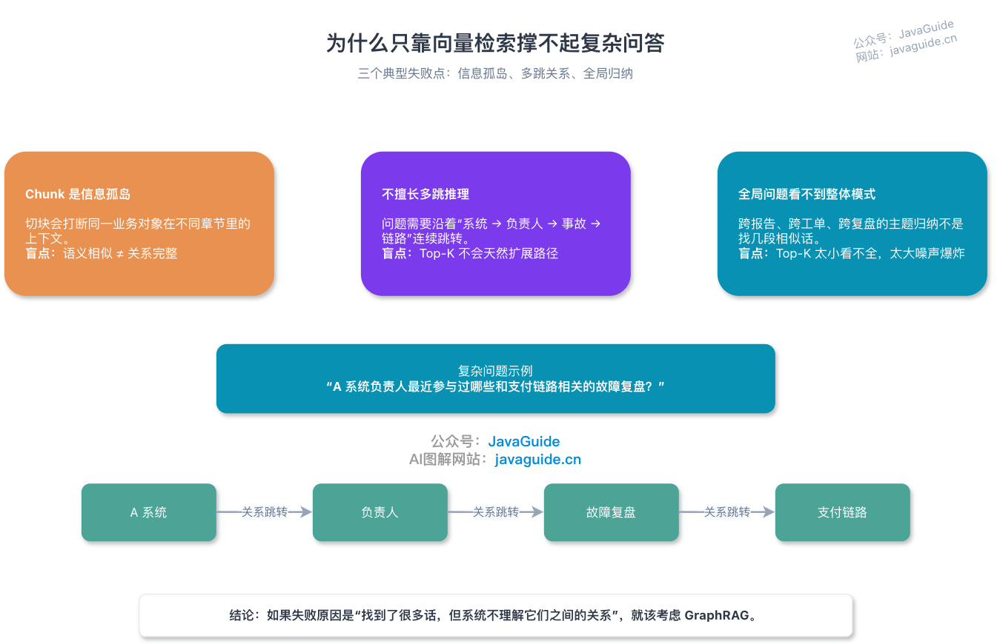

一次向量检索会把文档与问题编码到同一向量空间，再按相似度取回 Top-K Chunk，最后由 LLM 读取这些 Chunk。链路短，适合证据集中在少数片段中的问题，例如：

- "退款流程是什么？"
- "某个 API 的限流规则是多少？"
- "Spring AI 里怎么配置向量数据库？"

这类问题的关键约束通常和答案写在一起；召回到正确段落后，模型只需提取或整理。

跨文档问题则不同。负责关系、依赖链路、事故记录可能分别落在不同 Chunk，答案需要先把这些证据关联起来。

#### 1. Chunk 是信息孤岛

切块把长文档变成可检索单元，同时也会拆开跨章节的事实。以一个系统为例，定义、负责人、依赖的数据库和事故记录可能出现在不同章节；它们进入索引后不再共享明确的业务标识。

相似度可以把相关段落排到前面，却不表示这些段落已经被识别为同一系统的上下游证据。语义接近与关系完整是两件事。

#### 2. 向量相似度不擅长多跳推理

假设用户问：

> "A 系统的负责人最近参与过哪些和支付链路相关的故障复盘？"

回答这个问题要完成四次受约束的跳转：从 A 系统找到负责人，再定位该负责人参与的复盘，最后按支付链路过滤。

"A 系统说明"和"支付故障复盘"都可能被召回，但 Top-K 本身不会告诉检索器应沿着 `系统 -> 负责人 -> 复盘 -> 链路` 这条路径补齐证据。

#### 3. 全局性问题很难靠 Top-K 片段回答

还有一类问题更麻烦：

- "这批客户投诉主要集中在哪几类问题？"
- "过去一年公司知识库里反复出现的架构风险是什么？"
- "这几份报告背后共同指向的战略主题是什么？"

这类问题要求对语料做聚合与主题归纳，单次 Top-K 只能看到局部窗口：

- 召回片段太少，看不到整体模式。
- 召回片段太多，Token 成本和噪声一起爆炸。

扩大 Top-K、加入 rerank 或查询改写可以改善候选质量，但它们仍以片段排序为中心。关系链或全局主题缺少显式表示时，问题不会因候选数增多而自动消失。

### GraphRAG 和传统向量 RAG 的区别

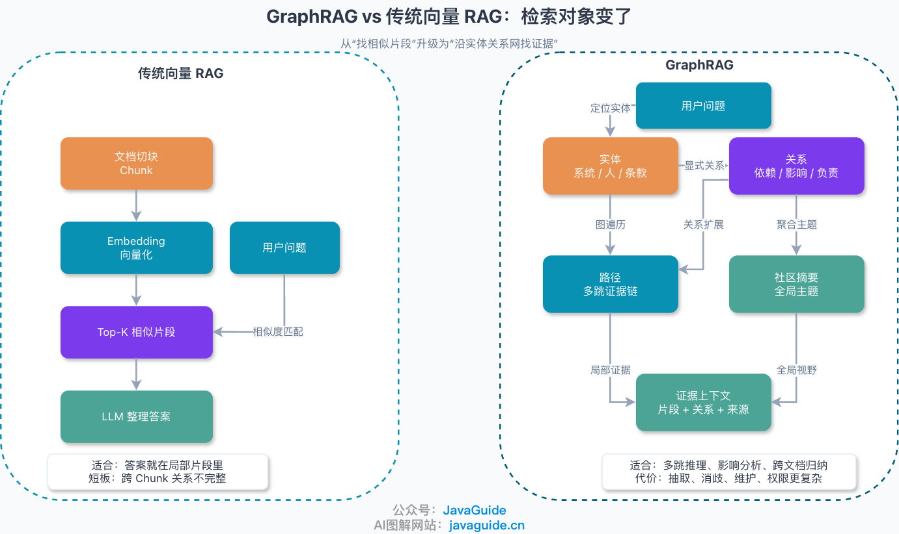

| 维度 | 传统向量 RAG | GraphRAG |
|---|---|---|
| 检索对象 | 文本 Chunk | 实体、关系、路径、社区摘要、原文片段 |
| 核心能力 | 语义相似度召回 | 关系推理、图遍历、全局主题聚合 |
| 数据结构 | 向量索引为主 | 知识图谱 + 向量索引 + 全文索引 |
| 适合问题 | 局部事实问答、文档片段解释 | 多跳关系问答、跨文档归纳、复杂业务分析 |
| 可解释性 | 主要依赖引用片段 | 可以展示节点、关系、路径和来源 |
| 构建成本 | 中等，重点是切块和 Embedding | 高，重点是抽取、消歧、建模、评测 |
| 查询延迟 | 通常较低 | 取决于图遍历、社区摘要和 LLM 调用次数 |
| 维护成本 | 更新 Chunk 和向量即可 | 还要维护实体、关系、社区和摘要 |
| 最大风险 | 召回片段不完整 | 图谱构建错误导致系统性误导 |

是否引入图结构，应从现有 RAG 的失败样本开始判断。关键词未命中、Chunk 被切断与实体多跳、全局归纳是不同问题，前两类通常先检查解析、切分和混合检索。

实体与关系抽取、消歧、图存储、摘要和增量更新都会引入额外工作。评估时在同一批语料上记录索引 Token、索引耗时、存储、查询 P95 和答案质量，再比较图检索是否改善目标问题。

如果面试官问"GraphRAG 和普通 RAG 有什么区别"，可以这样答：

> 普通向量 RAG 以文本 Chunk 为主要检索对象，适合局部事实问答。GraphRAG 额外保存实体、关系和主题结构：查询可以从语义命中点沿关系扩展，或读取社区摘要处理全局问题。相应地，实体消歧、关系抽取、增量更新和权限控制都成为系统的一部分。

如果继续追问"什么时候不用 GraphRAG"，可以补一句：

> 如果问题主要是简单文档问答，或者数据量小、关系不复杂，向量 RAG 加混合检索和 rerank 往往更划算。GraphRAG 应该用在向量 RAG 的 badcase 已经明确指向多跳关系、跨文档归纳和结构化约束的场景。

### GraphRAG 的核心概念

理解 GraphRAG，先把几个关键词拆开。

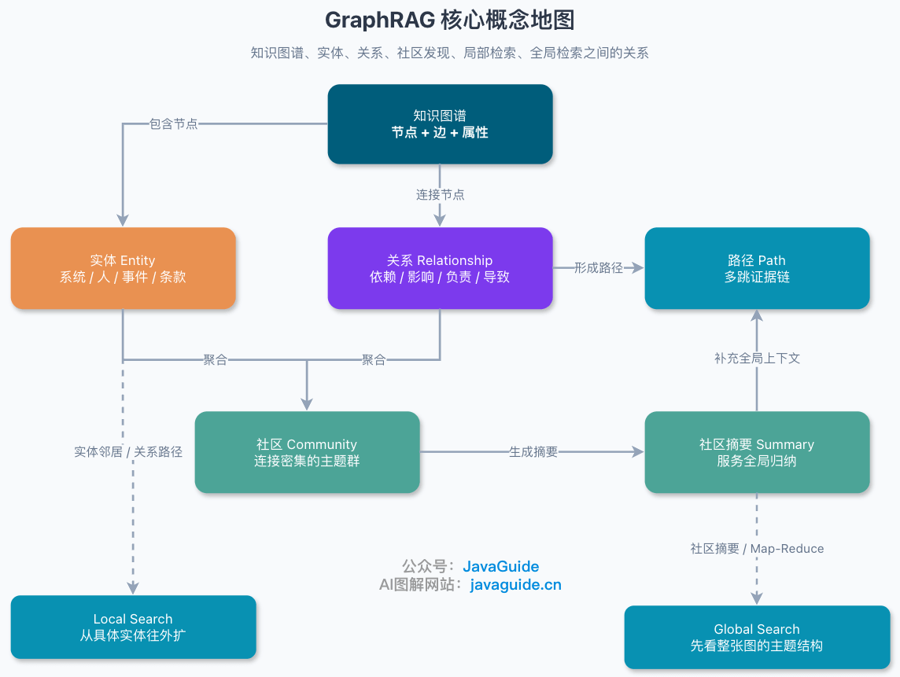

#### 知识图谱：把知识变成可遍历的关系网

知识图谱（Knowledge Graph）用节点和边表达实体、概念及其关系。

- 节点（Node）：表示实体或概念，比如用户、系统、订单、故障、供应商、政策条款。
- 边（Edge）：表示实体之间的关系，比如负责、依赖、影响、属于、导致、引用。
- 属性（Property）：挂在节点或边上的补充信息，比如时间、版本、置信度、来源文档。

举个例子：

```
用户服务 --依赖--> Redis 集群
Redis 集群 --发生过--> 连接池耗尽事故
连接池耗尽事故 --影响--> 下单接口
张三 --负责--> 用户服务
```

这几行关系放在图里之后，系统就能回答：

> "张三负责的系统最近有哪些影响下单链路的风险？"

向量 RAG 看到的是几段文字；知识图谱看到的是对象与对象之间的连接。

#### 实体：GraphRAG 的最小业务对象

**实体（Entity）** 是图谱里的核心节点。

在 GraphRAG 里，实体不一定是传统知识图谱里非常严格的"人名、地点、组织"。它也可以是：

- 一个业务系统，比如"订单中心"
- 一个技术组件，比如"Kafka 消费组"
- 一个规范条款，比如"数据脱敏要求"
- 一个风险主题，比如"权限绕过"
- 一个项目事件，比如"支付链路压测"

实体抽取得好不好，直接决定 GraphRAG 的上限。抽得太粗，图谱没有细节；抽得太碎，图谱里到处都是重复节点和噪声。

这一步很像做领域建模。工程实践中的几个要点：

- 用 JSON Schema 强约束抽取格式：避免自由文本解析，降低后处理成本。
- Few-shot 示例要覆盖正例、反例和边界例：告诉 LLM 什么不该抽。
- 设置最大实体数上限：防止 LLM 在长文本中过度抽取。
- 每个实体强制要求 `source_text_span` 字段：用于溯源和人工校验。

#### 关系：显式记录对象之间的联系

关系（Relationship）用于记录实体之间的依赖、影响、包含、负责等联系。

向量 RAG 可以告诉你"订单中心"和"支付故障"在语义上相近，但它不会天然告诉你二者之间是"依赖""影响""导致"还是"只是同时出现"。

GraphRAG 会尝试把关系显式化：

```
订单中心 --调用--> 支付网关
支付网关 --依赖--> 风控服务
风控服务 --导致过--> 交易超时
```

有了关系，检索就不只是"相似度排序"，而是可以沿着路径扩展：

- 从一个实体找邻居。
- 从一类关系找上下游。
- 从一个事故找影响范围。
- 从一个主题找相关社区。

这也是 GraphRAG 能处理多跳问题的关键。

#### 社区发现：从一堆节点里找主题群

**社区发现（Community Detection）** 是图算法里的常见任务，目标是把图里连接更紧密的一组节点聚成一个社区。

社区发现处理的是图中的连接结构。以一批文档为例，若下列节点之间频繁出现关联：

```
支付网关、风控服务、交易超时、限流策略、灰度发布、告警升级
```

图算法可能把这些节点划为一个社区；"支付稳定性"是摘要阶段为该节点集合生成的标签。

Microsoft GraphRAG 路线通常先抽取实体、关系和关键声明，再以 Leiden、Louvain 等算法划分层级社区，并为社区生成摘要。全局问题先使用这些摘要筛选主题，原文仍应作为可追溯证据保留。

#### 全局检索和局部检索

GraphRAG 里经常会看到两个词：**全局检索（Global Search）** 和 **局部检索（Local Search）**。

它们服务的查询范围不同。**局部检索** 从已知实体向邻居和关联文本扩展，适用于：

- "订单中心依赖哪些服务？"
- "某个供应商影响了哪些项目？"
- "某个故障的上下游链路是什么？"

检索起点是实体，返回的上下文包含邻居、关系路径及相关原文片段。

**全局检索** 用于跨语料的主题问题，例如：

- "这批报告里反复出现的风险主题是什么？"
- "客服投诉主要聚成哪几类？"
- "研发文档里最常见的架构瓶颈是什么？"

这类查询先聚合社区或主题摘要，再由模型归纳和排序；它不应替代对具体事实的原文核验。

**DRIFT Search** 在实体邻居之外加入社区摘要。当问题有明确实体，但回答还需要跨社区背景时，它能补充局部检索未覆盖的主题信息。

| 检索模式 | 适用场景 | 核心机制 |
|---|---|---|
| Basic Search | 普通事实查询 | 标准 Top-K 向量检索 |
| Local Search | 围绕特定实体的问答 | 从实体邻居和关联概念扩展 |
| DRIFT Search | 实体焦点 + 跨社区关联 | 局部扩展 + 社区摘要上下文 |
| Global Search | 全局主题归纳 | 社区摘要 Map-Reduce |

### GraphRAG 的构建和查询流程

#### 构建阶段：从文档到图谱

文档到图谱的处理链路如下：

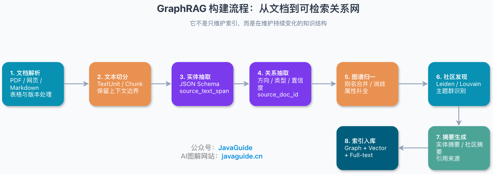

索引处理会经过下列步骤：

| 步骤 | 做什么 | 关键风险 |
|---|---|---|
| 文档解析 | 从 PDF、网页、Markdown、数据库记录中提取文本 | OCR 错误、表格丢结构、文档版本混乱 |
| 文本切分 | 把长文档切成 TextUnit 或 Chunk | 切分太碎会丢关系，切分太大会增加抽取成本 |
| 实体抽取 | 识别文档里的系统、人、组织、概念、事件 | 同名实体、别名、缩写、噪声实体 |
| 关系抽取 | 识别实体之间的依赖、包含、影响、因果等关系 | 关系方向错、关系类型泛化、置信度不足 |
| 图谱归一 | 合并重复实体，补充属性和来源 | 实体消歧成本高，需要人工规则和评测 |
| 社区发现 | 找出连接密集的主题群 | 图太稀或太脏时社区质量会下降 |
| 摘要生成 | 为社区、实体、关系生成摘要 | LLM 摘要可能丢约束或引入幻觉 |
| 索引入库 | 写入图数据库、向量库、全文索引 | 增量更新和权限过滤复杂 |

与只维护 Chunk 和向量相比，图检索还要处理实体归一、关系来源、社区与摘要更新，生产与维护范围随之扩大。

#### 查询阶段：先判断问题类型

GraphRAG 的查询阶段最关键的一步是**查询路由**。

用户问的问题不同，检索方式也不同：

| 问题类型 | 更适合的检索方式 | 示例 |
|---|---|---|
| 局部事实 | 向量检索或局部图检索 | "某个接口的超时时间是多少？" |
| 实体关系 | 局部图检索 | "订单中心依赖哪些服务？" |
| 多跳推理 | 图遍历 + 向量补证据 | "某负责人参与过哪些影响支付链路的事故？" |
| 全局归纳 | 社区摘要 + 全局检索 | "这批报告的主要风险主题是什么？" |
| 精确过滤 | 图查询或结构化查询 | "2025 年 Q4 哪些项目依赖供应商 A？" |

问题类型与检索模式的对应关系如下：

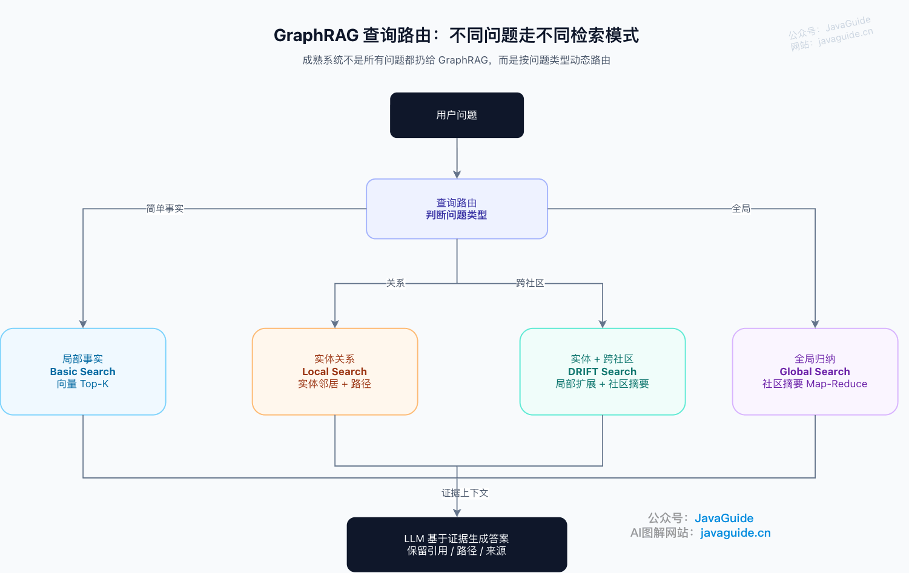

一个成熟系统不会把所有问题都扔给 GraphRAG。很多简单问题，用向量检索更便宜、更快、更稳。

### GraphRAG 适合什么场景？不适合什么场景？

是否适合 GraphRAG，取决于回答所需的证据是否必须经过实体关系、路径或跨文档主题才能拼完整。它会把数据治理范围从 Chunk 和向量扩展到实体、关系、摘要及其版本。

以下类型的问题可以把图结构作为候选方案：

- 企业知识库的复杂问答：问题需要跨部门、跨制度、跨项目复盘串联信息，比如"这个流程涉及哪些部门？每个部门承担什么职责？""某条制度和哪些历史制度冲突？"。
- IT 架构和故障影响分析：服务、接口、数据库、消息队列、负责人、告警、事故之间天然有依赖关系，比如"Redis 集群异常会影响哪些核心接口？""哪些系统同时依赖一个高风险组件？"。
- 金融、风控、合规、供应链：这些领域更关心对象之间的关系，而不是文本片段是否相似，比如客户和账户、企业和实控人、供应商和项目、合同条款和监管规则之间的关系。
- 跨文档主题归纳：当你要分析访谈记录、调研报告、客服工单、事故复盘的整体模式时，社区摘要可以先把语料聚成主题群，再让 LLM 做全局归纳。

下列条件下，先把向量或混合检索做稳通常成本更低：

- 数据量小、问题简单：如果知识库只有几十篇文档，问题基本都是"某个规则是什么"，向量 RAG 加混合检索和 rerank 往往更划算。
- 文档质量太差：如果源文档主语缺失、版本混乱、术语不统一、表格解析错误严重，抽出来的图谱也会很脏。向量 RAG 的错误通常是"找错几段文本"，GraphRAG 的错误可能是"整张关系网方向错了"。
- 实时性要求极高：实体关系抽取、社区发现、摘要生成都会增加更新成本。如果数据必须秒级可见，就要谨慎评估增量图更新和摘要刷新成本。
- 团队缺少图建模和评测能力：GraphRAG 需要持续回答"哪些实体值得建模、关系类型怎么设计、实体如何消歧、图谱错误怎么评测、权限过滤放在哪里"等问题。如果没人负责这些问题，它很容易变成昂贵但不可控的黑盒。

判断顺序很简单：若相关文本没有进入候选集，先排查解析、切分和召回；若候选文本已经齐全，但系统无法按业务关系把它们连起来，再验证 GraphRAG。

### Neo4j GraphRAG 适合解决什么问题？

Neo4j 路线把图数据库放在查询链路中央。向量或全文检索先定位实体、文档节点，再由 Cypher 在受控关系上查询邻居、路径与属性，原文片段则与路径一起交给 LLM。

一次查询可拆成：确定起点节点、执行关系遍历、组装节点属性与原文证据、生成回答。图中的 Schema、关系方向和查询约束由应用负责，并不是模型生成回答后才补的细节。

`neo4j-graphrag` Python 包覆盖图谱导入、向量索引及多种 retriever。检索链路可按问题组合全文、向量和 Cypher 查询，而不局限于向量命中后再遍历关系。

| 检索模式 | 做法 | 适合问题 |
|---|---|---|
| **VectorRetriever** | 基于 Neo4j 向量索引做相似度检索，返回匹配节点和分数 | 普通语义检索、找候选实体 |
| **VectorCypherRetriever** | 先向量检索命中节点，再执行 Cypher 查询扩展上下文 | "找到相似文档后，把相关实体、路径、属性一起带回来" |
| **HybridRetriever / HybridCypherRetriever** | 结合向量索引和全文索引，必要时再用 Cypher 补图上下文 | 关键词和语义都重要的企业知识库 |
| **Text2Cypher** | LLM 根据图 Schema 生成 Cypher，查询结果再交给 LLM 组织答案 | 精确结构化过滤、多条件查询、报表类问答 |
| **ToolsRetriever** | 把多个 retriever 包装成工具，让 LLM 按问题意图选择 | 复杂问题路由、多检索器组合 |
| **外部向量库 + Neo4j** | 向量存在 Weaviate、Pinecone、Qdrant 等系统里，再映射回 Neo4j 节点 | 已有向量基础设施，不想把全部向量迁入 Neo4j |

`VectorCypherRetriever` 与 `Text2Cypher` 的边界尤其需要区分。前者用向量结果确定起点，随后执行预先约束的 Cypher；命中"支付网关"后，可以沿 `[:DEPENDS_ON]`、`[:AFFECTS]`、`[:OWNER]` 读取上下游、影响范围和负责人，并保留路径。

`Text2Cypher` 适合"2025 年 Q4 哪些高优先级项目依赖供应商 A？"这样的结构化筛选。它必须限制在 Schema 白名单、查询校验、只读账户、结果上限和超时之内。高风险查询可优先使用固定模板或语义层，不应让 LLM 直接获得无约束的 Cypher 执行能力。

比如金融风控、供应链、IT 资产管理、权限治理、故障影响分析，这些领域里的对象关系本来就很重要。Neo4j GraphRAG 的优势是：**让 LLM 接入已有业务关系，而不是每次都从文本里临时猜关系。**

### 还有哪些 GraphRAG 相关实现？

除了 Neo4j，还有几条常见路线值得了解。

| 实现路线 | 核心思路 | 适合情况 |
|---|---|---|
| **LangChain + Neo4j** | 用 `Neo4jGraph` 连接 Neo4j，用 `GraphCypherQAChain` 等组件把自然语言转成 Cypher，再基于查询结果生成答案 | 已经在用 LangChain / LangGraph，希望快速把图数据库接入 Agent 或 RAG 链路 |
| **LlamaIndex PropertyGraphIndex** | 通过 `kg_extractors` 从文档 Chunk 中抽取实体和关系，构建可查询的属性图索引 | 文档 ingestion、索引和查询本来就在 LlamaIndex 体系里 |
| **FalkorDB GraphRAG SDK** | 基于支持 OpenCypher、全文索引、向量相似度和范围索引的图数据库做 GraphRAG | 想尝试 Neo4j 之外的图数据库，或者更关注低延迟、多租户图查询 |
| **轻量自研图谱 + 向量库** | 用业务表或边表保存少量核心实体关系，向量库只负责召回候选文本，再用关系表补上下文 | 第一版验证 GraphRAG 是否有价值，不想一开始就引入完整图数据库 |

三类方案的取舍不同：图数据库侧重在线路径查询；LangChain、LlamaIndex 等框架便于复用已有 ingestion 与 Agent 组件；轻量自研则通过减少实体和关系类型控制首版范围。

已有稳定业务图谱、且查询需要明确关系约束时，可评估 Neo4j。文档索引和 Agent 已建立在 LangChain 或 LlamaIndex 上时，优先验证对应图检索组件。若目标只是验证关系扩展能否改善一组失败样本，用少量边表或核心实体建模更容易观察效果。

### GraphRAG 的工程难点

图数据库只能存储和遍历图。文本进入图之前的抽取、消歧、版本管理、权限过滤和增量维护，决定了关系是否可用于检索。

向量 RAG 主要维护文档、Chunk 与索引；图检索还要保证实体、关系、来源和权限保持一致。常见故障点集中在这几个对象的同步上。

#### 1. 实体容易抽重、抽错、抽太碎

同一个实体可能有多个名字：

```
订单中心、订单服务、order-service、OMS
```

它们到底是不是同一个实体？什么时候合并，什么时候拆开？

这件事不能全靠 LLM 猜。生产里通常要配：

- 术语词典
- 别名表
- 规则匹配
- 人工校验
- 置信度阈值
- 评测集

实体消歧做不好，图谱会变成一堆重复节点，检索路径也会断。

#### 2. 关系方向一错，答案就会系统性跑偏

关系比实体更容易出错。

"A 依赖 B"和"B 依赖 A"只差一个方向，但工程含义完全相反。因果关系、影响关系、包含关系也很容易被 LLM 抽错。

生产环境里，建议给关系加上这些字段：

| 字段 | 作用 |
|---|---|
| `source_doc_id` | 追溯来源文档 |
| `source_span` | 追溯原文位置 |
| `confidence` | 记录抽取置信度 |
| `relation_type` | 控制关系类型 |
| `updated_at` | 支持增量更新 |
| `extraction_model_version` | LLM 升级后做差量重抽和 A/B 对比 |

没有来源追溯的图谱，不建议直接用于高风险问答。

#### 3. 社区摘要不是免费的

社区摘要用于跨语料归纳，每次生成和更新都需要执行额外的 LLM 调用：

- 抽取实体和关系。
- 生成实体描述。
- 生成社区摘要。
- 后续版本更新时刷新相关摘要。

语料扩大后，实体抽取和摘要刷新会同时增加索引成本。先以一小批全局问题验证答案质量，再决定是否引入多层社区摘要和 Global Search。

#### 4. 更新一篇文档，可能牵动一片图

普通向量 RAG 更新一篇文档，通常是删除旧 Chunk，再写入新 Chunk 和向量。

同一篇文档更新后，以下对象可能需要重新计算或失效：

- 实体节点
- 关系边
- 社区划分
- 社区摘要
- 实体摘要
- 向量索引
- 权限索引

全量重建会放大成本，增量更新则需要记录来源和依赖范围。系统维护的不只是向量索引，而是一组会随文档变更而变化的实体、边和摘要。

#### 5. 权限过滤不能只看文档级别

企业知识库绕不开权限。

向量 RAG 里，常见做法是在检索前或检索时做元数据过滤。GraphRAG 里还要考虑：

- 用户能看某个节点，但能不能看它的邻居？
- 用户能看某条边，但能不能看边连接的另一个实体？
- 社区摘要里是否混入了无权限文档的信息？
- 全局摘要会不会泄露敏感主题？

多个来源共同生成社区摘要时，无权文档的内容可能已写入摘要。查询阶段仅按文档 ID 过滤无法删除这部分信息，权限边界必须在摘要生成时处理：

- 按稳定的权限分区分别生成摘要，查询时只使用当前用户完整有权访问的分区；权限组合高度动态时，不要预生成跨权限摘要。
- 摘要保留全部源文档 ID，用于审计和失效更新。源文档 ID 不能把已经混入摘要的敏感内容"过滤掉"，因此不能用权限交集作为放行条件。
- 高敏感或权限频繁变化的语料走鉴权后的局部检索，原始证据通过授权检查后再进入模型上下文。

### 你会如何在项目中落地 GraphRAG？

第一版可以从向量 RAG 基线和少量高价值关系开始，确认收益后再扩大图谱范围。

#### 阶段一：先做好向量 RAG 基线

先把基础能力做扎实：

- 文档解析稳定。
- Chunk 策略可评测。
- 向量检索 + BM25 混合检索。
- rerank 可插拔。
- 引用来源可追溯。
- 权限过滤可靠。

如果这些都没做好，上 GraphRAG 只会把问题复杂化。

#### 阶段二：收集关系型失败案例

是否需要引入图结构，应先把线上失败样本按原因归类：

| Badcase 类型 | 是否适合 GraphRAG |
|---|---|
| 单纯没召回关键词 | 先优化 BM25 和 query rewrite |
| Chunk 切分不合理 | 先优化 Chunking |
| 需要跨实体关系推理 | 适合引入图结构 |
| 需要全局主题归纳 | 适合引入社区摘要 |
| 需要精确过滤和权限约束 | 适合结合结构化查询 |

只有关系推理和全局归纳在失败样本中持续出现，图谱投入才有可验证的目标；否则应先修复表中的前置问题。

#### 阶段三：从轻量图谱开始

第一版不一定要做完整知识图谱。

可以先做一个轻量版：

- 只抽取核心实体，比如系统、接口、负责人、事故、制度条款。
- 只保留少量高价值关系，比如依赖、负责、影响、属于、引用。
- 图谱只用于检索扩展，不直接用于最终事实判断。
- 每条关系都保留原文证据。

这样能用较低成本验证 GraphRAG 是否真的改善业务指标。

#### 阶段四：再引入社区发现和全局检索

当语料规模变大，且全局性问题增多，再考虑社区发现和社区摘要。

这个阶段要重点评测：

- 社区划分是否符合业务直觉。
- 社区摘要是否遗漏关键约束。
- 全局回答是否有稳定引用。
- 不同权限用户看到的摘要是否安全。

如果评测跟不上，不要把全局检索开放给高风险场景。

#### 阶段五：按需引入 Hybrid RAG 路由

如果同一入口同时处理事实、关系和全局归纳问题，可以按问题类型动态路由：

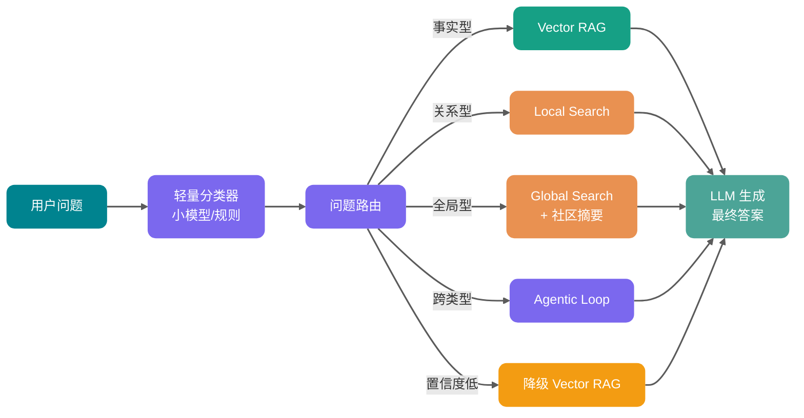
```mermaid
flowchart LR
    %% ========== 配色声明 ==========
    classDef client fill:#00838F,color:#FFFFFF,stroke:none,rx:10,ry:10
    classDef gateway fill:#7B68EE,color:#FFFFFF,stroke:none,rx:10,ry:10
    classDef business fill:#E99151,color:#FFFFFF,stroke:none,rx:10,ry:10
    classDef search fill:#16A085,color:#FFFFFF,stroke:none,rx:10,ry:10
    classDef success fill:#4CA497,color:#FFFFFF,stroke:none,rx:10,ry:10
    classDef warning fill:#F39C12,color:#FFFFFF,stroke:none,rx:10,ry:10

    Q[用户问题]:::client
    Classifier[轻量分类器<br/>小模型/规则]:::gateway
    Router[问题路由]:::gateway

    V[Vector RAG]:::search
    Local[Local Search]:::business
    Global[Global Search<br/>+ 社区摘要]:::business
    Agent[Agentic Loop]:::gateway
    Fallback[降级 Vector RAG]:::warning

    Q --> Classifier --> Router
    Router -->|事实型| V
    Router -->|关系型| Local
    Router -->|全局型| Global
    Router -->|跨类型| Agent
    Router -->|置信度低| Fallback

    V & Local & Global & Agent & Fallback --> Answer[LLM 生成<br/>最终答案]:::success

    linkStyle default stroke-width:2px,stroke:#333333,opacity:0.8
```

关键设计点：入口分类器要可解释、降级策略要明确、路由日志要可回溯。

### GraphRAG 评测怎么落地？

评测要把"图是否找到了正确证据"和"模型是否据此回答"分开记录，再观察这些变化是否影响业务结果：

#### 检索层指标

- 实体召回率 / 关系召回率：检索结果是否包含回答所需的实体和关系。
- 社区一致性：抽样核对社区划分是否符合业务主题。

#### 生成层指标

- Faithfulness（忠实度）：生成回答是否能由检索上下文支撑；可结合 RAGAS 计算。
- Answer Relevance（答案相关性）、Context Precision（上下文精确度）：分别观察回答是否回答了问题、送入模型的上下文是否有效。

#### 业务层指标

- 用户采纳率、转人工率、引用点击率：用于判断实际使用效果。
- 回归测试集：纳入线上失败和高风险问题；新增量由流量、变更频率和人工标注能力决定。

### 与其他 RAG 增强路线的对比

GraphRAG 不是唯一的 RAG 增强路线，了解横向坐标有助于做技术选型：

| 方案 | 解决的问题 | 未解决的问题 |
|---|---|---|
| **多向量（ColBERT/Late Interaction）** | Chunk 内细粒度匹配 | 关系问题 |
| **HyDE / Query Rewriting** | query 与 doc 表述差异 | 多跳推理 |
| **Self-RAG / Corrective RAG** | 答案可信度 | 检索结构 |
| **GraphRAG** | 关系检索与部分全局归纳 | 图谱抽取、消歧和维护成本 |

GraphRAG 是处理关系检索和全局归纳的一条路线，但不是唯一选择。RAPTOR、迭代式多跳检索、Agentic Retrieval 或面向业务的结构化查询，也能覆盖其中一部分问题；应使用同一评测集比较收益和成本。

### 选型检查

先区分失败类型：没有召回文本时，应先检查解析、BM25、向量检索和重排；已经召回相关文本，但问题依赖明确的实体关系、多跳证据或跨文档主题时，再评估图结构。试点阶段要把实体与关系限制在少量高价值类型，并为每条关系保留原文位置、版本和权限信息。

### 第五部分小结

GraphRAG 将检索对象从 Chunk 扩展到实体、关系、路径与社区摘要。多跳推理、影响范围和跨文档主题这类问题，才能在图中表达出所需的证据结构。

代价同样明确：抽取质量、实体消歧、关系方向、版本更新和权限边界都需要单独治理。已有业务图谱时，Neo4j 的图查询可以直接参与检索；使用 LangChain 或 LlamaIndex 的系统则可先验证其图检索组件。选型最终仍取决于现有技术栈、图模型规模和维护能力。

对失败样本做归因：没有召回原文时，先优化解析、切分和检索；原文已召回却无法建立必要关系时，再评估 GraphRAG。

### 第五部分面试题

- 什么是 GraphRAG？和普通 RAG 有什么区别？
- 传统向量 RAG 有什么局限性？哪些问题它回答不了？
- GraphRAG 的核心概念有哪些？（实体、关系、社区、局部/全局检索）
- Local Search 和 Global Search 有什么区别？
- 什么是 DRIFT Search？
- GraphRAG 的构建流程是怎样的？每个步骤有什么风险？
- 什么时候该用 GraphRAG？什么时候不该用？
- Neo4j GraphRAG 有哪些检索模式？VectorCypherRetriever 和 Text2Cypher 有什么区别？
- GraphRAG 的工程难点有哪些？权限过滤为什么难做？
- 怎么在项目中落地 GraphRAG？怎么评测？

### 第五部分参考资料

- Neo4j：What Is GraphRAG?
- Neo4j GraphRAG Python Package
- Neo4j GraphRAG RAG User Guide
- LangChain Neo4j Integration
- LlamaIndex PropertyGraphIndex
- FalkorDB Docs
- RAPTOR: Recursive Abstractive Processing for Tree-Organized Retrieval
- GraphRAG：从 RAG 到 GraphRAG 的企业知识检索实践
- RAGAS 评测框架

---

## 第六部分 RAG 优化与评估：定位问题、持续改进

> 本章整理自：[JavaGuide - RAG 检索优化](https://javaguide.cn/ai/rag/rag-optimization.html)

### 导读

前五部分覆盖了 RAG 的完整构建链路。这一部分是**方法论**：当系统答错时，怎么定位问题、怎么改、怎么验证？RAG 答错时，直接更换 Embedding 模型或扩大 Top-K 很难稳定解决问题。PDF 表格解析错误、Chunk 切断条件、权限过滤过晚、候选池缺少正确证据，都会让生成模型拿到错误上下文。

调优时要沿着文档、索引、召回、重排、上下文和生成逐段定位，再用固定评测集回放改动。

### RAG 优化到底在优化什么？

RAG 更像一条证据加工流水线：原始资料先被解析、清洗、切块、打标签、建索引；用户问题进来后，再经过查询理解、召回、重排、上下文构建，最后才交给 LLM 生成答案。

这条链路里任何一环出问题，都会传染到下游。

| 环节 | 典型问题 | 最终表现 |
|---|---|---|
| 文档解析 | 表格错位、标题丢失、页码缺失 | 答案引用不准，关键条件丢失 |
| Chunk 切分 | 块太大、太小、语义边界被切断 | 召回噪声大，或者召回片段缺上下文 |
| Metadata | 没有保存来源、时间、权限、章节 | 无法过滤，无法引用，容易越权 |
| 召回 | 只用向量检索，忽略关键词和结构化条件 | 错过错误码、SKU、版本号、专有名词 |
| 重排 | 直接把 Top-K 塞给模型 | 正确片段排在后面，模型看不到重点 |
| 上下文 | 不去重、不压缩、不排序 | Token 浪费，模型被噪声干扰 |
| 生成 | Prompt 没有限定证据边界 | 答案看起来流畅，但引用和事实对不上 |
| 评估 | 只看主观体验，不建测试集 | 改动靠感觉，线上反复回退 |

一次 RAG 调优是否有效，最终要落到答案的可用性、可追溯性、稳定性，以及为此付出的延迟和成本上。对每个失败样本，至少要留下五项检查结果：正确证据是否被召回、在候选中的排名、进入上下文的内容、回答是否受证据约束，以及改动能否在固定样本集上复现。缺少这些记录时，讨论向量库选型没有明确的判断依据。

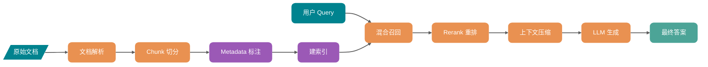
```mermaid
flowchart LR
    %% ========== classDef 配色声明 ==========
    classDef client fill:#00838F,color:#FFFFFF,stroke:none,rx:10,ry:10
    classDef business fill:#E99151,color:#FFFFFF,stroke:none,rx:10,ry:10
    classDef infra fill:#9B59B6,color:#FFFFFF,stroke:none,rx:10,ry:10
    classDef success fill:#4CA497,color:#FFFFFF,stroke:none,rx:10,ry:10

    %% ========== 节点声明 ==========
    Doc[/原始文档/]:::client
    Parse[文档解析]:::business
    Chunk[Chunk 切分]:::business
    Meta[Metadata 标注]:::infra
    Index[建索引]:::infra
    Query[用户 Query]:::client
    Recall[混合召回]:::business
    Rerank[Rerank 重排]:::business
    Compress[上下文压缩]:::business
    LLM[LLM 生成]:::business
    Answer[最终答案]:::success

    %% ========== 连线 ==========
    Doc --> Parse --> Chunk --> Meta --> Index
    Query --> Recall
    Index --> Recall
    Recall --> Rerank --> Compress --> LLM --> Answer

    linkStyle default stroke-width:2px,stroke:#333333,opacity:0.8
```

### RAG 优化闭环

生产级 RAG 需要评估和回放。否则无法判断一次改动改善了哪些问题，又引入了哪些回归。

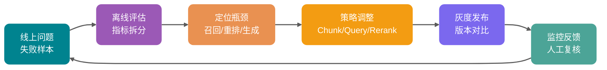
```mermaid
flowchart LR
    Q["线上问题<br/>失败样本"]:::client --> E["离线评估<br/>指标拆分"]:::infra
    E --> L["定位瓶颈<br/>召回/重排/生成"]:::business
    L --> T["策略调整<br/>Chunk/Query/Rerank"]:::warning
    T --> G["灰度发布<br/>版本对比"]:::gateway
    G --> M["监控反馈<br/>人工复核"]:::success
    M --> Q

    classDef gateway fill:#7B68EE,color:#FFFFFF,stroke:none,rx:10,ry:10
    classDef business fill:#E99151,color:#FFFFFF,stroke:none,rx:10,ry:10
    classDef infra fill:#9B59B6,color:#FFFFFF,stroke:none,rx:10,ry:10
    classDef client fill:#00838F,color:#FFFFFF,stroke:none,rx:10,ry:10
    classDef success fill:#4CA497,color:#FFFFFF,stroke:none,rx:10,ry:10
    classDef warning fill:#F39C12,color:#FFFFFF,stroke:none,rx:10,ry:10
    linkStyle default stroke-width:2px,stroke:#333333,opacity:0.8
```

每次调整 Chunk 大小、重写策略、Rerank 模型、Top-K 参数，都应该拿同一批问题跑一遍，比较 Context Recall、Context Precision、Faithfulness、Answer Relevancy、延迟和成本。

没有回放，就不知道变好了还是只是换了一种错法。

### 先做数据治理，再谈检索优化

检索前的数据如果已经解析错位或丢失结构，后面的召回和生成无法恢复原始证据。

#### 文档解析决定上限

PDF、Word、HTML、Markdown、数据库记录、工单日志，看起来都是文本，实际结构差异很大。尤其是 PDF 表格、图片、页眉页脚、脚注、跨页表格，如果只用普通文本抽取，常见结果是：

- 表格列关系丢失，价格、版本、条件混在一起。
- 页眉页脚被重复写入每个 Chunk，污染向量空间。
- 图片和流程图完全丢失，答案缺关键步骤。
- 标题层级消失，模型不知道一段话属于哪个章节。

对研发文档、政策文档、产品手册来说，**解析质量往往比换 embedding 模型更重要**。

一个实用建议：

| 文档类型 | 推荐处理方式 | 核心目标 |
|---|---|---|
| Markdown / HTML | 保留标题层级、列表、代码块 | 不破坏天然结构 |
| PDF 文档 | 解析正文、表格、页码、图片说明 | 保住证据边界 |
| 表格型文档 | 转成结构化行记录或 Markdown 表格 | 保住字段关系 |
| 代码文档 | 按包、类、方法、注释分层 | 保住调用语义 |
| 工单/聊天记录 | 按会话、时间、角色切分 | 保住上下文顺序 |

表格和图片占比高时，可以为命中率低的文档补 OCR 或多模态结构化描述。不要把全量文件直接交给视觉模型：先从高价值文档和高频失败样本开始，观察解析收益是否覆盖新增的处理成本和等待时间。

#### Metadata 的作用

检索请求中的过滤条件和最终答案的来源信息，都依赖 Metadata。它既决定哪些 Chunk 可以进入候选池，也让结果能回到原文、页码和对应版本。

至少建议为每个 Chunk 保存这些字段：

- source_id：原始文档 ID，便于回溯和去重。
- source_type：PDF、网页、工单、代码、数据库记录等。
- title：文档标题。
- section_path：章节路径，例如"退换货政策 / 售后范围 / 特殊商品"。
- page：页码或段落位置。
- created_at / updated_at：时间过滤和新旧版本判断。
- tenant_id / acl：多租户和权限控制。
- business_tags：产品线、语言、地区、版本、模块。

权限过滤要在召回前参与查询。若向量库先返回 Top-10、其中 8 条无权访问，过滤后剩下的 2 条不能说明系统只找到了两条相关内容；权限条件一旦漏配，还会直接污染上下文。

因此，能由 Metadata 表达的范围应先收紧。例如先限定 `tenant_id`、文档类型、版本和更新时间，再计算向量相似度或执行混合检索。

### Chunk 策略：别把知识切碎了

Chunk 的边界决定召回单位能带走多少条件和结论。条件被切进相邻块后，即使后面使用重排，也只能在不完整的候选里做选择。

#### Chunk 大小没有万能值

512、800、1000 Token 只能用来建立第一轮实验索引。对于"以上情况不适用七天无理由退货"这类带前置条件的句子，切得过细会只留下结论；切得过大时，一个相关句子又会把整段无关说明带进上下文。

第一轮可以从以下范围开始：

- FAQ、短政策、接口说明：可以从 200 到 500 Token 起步。
- 技术文档、教程、方案文档：可以从 400 到 800 Token 起步。
- 法规、合同、金融政策：更关注条款完整性，优先按标题、条、款、项切。
- 代码类知识库：不要只按 Token 切，优先按文件、类、函数、注释块切。

为这些候选参数分别建索引，用同一批问题比较 Context Recall、Context Precision、答案正确率和平均上下文 Token，再保留适合当前文档集合的一组。

#### 语义切分适合稳定文档

语义切分会结合标题、段落和相邻句子的关系确定边界，不按固定字符数截断。文档主题混杂、问题偏概念查询且可接受较复杂离线处理时，通常可将它纳入实验：

- 文档主题混杂，一页里连续讲多个概念。
- 用户问题更偏概念型，而不是查某个字段。
- 知识库更新频率不高，可以接受较复杂的离线预处理。

这类切分也有明确的适用边界：

- 文档频繁增量更新时，变更文档需要重新计算句子或段落 Embedding，离线成本高于结构化切分。常见语义切分在单篇文档内部判断相邻内容，不要求每次重新聚类整个知识库。
- 文档结构本身已经很清晰，例如 Markdown 标题层级。
- 查询主要是精确查编号、字段、状态、配置项。

接口文档已有 OpenAPI path、method 和参数表时，应按这些结构切分。若改由句子 Embedding 判断边界，参数和返回条件可能被拆开。

#### Parent-Child Chunk 是很实用的折中

Parent-Child Chunk 将召回粒度与阅读粒度分开处理。以 300 Token 的子 Chunk 建向量索引，并把它关联到 1200 Token 的父段落；命中子块后，再把父段落带入上下文。这样既能让问题命中细粒度表述，也能保留前置条件和相邻说明，而无需仅靠扩大 Top-K 补上下文。长文档、教程、政策解读和故障手册都可用这种关联关系。

#### 给 Chunk 增加语义入口

"钱怎么退"和"退款申请路径"表达的是同一需求，但文本表面相似度未必足够。遇到这类差异时，可以在索引阶段为同一 Chunk 提供额外入口：

- 给每个 Chunk 生成摘要，摘要和正文都入索引。
- 给每个 Chunk 生成可能回答的问题，用问题向量辅助召回。
- 给章节生成标题向量，让概念型问题先命中主题。
- 对代码或表格生成结构化描述，避免原文难以嵌入。

摘要、问题和结构化描述都需要重新生成和维护。先在高价值文档或高频失败样本上验证这些入口能否补回遗漏的证据，再决定是否扩大范围。

### 召回优化：不要只靠向量相似度

将 Query 转为 Embedding 后取 Top-K 可以作为基线。错误码、型号和版本号这类精确词容易被近义但错误的内容挤掉，需要额外的关键词召回信号。

#### Hybrid Search 适合哪些查询？

向量检索按语义接近程度找候选，BM25 按出现的词项匹配候选。两路结果在下表中的查询类型上各有覆盖范围。

| 查询类型 | 向量检索表现 | BM25 表现 | 建议 |
|---|---|---|---|
| "如何取消订阅" | 能匹配"关闭自动续费" | 可能匹配不到 | 保留向量召回 |
| "错误码 E1027" | 可能召回泛化故障 | 精确命中错误码 | 必须保留关键词召回 |
| "ABX-4421 型号参数" | 容易找相似型号 | 精确命中 SKU | 必须保留关键词召回 |
| "Java 线程池拒绝策略区别" | 语义理解较好 | 能匹配关键词 | 混合更稳 |
| "最新 v3.2 价格政策" | 需要语义和时间条件 | 可匹配版本号 | Metadata + Hybrid |

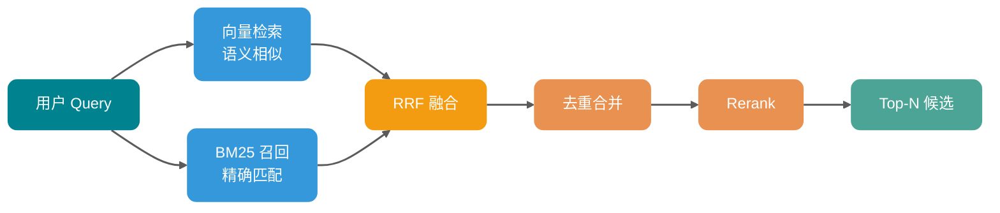
```mermaid
flowchart LR
    %% ========== classDef 配色声明 ==========
    classDef client fill:#00838F,color:#FFFFFF,stroke:none,rx:10,ry:10
    classDef business fill:#E99151,color:#FFFFFF,stroke:none,rx:10,ry:10
    classDef cache fill:#3498DB,color:#FFFFFF,stroke:none,rx:10,ry:10
    classDef success fill:#4CA497,color:#FFFFFF,stroke:none,rx:10,ry:10
    classDef warning fill:#F39C12,color:#FFFFFF,stroke:none,rx:10,ry:10

    %% ========== 节点声明 ==========
    Query[用户 Query]:::client
    Vec[向量检索<br/>语义相似]:::cache
    BM25[BM25 召回<br/>精确匹配]:::cache
    RRF[RRF 融合]:::warning
    Dedupe[去重合并]:::business
    Rerank[Rerank]:::business
    Final[Top-N 候选]:::success

    %% ========== 连线 ==========
    Query --> Vec
    Query --> BM25
    Vec --> RRF
    BM25 --> RRF
    RRF --> Dedupe --> Rerank --> Final

    linkStyle default stroke-width:2px,stroke:#333333,opacity:0.8
```

实际链路会并行取语义候选和关键词候选，使用 RRF 或归一化加权合并，再对合并结果去重并交给 Rerank。Microsoft Azure AI Search、Google Vertex AI Vector Search、Weaviate 都将 Hybrid Search 和 RRF 作为常见方案。RRF 只依据候选名次融合，不必把 BM25 分数与向量余弦分数直接换算到同一尺度。

文档高度结构化且查询几乎不含关键词时，Hybrid 的增益可能不明显。相反，错误码、产品型号、配置项和专有名词占比较高的查询，需要保留关键词通道，避免相似但不包含精确实体的文档排到前面。

#### Query Rewrite：先把问题变得可检索

用户输入往往缺少检索需要的对象、时间和范围。例如：

- "这个报错咋整？"
- "钱能退吗？"
- "线上那个限流问题是不是又来了？"

"这个报错咋整"没有说明报错码和服务，"钱能退吗"没有说明订单状态。Query Rewrite 要补出可检索的表达，但不能替用户改变问题的含义。

常见策略如下：

| 策略 | 适用场景 | 例子 |
|---|---|---|
| 规范化改写 | 口语化、缩写、上下文缺失 | "钱能退吗"改成"退款政策、退款条件、退款流程" |
| Multi-Query | 表达可能有多种说法 | 同时检索"取消订阅""关闭自动续费""停止会员计划" |
| Query Decomposition | 问题包含多个子问题 | 把"对比 Stripe 和 Square 的手续费和争议处理"拆成 4 个子问题 |
| Step-back Query | 问题太细，缺背景 | 先检索"订阅计费规则"，再回答具体取消问题 |
| HyDE | 查询太短，和文档形态差异大 | 先生成假设答案，再用假设答案向量检索真实文档 |
| Self-Query | 问题里包含过滤条件 | 从"查 2025 年 Java 相关政策"提取年份和类别过滤 |

LangChain 的 MultiQueryRetriever、SelfQueryRetriever 等组件对这些策略做了封装。无论是否使用这些组件，原始 Query 都应和改写结果一起参与召回并融合：改写模型把"退款"错误理解为"取消订阅"时，原始 Query 仍能保留正确的召回入口。

#### Top-K 不是越大越好

扩大 Top-K 会增加正确证据进入候选池的机会，也会同时拉高 Rerank 的输入量、Prompt Token 和噪声比例。候选池、重排结果和最终上下文应使用不同的上限：

- recall_top_k：粗召回候选池，例如 30 到 100。
- rerank_top_n：重排后保留，例如 5 到 10。
- context_top_n：最终进入上下文，例如 3 到 6。

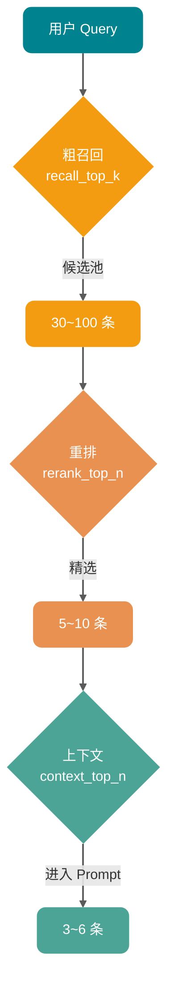
```mermaid
flowchart TB
    %% ========== classDef 配色声明 ==========
    classDef client fill:#00838F,color:#FFFFFF,stroke:none,rx:10,ry:10
    classDef business fill:#E99151,color:#FFFFFF,stroke:none,rx:10,ry:10
    classDef warning fill:#F39C12,color:#FFFFFF,stroke:none,rx:10,ry:10
    classDef success fill:#4CA497,color:#FFFFFF,stroke:none,rx:10,ry:10

    %% ========== 节点声明 ==========
    Start[用户 Query]:::client
    Recall{粗召回<br/>recall_top_k}:::warning
    Rerank{重排<br/>rerank_top_n}:::business
    Context{上下文<br/>context_top_n}:::success
    Candidates["30~100 条"]:::warning
    TopN["5~10 条"]:::business
    Final["3~6 条"]:::success

    %% ========== 连线 ==========
    Start --> Recall
    Recall -->|候选池| Candidates
    Candidates --> Rerank
    Rerank -->|精选| TopN
    TopN --> Context
    Context -->|进入 Prompt| Final

    linkStyle default stroke-width:2px,stroke:#333333,opacity:0.8
```

`recall_top_k` 用于防止漏召回，`rerank_top_n` 用于控制精排成本，`context_top_n` 则由模型实际可阅读的证据量决定。三者应在同一评估集上一起调整。

### Rerank：把"相关"重新排成"可回答"

双塔检索会分别编码 Query 和文档，再计算向量距离，适合从大量文档中快速取候选。Cross-Encoder 或专用重排模型则把 Query 和候选文档一起编码，成本更高，但能判断候选是否包含回答所需的条件和结论。

#### 为什么 Rerank 有用？

向量分数衡量的是表达是否接近；重排分数应服务于"这段内容能否回答当前问题"。

举个例子：

用户问："线程池为什么会触发拒绝策略？"

向量召回可能找出这些片段：

1. 线程池核心参数说明。
2. 拒绝策略枚举列表。
3. 队列满、线程数达到 maximumPoolSize 后触发拒绝策略的条件。
4. 线程池使用示例代码。

第 1、2 条语义很接近，但第 3 条才是答案核心。Rerank 的价值就是把第 3 条顶上来。

#### Rerank 放在哪里？

可将链路拆为五步：Metadata 预过滤，Hybrid Search 粗召回 30 到 100 条，去重并合并相邻片段，Rerank 选出 5 到 10 条，最后压缩后写入 Prompt。

Rerank 不会补回候选池中不存在的文档。先检查 Context Recall；如果粗召回没有正确片段，应回到解析、Chunk 和查询侧排查，而不是继续更换重排模型。

#### LLM Rerank 和专用 Reranker 怎么选？

| 方案 | 优点 | 缺点 | 适用场景 |
|---|---|---|---|
| Cross-Encoder Reranker | 相关性判断细，成本可控 | 需要选模型，可能有语言和领域偏差 | 通用生产链路 |
| LLM 打分 | 可输出评分理由，规则灵活 | 慢、贵、稳定性受 Prompt 影响；理由不等于决策真相 | 小流量、高价值、复杂判断 |
| 规则重排 | 便宜、可控 | 只能处理明确规则 | 时间、权限、版本、来源优先级 |
| 混合重排 | 灵活，适合复杂业务 | 工程复杂度高 | 企业知识库、客服、合规场景 |

专用 Reranker 可以承担主链路的相关性判断，时间、权限和版本等确定条件交给规则处理；LLM 打分适合离线评估或低流量的复杂判断。选择模型时要在目标语言、领域数据、延迟和成本上分别对比。

### 上下文工程：别把模型当垃圾桶

召回完成后，还要决定哪些片段以何种顺序进入 Prompt。上下文窗口变大并不意味着可以忽略注意力、延迟、成本和信噪比；不相关的片段会占据模型阅读位置，并造成以下后果：

- 抓错证据，把相似但不相关的段落当依据。
- 忽略中间位置的重要信息。
- 回答变长但不聚焦。
- 引用错来源。
- 成本和首字延迟明显上升。

每个进入 Prompt 的片段都应能支撑当前问题中的一个结论、条件或例外。

#### 上下文压缩

压缩操作围绕当前 Query 保留证据，而不是把所有候选统一摘要。常见选择如下：

| 压缩方式 | 做法 | 风险 |
|---|---|---|
| 选择性抽取 | 只保留和问题相关的原句 | 可能漏掉隐含条件 |
| 查询相关摘要 | 把长片段压成围绕问题的摘要 | 可能引入改写偏差 |
| 结构化抽取 | 抽取字段、条件、结论、例外 | 依赖抽取 Schema 设计 |

ContextualCompressionRetriever 体现了"基础检索器加压缩器"的组合。实践中可先按规则过滤和去重，再仅对较长片段调用 LLM 压缩，避免为每个 Chunk 付出模型调用成本。

#### 上下文排序也会影响答案

返回顺序通常混合了召回通道、文档来源和版本，不能直接作为 Prompt 顺序。可按以下规则组织：

- 最相关证据放前面。
- 同一文档的相邻片段尽量保持原始顺序。
- 互相矛盾的片段标注更新时间和版本。
- 被引用的片段保留来源信息。
- 低置信度证据不要和高置信度证据混在一起。

跨文档对比可按主题分组，时间分析可按时间线排列，故障排查则可按"现象、原因、处理步骤、注意事项"组织。上下文工程处理的是这些证据在模型输入中的结构，而不仅是召回数量。

#### Prompt 要限制证据边界

Prompt 至少应写清以下边界：

- 只基于给定上下文回答。
- 上下文不足时明确说无法判断。
- 每个关键结论尽量附来源。
- 不要把相似文档当成当前版本事实。

证据质量判断和引用校验仍需在 Prompt 外执行。提示词能表达"证据不足时拒答"，但无法独自验证模型是否遵守。

### 评估：分开定位检索和生成问题

RAG 评估要拆开看。只看最终答案分数，很难知道到底是哪一环坏了。

#### 建一套最小评估集

不用一开始就搞几千条样本。先从 50 到 100 条高价值问题开始：

- 高频用户问题。
- 线上失败问题。
- 业务关键问题。
- 多跳推理问题。
- 精确匹配问题，例如错误码、版本号、SKU。
- 容易越权或过期的问题。
- 应该拒答的问题。

每条样本最好包含：

- question：用户原始问题。
- golden_answer：理想答案。
- golden_context：应该命中的证据片段或文档。
- metadata_filter：必要过滤条件。
- answer_type：事实问答、流程说明、对比、拒答、摘要等。

#### 检索指标和生成指标分开

| 指标 | 衡量对象 | 说明 |
|---|---|---|
| Hit Rate@K | 召回 | 正确证据是否出现在前 K 个结果里 |
| MRR | 排序 | 第一个正确证据排得有多靠前 |
| Context Recall | 召回完整性 | 回答所需证据是否被找全 |
| Context Precision | 上下文纯度 | 放入上下文的内容有多少是真的相关 |
| Faithfulness | 生成忠实度 | 答案是否能被上下文支撑 |
| Answer Relevancy | 回答相关性 | 答案是否真正回应用户问题 |
| Citation Accuracy | 引用准确性 | 引用位置是否支撑对应结论 |
| Latency / Cost | 工程指标 | P95 延迟、Token、重排耗时、缓存命中率 |

RAGAS、DeepEval、LangSmith 等工具都支持围绕上下文相关性、忠实度、答案相关性做评估。RAGAS 文档里把 Context Precision、Context Recall、Faithfulness、Response Relevancy 等指标拆得比较清楚；DeepEval 也支持把检索和生成指标组合成端到端测试。

但要记住：**LLM-as-a-Judge 不是裁判真理，它只是辅助信号。**

上线前至少抽样人工复核一批结果，校准自动评估器是否偏向长答案、是否漏判引用错误、是否对中文领域术语不敏感。

#### 每次改动都要版本化

一次评测结果必须能对应到以下版本信息：

- 文档解析器版本。
- Chunk 策略版本。
- Embedding 模型版本。
- 索引参数版本。
- Query Rewrite Prompt 版本。
- Rerank 模型版本。
- 生成 Prompt 版本。
- 评估集版本。

知识库更新后指标发生变化时，这些记录才能定位是解析、索引、检索还是生成侧引入了回归。

### 常见错误

#### 只调 Embedding

PDF 表格解析错误、Chunk 丢掉前置条件、Metadata 未过滤权限，或者正确文档根本没有进入候选池时，Embedding 换得再好也无法补回缺失证据。应先在评估集上区分召回、排序、上下文和生成问题，再决定是否调整 Embedding。

#### 不做评估

单个回答看起来更好，不能说明整体效果提高。Top-K 变大后，部分问题可能补回证据，另一些问题却被噪声干扰；没有固定样本集时，很难同时看到两种变化。最小评估集应覆盖高频、失败、精确匹配和拒答问题。

#### 盲目扩大 Top-K

较大的 Top-K 会增加重排成本、Prompt Token 和模型延迟，并降低上下文信噪比。需要提高召回覆盖率时，可增大粗召回候选池，再由 Rerank 和压缩筛掉噪声；不要把新增候选直接拼进上下文。粗召回 Top-K、重排 Top-N 和上下文 Top-N 应分别记录和评估。

#### 把无关上下文塞给模型

多个版本的政策、相似产品文档和相邻但无关的段落混在一起时，模型可能把它们组合成看似合理、实际错误的结论。写入 Prompt 前应去重、压缩、按证据强度排序，并保留版本和来源。

#### 忽略拒答能力

检索结果置信度低、证据相互矛盾，或用户无权访问关键文档时，系统应拒答、追问或升级人工。可在检索后增加证据质量判断，根据结果触发查询改写、扩大范围、外部搜索或拒答。

### 一套可落地的排查路径

线上 RAG 效果下降时，排查记录应先确认正确证据是否进入候选池，再检查排名、上下文和最终回答。这样可以避免同时修改 Prompt、模型和检索参数。

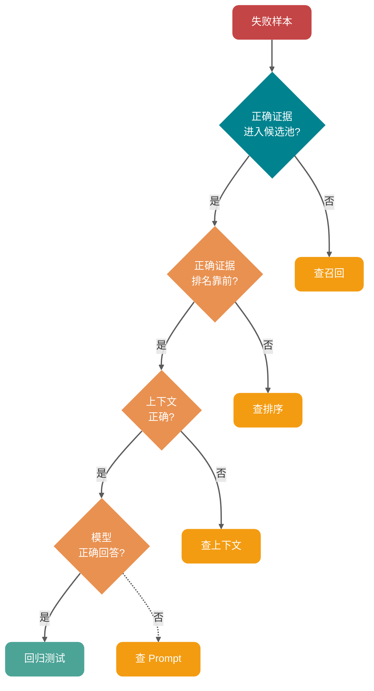
```mermaid
flowchart TB
    %% ========== classDef 配色声明 ==========
    classDef client fill:#00838F,color:#FFFFFF,stroke:none,rx:10,ry:10
    classDef business fill:#E99151,color:#FFFFFF,stroke:none,rx:10,ry:10
    classDef danger fill:#C44545,color:#FFFFFF,stroke:none,rx:10,ry:10
    classDef success fill:#4CA497,color:#FFFFFF,stroke:none,rx:10,ry:10
    classDef warning fill:#F39C12,color:#FFFFFF,stroke:none,rx:10,ry:10

    %% ========== 节点声明 ==========
    Start[失败样本]:::danger
    Step1{正确证据<br/>进入候选池?}:::client
    Step2{正确证据<br/>排名靠前?}:::business
    Step3{上下文<br/>正确?}:::business
    Step4{模型<br/>正确回答?}:::business
    Step5[回归测试]:::success
    RecallFix[查召回]:::warning
    RerankFix[查排序]:::warning
    ContextFix[查上下文]:::warning
    PromptFix[查 Prompt]:::warning

    %% ========== 连线 ==========
    Start --> Step1
    Step1 -->|否| RecallFix
    Step1 -->|是| Step2
    Step2 -->|否| RerankFix
    Step2 -->|是| Step3
    Step3 -->|否| ContextFix
    Step3 -->|是| Step4
    Step4 -->|是| Step5
    Step4 -.->|否| PromptFix

    linkStyle default stroke-width:2px,stroke:#333333,opacity:0.8
```

#### 第一步：把失败样本分类

先看 20 到 50 条失败问题，把它们分成几类：

- 完全没召回正确文档。
- 召回了正确文档，但排名靠后。
- 正确文档进入上下文，但答案没用上。
- 答案用了上下文，但理解错了。
- 引用了不存在或不相关来源。
- 应该拒答却强行回答。
- 权限、时间、版本过滤错误。

这一步的价值很高，因为每类问题对应的修复方向完全不同。

#### 第二步：先看正确证据有没有进入候选池

粗召回 Top-50 未出现正确证据时，先检查：

- 文档是否入库。
- 文档解析是否正确。
- Chunk 是否切断关键事实。
- Metadata 过滤是否过严。
- Query 是否需要改写、分解或 HyDE。
- 是否需要 BM25 或 Hybrid Search。

此时继续调 Rerank 没有意义：候选池没有答案，重排只能改变错误结果的顺序。

#### 第三步：正确证据在候选池里但没进上下文

正确证据已在 Top-50、却没有进入最终上下文时，检查：

- Rerank 模型是否适配语言和领域。
- Rerank 输入是否过长被截断。
- 分数融合是否让关键词结果被压下去。
- 相邻 Chunk 合并是否把噪声一起带入。
- rerank_top_n 是否过小。

这些信号分别指向重排模型、融合权重、候选池大小或去重策略。

#### 第四步：上下文正确但答案错误

正确证据已写入 Prompt、模型仍然答错时，检查：

- Prompt 是否要求基于上下文回答。
- 上下文是否有互相冲突的版本。
- 证据是否在上下文中间位置被淹没。
- 问题是否需要多跳推理或对比表。
- 是否需要结构化输出和引用约束。
- 是否需要先压缩再生成。

确认前面三类问题已排除后，再调整 Prompt、上下文排序、压缩和生成模型。

#### 第五步：建立回归测试

每修复一个失败样本，都应带上复现输入、期望证据和判定标准加入评估集。后续改动用它回放，才能发现某次修复是否引入了新回归。

### 从零落地的顺序

从零搭建企业 RAG 时，先保证文档解析、去噪、标题层级、页码、表格和 Metadata 可以被正确使用，并用覆盖高频、失败、精确匹配、权限与拒答场景的问题跑通评估回放。

有了基线后，再依次比较固定长度、结构化、Parent-Child 和语义 Chunk；用向量召回处理语义相近内容，用 BM25 或稀疏向量保留精确词；最后针对口语化、缩写、多意图和多跳问题增加 Query Rewrite。候选池扩大后，经 Rerank、去重、裁剪、摘要或结构化抽取，才形成受 Token 和噪声约束的上下文。

生成侧需处理证据不足时的拒答与关键结论引用。灰度期间按版本记录指标，持续收集失败样本。每一轮只改变少量变量，同时记录解析器、Chunk、Embedding、索引、Query Rewrite、Rerank 和 Prompt 的版本；回归集验证的离线收益还需要在灰度流量中继续观察。

### 第六部分小结

一次调优回放从解析和 Metadata 产生的可检索内容开始，经由 Chunk、Hybrid Search、Query Rewrite、Rerank 和上下文编排，最后检查模型实际读取的证据与答案。固定评估集和版本记录让每一环的改动都能被重复比较。

核心要点回顾：

1. 排查顺序固定：先看正确证据有没有进候选池，再看排名，再看上下文，最后才动 Prompt 和模型。
2. 召回要混合：向量 + BM25，错误码、SKU、版本号必须保留关键词通道。
3. Top-K 分层：recall_top_k（30-100）、rerank_top_n（5-10）、context_top_n（3-6），分开调。
4. Rerank 只能排序，不能补证据；先查 Context Recall。
5. 上下文要压缩、去重、按证据强度排序，不要当垃圾桶。
6. 评估要拆检索和生成两层指标，每次改动都要版本化并回放。

### 第六部分面试题

- RAG 优化到底在优化什么？链路里哪些环节会出问题？
- 为什么说"解析质量比换 Embedding 模型更重要"？
- Metadata 的作用是什么？权限过滤应该放在哪一步？
- Chunk 大小怎么调？有哪些候选范围？
- Hybrid Search 是什么？RRF 融合怎么工作？哪些查询必须保留关键词召回？
- Query Rewrite 有哪些策略？Multi-Query、HyDE、Self-Query 分别解决什么问题？
- Top-K 是不是越大越好？recall_top_k、rerank_top_n、context_top_n 怎么配合？
- Rerank 的作用是什么？为什么 Rerank 不能补回候选池里没有的文档？
- 上下文压缩有哪些方式？上下文排序要注意什么？
- RAG 评估指标有哪些？Hit Rate、MRR、Context Recall、Faithfulness 分别衡量什么？
- LLM-as-a-Judge 有什么问题？
- 线上 RAG 效果下降，你的排查路径是什么？

### 第六部分参考资料

- Production RAG: The Five Decisions Behind Every System That Works
- RAG 优化字典：20 种 RAG 优化方法全解析
- Weaviate Hybrid Search Documentation
- Microsoft Azure AI Search: Hybrid Search RRF
- Google Vertex AI Vector Search: Hybrid Search
- Cohere Rerank Documentation
- LangChain Retriever API Documentation
- RAGAS Metrics Documentation
- DeepEval RAG Evaluation Guide

---

## 附录

### 附录 A：RAG 实战项目推荐

推荐一个由 JavaGuide 作者开源的实战项目，基于 Spring Boot 4.0 + Java 21 + Spring AI + PostgreSQL + pgvector + RustFS + Redis，实现简历智能分析、AI 模拟面试、知识库 RAG 检索等核心功能。非常适合作为学习和简历项目，学习门槛低。

**系统架构如下**：

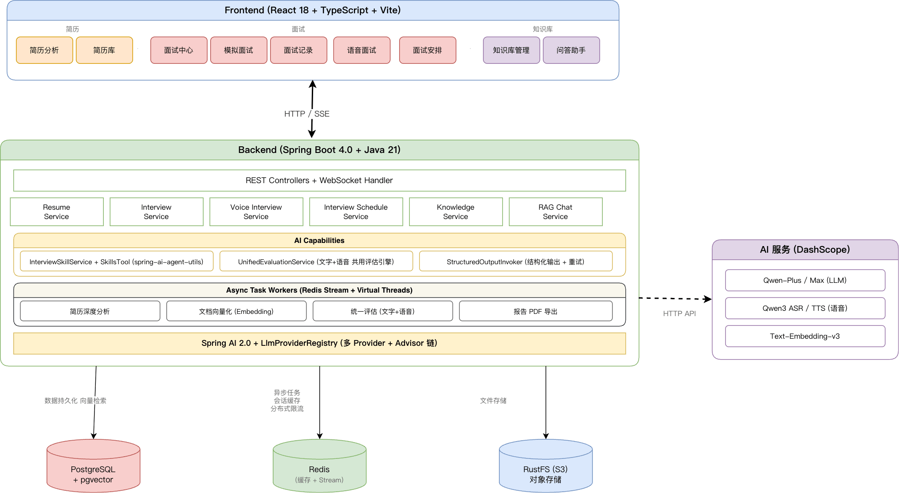

**效果图：**

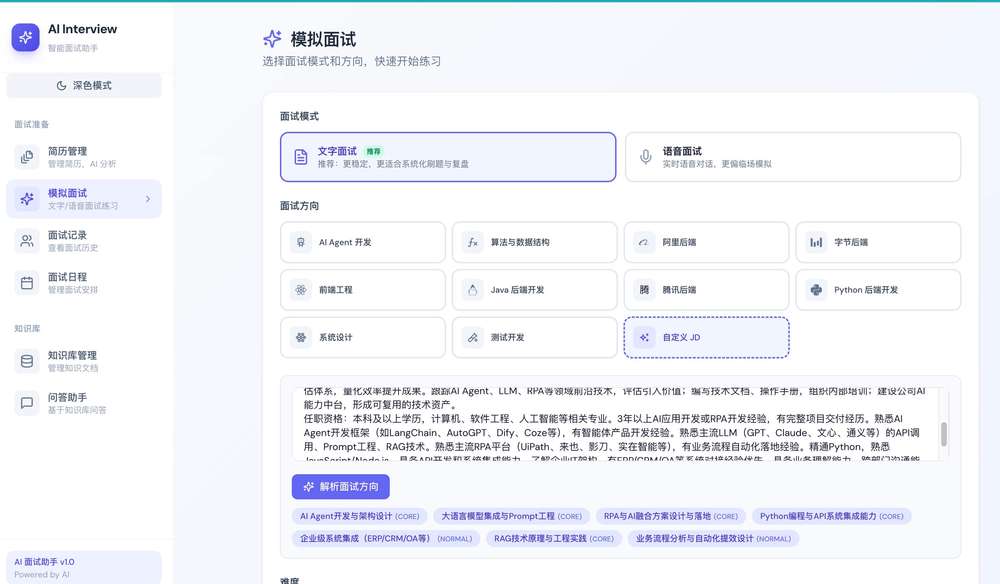

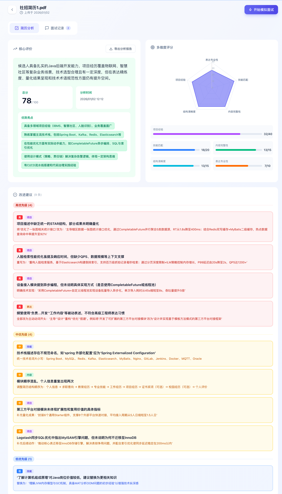

完整代码完全免费开源，没有 Pro 版本或者付费版！

**项目地址**（欢迎 Star 鼓励）：

- Github：https://github.com/Snailclimb/interview-guide
- Gitee：https://gitee.com/SnailClimb/interview-guide

项目详细介绍和系统学习教程地址（星球专属，性价比很高）：[《SpringAI 智能面试平台+RAG 知识库》](https://javaguide.cn/zhuanlan/interview-guide.html)。

内容安排如下（已经更完，一共 18w+ 字）：

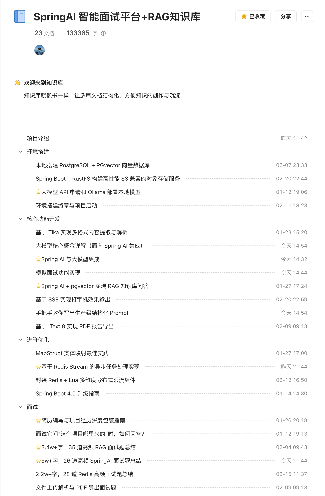

### 附录 B：全部面试题汇总

#### 第一部分（RAG 基础）

- 什么是 RAG？为什么需要 RAG？
- RAG 和传统搜索引擎有什么区别？
- RAG 和微调怎么选？什么时候用 RAG，什么时候微调，什么时候两者结合？
- RAG 系统中 Embedding 模型怎么选？为什么？
- 余弦相似度、内积和欧氏距离有什么区别？
- RAG 的幻觉问题怎么解决？RAG 一定不会产生幻觉吗？
- 什么是 Lost in the Middle 问题？怎么应对？
- 长上下文窗口是否会取代 RAG？
- RAG 系统的评估指标有哪些？
- RAG 的优势和局限性是什么？
- 什么场景适合用 RAG？什么场景不适合？

#### 第二部分（文档处理）

- 文档处理管线分哪些环节？每个环节最容易出什么问题？
- 固定长度切分、递归切分、语义切分、按结构切分的区别和适用场景？
- Parent-Child Chunk 解决了什么问题？有什么代价？
- 什么是语义丢失？常见场景有哪些？怎么应对？
- PDF 多栏布局、Word 标题层级、Excel 字段关联分别怎么处理？
- OCR 质量怎么保证？
- 分层校验策略怎么设计？降级处理怎么做？
- 多模态内容（图片、表格、图表）怎么进 RAG？

#### 第三部分（向量索引与数据库）

- 什么是 Embedding？为什么需要把文本转成向量？
- RAG 场景为什么需要向量数据库？
- 余弦相似度和欧氏距离有什么区别？RAG 场景下用哪个？
- ANN 算法为什么可以接受不是 100% 精确的结果？
- 有哪些向量索引算法？各自优缺点是什么？
- HNSW 和 IVFFLAT 有什么区别？
- HNSW 的 ef_search 参数怎么调？调大和调小分别会怎样？
- 向量数据库和传统数据库最核心的区别是什么？
- 如果向量数据从 100 万增长到 1 亿，架构上需要做什么调整？
- pgvector 的 HNSW 索引在什么情况下会失效或退化为更慢的扫描？
- 为什么选择 PostgreSQL + pgvector？

#### 第四部分（知识库更新）

- 知识库更新要解决哪些问题？
- 为什么 Embedding 模型必须保持一致？模型升级怎么处理？
- 元数据体系怎么设计？`content_hash`、`version_id`、`is_deleted` 分别解决什么问题？
- 新增、修改、删除文档分别怎么同步？
- 增量更新和全量重建各适合什么场景？
- 怎么保证更新链路的幂等性？乱序事件怎么处理？
- 回滚机制有哪些？灰度发布怎么设计？
- 知识库更新有哪些常见坑？"幽灵数据"是什么？
- 知识库更新的可观测性怎么保证？

#### 第五部分（GraphRAG）

- 什么是 GraphRAG？和普通 RAG 有什么区别？
- 传统向量 RAG 有什么局限性？哪些问题它回答不了？
- GraphRAG 的核心概念有哪些？（实体、关系、社区、局部/全局检索）
- Local Search 和 Global Search 有什么区别？
- 什么是 DRIFT Search？
- GraphRAG 的构建流程是怎样的？每个步骤有什么风险？
- 什么时候该用 GraphRAG？什么时候不该用？
- Neo4j GraphRAG 有哪些检索模式？VectorCypherRetriever 和 Text2Cypher 有什么区别？
- GraphRAG 的工程难点有哪些？权限过滤为什么难做？
- 怎么在项目中落地 GraphRAG？怎么评测？

#### 第六部分（优化与评估）

- RAG 优化到底在优化什么？链路里哪些环节会出问题？
- 为什么说"解析质量比换 Embedding 模型更重要"？
- Metadata 的作用是什么？权限过滤应该放在哪一步？
- Chunk 大小怎么调？有哪些候选范围？
- Hybrid Search 是什么？RRF 融合怎么工作？哪些查询必须保留关键词召回？
- Query Rewrite 有哪些策略？Multi-Query、HyDE、Self-Query 分别解决什么问题？
- Top-K 是不是越大越好？recall_top_k、rerank_top_n、context_top_n 怎么配合？
- Rerank 的作用是什么？为什么 Rerank 不能补回候选池里没有的文档？
- 上下文压缩有哪些方式？上下文排序要注意什么？
- RAG 评估指标有哪些？Hit Rate、MRR、Context Recall、Faithfulness 分别衡量什么？
- LLM-as-a-Judge 有什么问题？
- 线上 RAG 效果下降，你的排查路径是什么？

### 附录 C：参考资料汇总

#### 文档处理

- Databricks: Mastering Chunking Strategies for RAG
- Firecrawl: Best Chunking Strategies for RAG in 2026
- Premiere AI: RAG Chunking Strategies 2026 Benchmark Guide
- Weaviate: Chunking Strategies to Improve LLM RAG Pipeline Performance
- Omdena: Document Parsing for RAG - A Complete Guide for 2026
- DataCamp: Multimodal RAG - A Hands-On Guide
- LangChain: Multi-Vector Retriever for RAG on Tables, Text, and Images
- Procycons: PDF Data Extraction Benchmark 2025
- LlamaIndex: Mastering PDF Parsing

#### 知识库更新

- How to Update RAG Knowledge Base Without Rebuilding Everything
- RAG Knowledge Base Management: Updates & Refresh
- RAG in Practice: Versioning, Observability, and Evaluation in Production
- RAG in Production: Deployment Strategies & Practical Considerations
- 23 RAG Pitfalls and How to Fix Them
- Incremental Indexing Strategies for Large RAG Systems
- RAG Series: Embedding Versioning with pgvector

#### GraphRAG

- Neo4j：What Is GraphRAG?
- Neo4j GraphRAG Python Package
- Neo4j GraphRAG RAG User Guide
- LangChain Neo4j Integration
- LlamaIndex PropertyGraphIndex
- FalkorDB Docs
- RAPTOR: Recursive Abstractive Processing for Tree-Organized Retrieval
- GraphRAG：从 RAG 到 GraphRAG 的企业知识检索实践
- RAGAS 评测框架

#### 优化与评估

- Production RAG: The Five Decisions Behind Every System That Works
- RAG 优化字典：20 种 RAG 优化方法全解析
- Weaviate Hybrid Search Documentation
- Microsoft Azure AI Search: Hybrid Search RRF
- Google Vertex AI Vector Search: Hybrid Search
- Cohere Rerank Documentation
- LangChain Retriever API Documentation
- RAGAS Metrics Documentation
- DeepEval RAG Evaluation Guide

### 附录 D：原文溯源

本讲义由以下 6 篇 JavaGuide 文章按逻辑整合而成，正文内容均按原文保留：

| 讲义章节 | 原文标题 | 原文链接 |
|---|---|---|
| 第一部分 | RAG 基础概念：检索、生成与工程取舍 | https://javaguide.cn/ai/rag/rag-basis.html |
| 第二部分 | RAG 文档处理与切分策略 | https://javaguide.cn/ai/rag/rag-document-processing.html |
| 第三部分 | RAG 向量索引算法和向量数据库 | https://javaguide.cn/ai/rag/rag-vector-store.html |
| 第四部分 | RAG 知识库文档更新策略 | https://javaguide.cn/ai/rag/rag-knowledge-update.html |
| 第五部分 | GraphRAG 详解 | https://javaguide.cn/ai/rag/graphrag.html |
| 第六部分 | RAG 检索优化 | https://javaguide.cn/ai/rag/rag-optimization.html |

其他相关文章：

- MySQL vs PostgreSQL，如何选择？：https://mp.weixin.qq.com/s/APWD-PzTcTqGUuibAw7GGw
- SpringAI 智能面试平台+RAG 知识库：https://javaguide.cn/zhuanlan/interview-guide.html

---

> **讲义完**。建议学完本讲义后，结合附录 A 的实战项目动手搭建一个 RAG 系统，再用第六部分的评估方法论持续调优。
