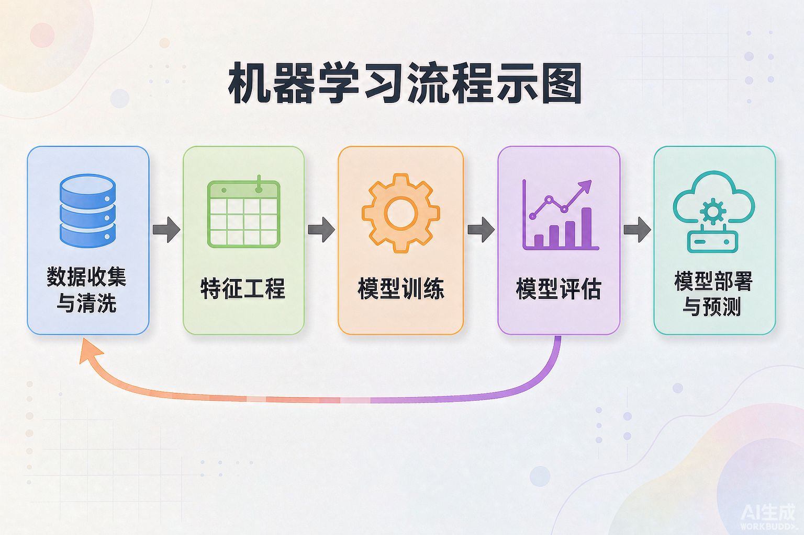
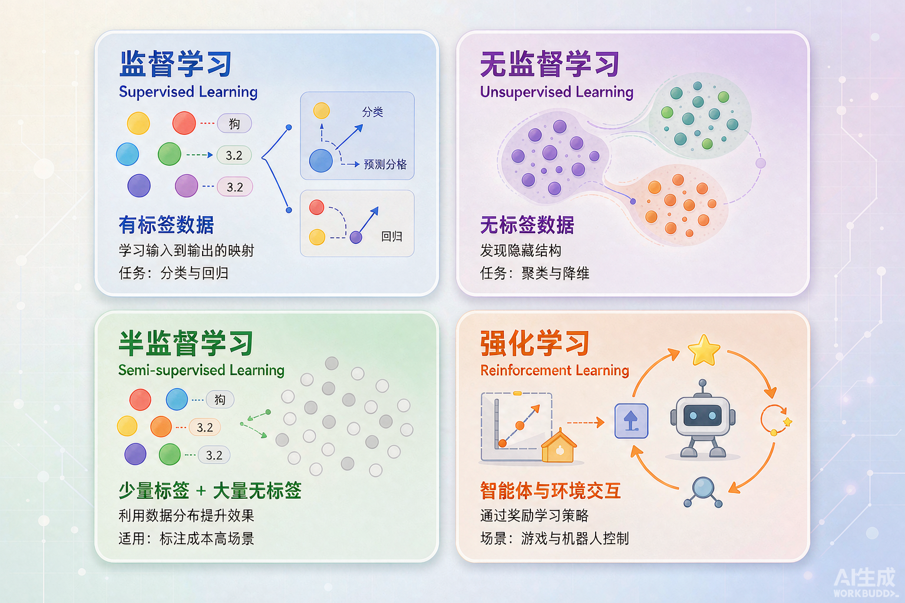
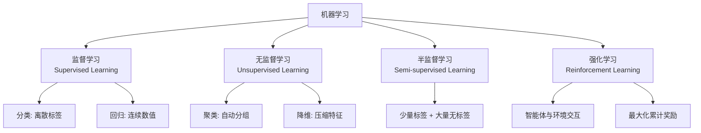
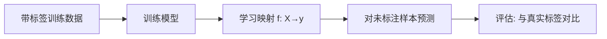
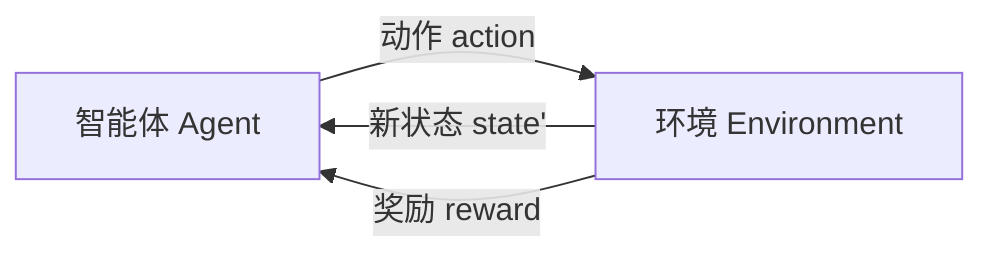
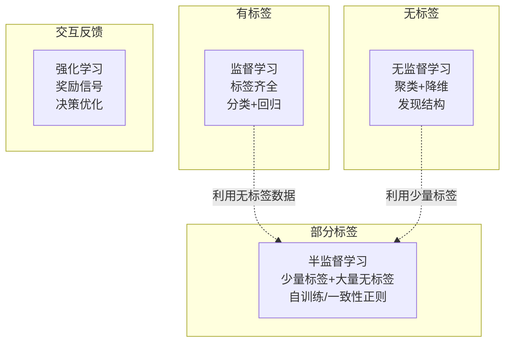
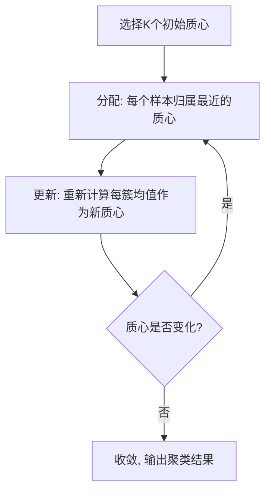
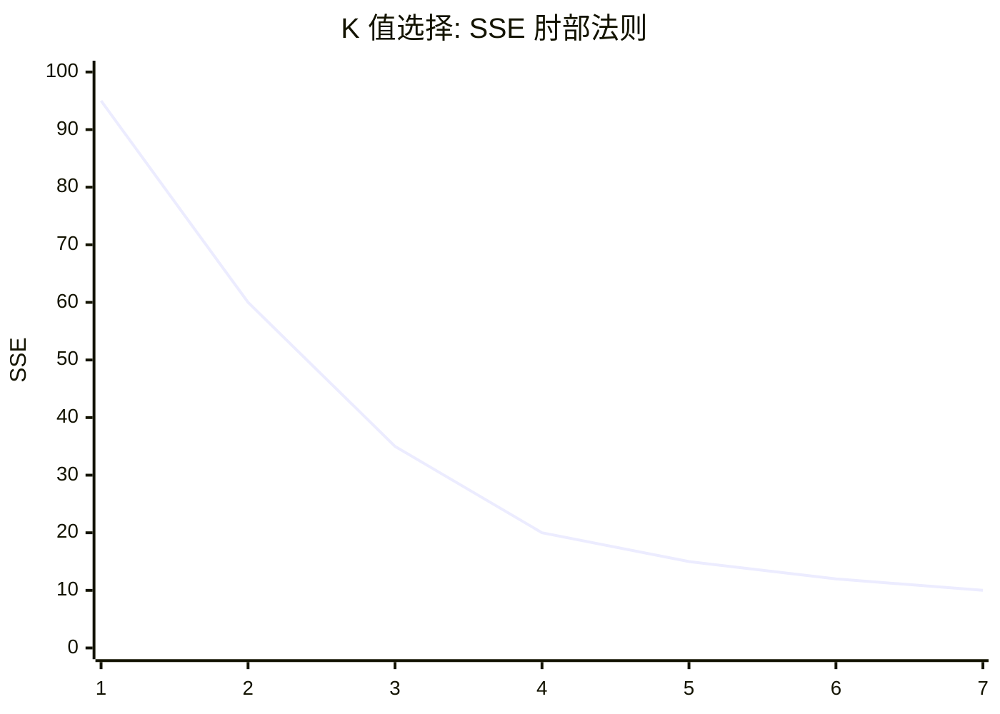
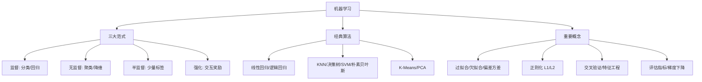

# 机器学习理论、经典算法与学习范式

> 本文档根据以下网络博客内容整理编写（已抓取原文）：
> - 腾讯云开发者社区《机器学习中的有监督学习、无监督学习、半监督学习》
> - 博客园《监督学习、无监督学习、线性回归、代价函数》
> - CSDN《机器学习：监督学习、无监督学习、半监督学习、强化学习》
> - 菜鸟教程《过拟合、欠拟合、偏差与方差》
> - 腾讯云开发者社区《K-Means 聚类算法与 PCA 主成分分析》
> - 阿里云开发者社区《支持向量机、逻辑回归、决策树对比详解》
> - 阿里云开发者社区《正则化与交叉验证详解》
> - 掘金《L1 与 L2 正则化的原理与区别》
> - 腾讯云开发者社区《强化学习与决策智能：让模型学会行动》

---

## 目录

1. 机器学习概述与理论
2. 机器学习三大学习范式：监督 / 无监督 / 半监督 / 强化
3. 经典算法与必要公式
4. 其他重要概念与理论
5. 总结与练习

---

## 一、机器学习概述与理论

### 1.1 什么是机器学习

**机器学习（Machine Learning, ML）** 是一种让计算机**从数据中自动学习规律**，并利用学到的规律对新数据进行预测或决策的方法。与传统的"人为编写规则"不同，机器学习的核心是**数据驱动**：

```
传统编程：数据 + 规则(程序) → 答案
机器学习：数据 + 答案(标签) → 规则(模型)
```

| 维度 | 传统编程 | 机器学习 |
|------|----------|----------|
| 输入 | 数据 + 手写规则 | 数据 + 标签（或纯数据） |
| 输出 | 答案 | 规则（模型） |
| 适用 | 规则明确、可枚举 | 规则难以人工编写（图像识别、语音、推荐） |
| 例子 | 计算器、订单系统 | 垃圾邮件识别、人脸识别、股票预测 |

**机器学习算法**本质上是**从数据中学习函数映射**的过程：寻找函数 $ f $ 使得 $ f(X) \approx y $，其中 $ X $ 是输入特征，$ y $ 是输出目标。

### 1.2 机器学习的基本术语

| 术语 | 英文 | 含义 | 生活类比 |
|------|------|------|----------|
| 样本/实例 | Sample/Instance | 一条数据记录 | 一个人 |
| 特征 | Feature | 样本的属性（可度量） | 身高、体重、年龄 |
| 标签 | Label | 样本的正确答案 | 是否患病 |
| 数据集 | Dataset | 样本的集合 | 一群人的体检记录 |
| 训练集 | Training Set | 用于学习模型的样本 | 用来背书的题 |
| 测试集 | Test Set | 检验模型泛化能力的样本 | 没见过的考试题 |
| 模型 | Model | 学习到的规律/映射函数 | 解题方法 |
| 泛化能力 | Generalization | 对新样本的预测能力 | 举一反三的能力 |

> **关键词：泛化（Generalization）** —— 机器学习追求的不是"记住训练数据"，而是**在未见过的数据上表现良好**。这是机器学习理论的核心目标。

### 1.3 机器学习的通用工作流程



```
① 数据收集 → ② 数据清洗与预处理 → ③ 特征工程
→ ④ 划分训练集/验证集/测试集 → ⑤ 选择模型与训练
→ ⑥ 模型评估 → ⑦ 调参与迭代 → ⑧ 部署上线与监控
```

**关键步骤说明**：

1. **数据清洗**：处理缺失值（填充/删除）、异常值、重复数据。
2. **特征工程**：对原始特征进行变换、组合、选择（第 4 节详解）。
3. **数据划分**：常见比例——训练集 70-80%、验证集 10-15%、测试集 10-15%。
4. **模型训练**：用训练集学习参数，用验证集调参。
5. **模型评估**：用从未参与训练的测试集评估最终泛化能力。

### 1.4 机器学习的"三步曲"框架（Tom Mitchell 定义）

一个机器学习问题包含三个要素：

```
① 表示（Representation）：用什么模型？——线性模型？决策树？神经网络？
② 评估（Evaluation）：如何衡量好坏？——准确率？损失函数？
③ 优化（Optimization）：如何找到最优参数？——梯度下降？解析解？
```

**正式定义（Mitchell, 1997）**：计算机程序从经验 E 中学习任务 T，并用性能度量 P 衡量；若 P 随 E 的增加而提高，则称该程序在"学习"。

### 1.5 机器学习的典型应用场景

| 领域 | 应用 |
|------|------|
| 计算机视觉 | 图像分类、目标检测、人脸识别 |
| 自然语言处理 | 文本分类、机器翻译、情感分析 |
| 推荐系统 | 电商/短视频个性化推荐 |
| 金融风控 | 信用评分、欺诈检测 |
| 医疗健康 | 疾病诊断辅助、医学影像分析 |
| 自动驾驶 | 目标识别、路径规划 |

---

## 二、机器学习三大学习范式

### 2.1 学习范式总览



按照**训练数据中是否存在标签**以及**学习目标**的不同，机器学习可分为四大范式：



| 范式 | 数据标签 | 目标 | 典型算法 | 类比 |
|------|----------|------|----------|------|
| 监督学习 | 全部有标签 | 学习输入→输出的映射 | 线性回归、逻辑回归、SVM、决策树 | 老师带着答案讲题 |
| 无监督学习 | 全部无标签 | 发现数据内在结构 | K-Means、PCA、DBSCAN | 自己分类整理物品 |
| 半监督学习 | 少量有标签 + 大量无标签 | 用无标签数据提升监督性能 | 自训练、一致性正则 | 少量例题 + 大量习题 |
| 强化学习 | 无标签（只有奖励信号） | 学习最优决策策略 | Q-Learning、DQN、PPO | 通过奖惩学习走路 |

### 2.2 监督学习（Supervised Learning）

**定义**：训练数据中每个样本都带有**标签**（正确答案），模型学习从特征到标签的映射 $ f: X \rightarrow y $，然后对新样本预测标签。

**数学模型**：给定训练集 $ \{(x^{(i)}, y^{(i)})\}_{i=1}^{n} $，寻找假设函数 $ h_\theta(x) $ 使损失 $ L(\theta) $ 最小：

$$
\theta^* = \arg\min_\theta \frac{1}{n} \sum_{i=1}^{n} L(h_\theta(x^{(i)}), y^{(i)})
$$

**两大子任务**：

```
监督学习
 ├── 分类（Classification）：标签是离散类别
 │    例子：垃圾邮件(是/否)、手写数字(0-9)、图像类别(猫/狗)
 │    算法：逻辑回归、SVM、决策树、KNN、朴素贝叶斯、神经网络
 │
 └── 回归（Regression）：标签是连续数值
      例子：房价预测、气温预测、销售额预测
      算法：线性回归、岭回归、Lasso、决策树回归、神经网络
```

**监督学习流程**：



### 2.3 无监督学习（Unsupervised Learning）

**定义**：训练数据**没有标签**，模型自动发现数据中隐藏的结构、模式或分组。

**两大子任务**：

```
无监督学习
 ├── 聚类（Clustering）：把相似样本自动分成若干组
 │    例子：用户分群、图像分割、异常检测
 │    算法：K-Means、层次聚类、DBSCAN
 │
 └── 降维（Dimensionality Reduction）：把高维数据压缩到低维
      例子：特征可视化、数据压缩、去噪
      算法：PCA、t-SNE、AutoEncoder
```

**聚类与分类的关键区别**：

| 维度 | 分类（监督） | 聚类（无监督） |
|------|-------------|---------------|
| 标签 | 有（已知类别） | 无（类别未知） |
| 分组数 | 已知 | 需自己确定（K 值） |
| 评价 | 与真实标签比对 | 簇内紧密、簇间分离 |
| 结果含义 | 有明确语义 | 需人工解读簇的含义 |

### 2.4 半监督学习（Semi-supervised Learning）

**定义**：训练数据**少量有标签 + 大量无标签**。利用无标签数据的分布信息，提升模型性能。

**为什么有意义**：
- 获取标签成本高（需人工标注：医疗影像、语音转写）。
- 无标签数据易得（海量网页、图片、录音）。
- 无标签数据蕴含分布信息，能帮助模型更好地决策边界。

**常见方法**：

```
① 自训练（Self-training）：
   用少量标签训练初始模型 → 对无标签数据打伪标签
   → 把高置信度伪标签样本加入训练集 → 迭代

② 一致性正则（Consistency Regularization）：
   对无标签样本做轻微扰动（噪声/增强），
   要求模型对不同扰动版本输出一致

③ 生成式方法：
   假设数据由混合分布产生，用 EM 算法估计
```

**应用案例**：医学影像标注（1000 张人工标注 + 10 万张未标注 CT 图像），半监督方法可比纯监督提升 5-10% 准确率。

### 2.5 强化学习（Reinforcement Learning）

**定义**：智能体（Agent）通过与**环境（Environment）交互**，根据**奖励（Reward）信号**试错学习，最终掌握最优决策策略。

**核心闭环**：



```
状态(state) → 动作(action) → 奖励(reward) → 新状态(state') → ...
```

**与监督学习的本质区别**：

| 维度 | 监督学习 | 强化学习 |
|------|----------|----------|
| 数据来源 | 现成的（特征, 标签）对 | 智能体与环境交互产生 |
| 反馈 | 即时、明确的标签 | 延迟、稀疏的奖励 |
| 目标 | 拟合映射 | 最大化长期累计奖励 |
| 决策影响 | 独立预测 | 当前动作影响未来状态 |

**数学框架：马尔可夫决策过程（MDP）**，用五元组 $ (S, A, P, R, \gamma) $ 定义：

- $ S $：状态集合
- $ A $：动作集合
- $ P(s'|s,a) $：状态转移概率
- $ R(s,a) $：奖励函数
- $ \gamma \in [0,1] $：折扣因子（越远期的奖励越打折）

**目标**：最大化长期折扣累计回报：

$$
G_t = \sum_{k=0}^{\infty} \gamma^k R_{t+k+1}
$$

**关键算法谱系**：

```
强化学习
 ├── 基于值（Value-based）：Q-Learning、DQN、Sarsa
 ├── 基于策略（Policy-based）：REINFORCE、PPO
 └── Actor-Critic 混合：A2C、DDPG、SAC
```

**著名应用**：AlphaGo（围棋）、自动驾驶控制、游戏 AI（OpenAI Five）、**大模型 RLHF（人类反馈强化学习，ChatGPT 训练的关键技术之一）**。

### 2.6 四范式总结对比图



---

## 三、经典算法与必要公式

> 本节覆盖机器学习最经典、最常用的算法，每个算法给出**核心思想、模型公式、损失函数与关键超参数**。这些算法是大模型、深度学习的基础，务必掌握。

### 3.1 线性回归（Linear Regression）——监督·回归

**核心思想**：用一条直线（或超平面）拟合数据点，使预测值与真实值的**平方误差最小**。

**模型**：对单个特征 $ x $：

$$
h_\theta(x) = \theta_0 + \theta_1 x = \theta^T x
$$

其中 $ \theta = [\theta_0, \theta_1] $ 是参数（截距 + 斜率）。

**代价函数（均方误差 MSE）**：

$$
J(\theta) = \frac{1}{2n} \sum_{i=1}^{n} (h_\theta(x^{(i)}) - y^{(i)})^2
$$

> 除以 2 是为了求导时消掉指数，方便计算。

**参数求解**：

① **闭式解（正规方程）**：

$$
\theta = (X^T X)^{-1} X^T y
$$

② **梯度下降**（迭代更新，逐步逼近最小值）：

$$
\theta_j := \theta_j - \alpha \frac{\partial J}{\partial \theta_j}
= \theta_j - \alpha \frac{1}{n} \sum_{i=1}^{n} (h_\theta(x^{(i)}) - y^{(i)}) x_j^{(i)}
$$

其中 $ \alpha $ 是学习率（步长）。学习率过大发散、过小收敛慢。

**适用场景**：房价预测、销售预测、趋势分析等连续值预测。

### 3.2 逻辑回归（Logistic Regression）——监督·分类

**核心思想**：虽然叫"回归"，实际用于**二分类**。在线性模型输出上套一个 **Sigmoid 函数**，把输出压缩到 (0,1) 区间表示概率。

**模型**：

$$
h_\theta(x) = \sigma(\theta^T x) = \frac{1}{1 + e^{-\theta^T x}}
$$

决策规则：$ h_\theta(x) \geq 0.5 $ 判为正类（1），否则负类（0）。注意 $ \sigma(z) \to 1 $ 当 $ z \to +\infty $；$ \sigma(z) \to 0 $ 当 $ z \to -\infty $。

**损失函数（交叉熵 / 对数损失）**：

$$
J(\theta) = -\frac{1}{n} \sum_{i=1}^{n} \left[ y^{(i)} \log h_\theta(x^{(i)}) + (1 - y^{(i)}) \log(1 - h_\theta(x^{(i)})) \right]
$$

> 为什么不用 MSE？因为 Sigmoid 输出非线性，MSE 会导致代价函数非凸，梯度下降可能陷入局部最优；交叉熵是凸函数，保证收敛到全局最优。

**梯度更新**（形式上与线性回归相同，但 $ h_\theta $ 含义不同）：

$$
\theta_j := \theta_j - \alpha \frac{1}{n} \sum_{i=1}^{n} (h_\theta(x^{(i)}) - y^{(i)}) x_j^{(i)}
$$

**扩展**：Softmax 回归（多分类）、二分类的"一对多"策略。

### 3.3 K 近邻（K-Nearest Neighbors, KNN）——监督·分类/回归

**核心思想**：**物以类聚**——一个样本的类别由它最近的 K 个邻居投票决定。非参数、无训练过程（惰性学习）。

**算法流程**：

```
① 计算待预测样本与所有训练样本的距离（常用欧氏距离）
② 选出距离最近的 K 个样本
③ 分类：K 个邻居中类别众数 → 预测类别
④ 回归：K 个邻居标签的平均值 → 预测数值
```

**欧氏距离**：

$$
d(x, p) = \sqrt{\sum_{j=1}^{m} (x_j - p_j)^2}
$$

**关键超参数**：
- **K 值**：过小易受噪声影响（过拟合）；过大则决策边界过于平滑（欠拟合）。常用 K=3、5、7，交叉验证选取。
- **距离度量**：欧氏距离（默认）、曼哈顿距离、余弦相似度。

**优缺点**：
- 优点：简单直观、无需训练、多分类友好。
- 缺点：预测慢（需遍历全部样本）、对特征缩放敏感（**务必标准化**）、高维下距离失效（维度灾难）。

### 3.4 决策树（Decision Tree）——监督·分类/回归

**核心思想**：用一系列"是/否"判断把特征空间递归划分，每个叶子节点对应一个类别（或数值）。可解释性最强。

**划分依据——如何选择最优特征**：

① **信息增益（ID3）**：选择使信息增益最大的特征。

信息熵（不确定性度量）：

$$
H(S) = -\sum_{k=1}^{K} p_k \log_2 p_k
$$

信息增益 = 划分前熵 - 划分后加权熵：

$$
Gain(S, A) = H(S) - \sum_{v \in values(A)} \frac{|S_v|}{|S|} H(S_v)
$$

② **信息增益率（C4.5）**：克服信息增益偏向取值多特征的缺点，除以固有值：

$$
GainRatio(S, A) = \frac{Gain(S, A)}{H_A(S)}, \quad H_A(S) = -\sum_{v} \frac{|S_v|}{|S|} \log_2 \frac{|S_v|}{|S|}
$$

③ **基尼系数（CART）**：选择基尼指数最小的特征。基尼系数越小，纯度越高：

$$
Gini(S) = 1 - \sum_{k=1}^{K} p_k^2
$$

**决策树剪枝**：防止过拟合——预剪枝（建树时限制深度/最小样本数）、后剪枝（建完树后合并冗余分支）。

**集成提升**：单棵决策树易过拟合，实际常用**随机森林（Bagging + 随机特征）**和 **GBDT/XGBoost（Boosting）**。

### 3.5 支持向量机（Support Vector Machine, SVM）——监督·分类

**核心思想**：寻找一个**最大间隔超平面**把两类样本分开。间隔越大，泛化能力越强。

**线性可分 SVM**：求解最优超平面 $ w^T x + b = 0 $，最大化几何间隔 $ 2/\|w\| $，等价于：

$$
\min_{w,b} \frac{1}{2} \|w\|^2 \quad \text{s.t.} \quad y^{(i)}(w^T x^{(i)} + b) \geq 1, \quad i=1,...,n
$$

**支持向量**：距离超平面最近的那些样本点，决定超平面的位置（其余样本不影响）。

**软间隔（应对噪声/线性不可分）**：引入松弛变量 $ \xi_i $，允许少量误分类：

$$
\min_{w,b,\xi} \frac{1}{2} \|w\|^2 + C \sum_{i=1}^{n} \xi_i
$$

其中 **C 是正则化参数**：C 大 → 严格分类（易过拟合）；C 小 → 容忍误分（更平滑）。

**核技巧（Kernel Trick）**：把低维不可分数据映射到高维特征空间使其线性可分，而无需显式计算映射（只需计算核函数内积）：

```
线性核:   K(x,z) = x·z
多项式核: K(x,z) = (x·z + c)^d
高斯核/RBF: K(x,z) = exp(-γ‖x-z‖²)   ← 最常用
```

**RBF 核**的 $ \gamma $ 控制影响半径：过大过拟合、过小欠拟合。

### 3.6 朴素贝叶斯（Naive Bayes）——监督·分类

**核心思想**：基于贝叶斯定理，并假设特征之间**条件独立**（"朴素"所在）：

$$
P(y | x) = \frac{P(x | y) P(y)}{P(x)} = \frac{P(y) \prod_{j} P(x_j | y)}{P(x)}
$$

**预测规则（最大后验）**：

$$
\hat{y} = \arg\max_{y} P(y) \prod_{j=1}^{m} P(x_j | y)
$$

**三种常见假设**：
- 高斯朴素贝叶斯（连续特征服从正态分布）
- 多项式朴素贝叶斯（文本分类，词频）
- 伯努利朴素贝叶斯（0/1 特征）

**应用**：垃圾邮件过滤、文本分类、情感分析。速度快、小数据表现好。

### 3.7 K-Means 聚类——无监督·聚类

**核心思想**：把 n 个样本划分到 K 个簇，使**簇内平方和（SSE）最小**：

$$
J = \sum_{k=1}^{K} \sum_{x \in C_k} \|x - \mu_k\|^2
$$

其中 $ \mu_k $ 是第 k 个簇的中心（均值）。

**算法流程**：



```
Step 1: 随机选 K 个样本作为初始质心 μ1...μK
Step 2: 分配——每个样本归入距离最近的质心所在簇
Step 3: 更新——μk = 簇内所有样本的均值
Step 4: 重复 Step 2-3 直到质心不再变化（收敛）
```

**如何选 K 值——肘部法则**：绘制"K 值 vs SSE"曲线，取拐点（手肘）处的 K：



**关键点**：K 值需人工指定；对初始质心敏感（多次随机初始化取最优）；对离群点敏感。

### 3.8 主成分分析（PCA）——无监督·降维

**核心思想**：把高维数据投影到方差最大的几个正交方向上，**用少量主成分保留数据的大部分信息**，实现降维。

**算法流程**：

```
Step 1: 数据标准化（均值0、方差1）
Step 2: 计算协方差矩阵 Σ = (1/n)·XᵀX
Step 3: 对 Σ 做特征值分解，得到特征值与特征向量
Step 4: 按特征值从大到小排序，取前 k 个特征向量组成投影矩阵 W
Step 5: 降维结果 Z = X·W
```

**保留信息量度量（方差解释率）**：

$$
\text{解释率} = \frac{\sum_{i=1}^{k} \lambda_i}{\sum_{i=1}^{m} \lambda_i} \times 100\%
$$

一般保留 85%-95% 的方差即可。

**应用**：可视化（降到 2/3 维画散点图）、数据压缩、去相关、加速训练。

### 3.9 经典算法对比总结

| 算法 | 范式 | 任务 | 模型复杂度 | 可解释性 | 训练速度 | 适用场景 |
|------|------|------|-----------|----------|----------|----------|
| 线性回归 | 监督 | 回归 | 低 | 高 | 快 | 连续值预测 |
| 逻辑回归 | 监督 | 分类 | 低 | 高 | 快 | 二分类基线 |
| KNN | 监督 | 分类/回归 | 中 | 高 | 无训练/预测慢 | 小数据集 |
| 决策树 | 监督 | 分类/回归 | 中 | 最高 | 快 | 规则清晰场景 |
| SVM | 监督 | 分类 | 中高 | 中 | 中 | 小样本高维 |
| 朴素贝叶斯 | 监督 | 分类 | 低 | 高 | 极快 | 文本分类 |
| K-Means | 无监督 | 聚类 | 低 | 高 | 快 | 自动分组 |
| PCA | 无监督 | 降维 | 低 | 中 | 快 | 压缩/可视化 |

**算法选择决策树（经验法则）**：

```
数据量大（>10万）? → 梯度提升树(XGBoost/LightGBM) 或 神经网络
小数据 + 需要解释? → 决策树 / 逻辑回归
小数据 + 高维 + 分类? → SVM（RBF 核）
文本分类? → 朴素贝叶斯（强基线）
无标签、找分组? → K-Means 起步
要可视化高维数据? → PCA 降到 2/3 维
```

---

## 四、其他重要概念与理论

### 4.1 过拟合与欠拟合（Overfitting & Underfitting）

**欠拟合（Underfitting）**：模型太简单，连训练数据都拟合不好——"学习不足"。
- 表现：训练误差和测试误差都高。
- 原因：模型容量不足、特征太少、训练不足。
- 对策：增加模型复杂度、增加特征、减少正则化、加大训练轮次。

**过拟合（Overfitting）**：模型太复杂，把训练数据的噪声也记住了——"死记硬背"。
- 表现：训练误差极低，但测试误差高（泛化差）。
- 原因：模型容量过大、训练数据太少、特征过多。
- 对策：增加训练数据、降低模型复杂度、正则化（L1/L2）、Dropout、早停、交叉验证。

```
偏差-方差权衡（Bias-Variance Tradeoff）：
总误差 = 偏差² + 方差 + 噪声

偏差（Bias）大 → 模型欠拟合（太简单，系统性偏差）
方差（Variance）大 → 模型过拟合（对数据细节过于敏感）

最优模型 = 偏差与方差的平衡点
```

| 状态 | 偏差 | 方差 | 训练误差 | 测试误差 | 对策 |
|------|------|------|----------|----------|------|
| 欠拟合 | 高 | 低 | 高 | 高 | 加强模型 |
| 理想 | 中 | 中 | 中 | 中 | - |
| 过拟合 | 低 | 高 | 极低 | 高 | 正则化/加数据 |

**学习曲线诊断**（菜鸟教程方法）：画出"训练样本数 vs 训练/测试误差"曲线——

```
欠拟合：两条曲线都高，且随数据增加几乎不下降（加数据无效）
过拟合：训练曲线低、测试曲线高，差距大（加数据有效，或正则化）
```

### 4.2 正则化（Regularization）

**目的**：抑制过拟合。在损失函数中加入**模型复杂度惩罚项**，防止参数过大。

**通用形式**：

$$
J(\theta) = \text{原损失} + \lambda \cdot \Omega(\theta)
$$

**L1 正则化（Lasso）**——惩罚参数绝对值之和：

$$
J(\theta) = \frac{1}{n} \sum (h_\theta(x^{(i)}) - y^{(i)})^2 + \lambda \sum_j |\theta_j|
$$

**L2 正则化（Ridge）**——惩罚参数平方和：

$$
J(\theta) = \frac{1}{n} \sum (h_\theta(x^{(i)}) - y^{(i)})^2 + \lambda \sum_j \theta_j^2
$$

**L1 vs L2 关键区别**：

| 维度 | L1（Lasso） | L2（Ridge） |
|------|------------|-------------|
| 惩罚形式 | 绝对值之和 | 平方和 |
| 解的性质 | **产生稀疏解**（部分参数被压到 0） | 参数整体变小但非零 |
| 特征选择 | 自动做特征选择 | 不做特征选择 |
| 几何解释 | 菱形约束区域（角点易触 0） | 圆形约束区域 |
| 适用 | 高维稀疏特征 | 一般过拟合 |

**弹性网络（Elastic Net）**：L1 + L2 组合 $ \lambda_1 \sum|\theta_j| + \lambda_2 \sum \theta_j^2 $，兼具两者优点。

**其他正则化手段**：Dropout（深度学习，随机丢弃神经元）、早停（Early Stopping）、数据增强、批量归一化。

### 4.3 交叉验证（Cross Validation）

**目的**：更可靠地评估模型泛化能力，避免"运气好/坏"的数据划分影响评估。

**三种常用方式**：

```
① 简单划分：训练 70% / 测试 30%
   → 简单但结果依赖划分方式

② K 折交叉验证（K-Fold CV，最常用）：
   数据均分为 K 份，每次用 K-1 份训练、1 份验证
   轮流做 K 次，取平均成绩
   K 常取 5 或 10

③ 留一法（Leave-One-Out, LOO）：
   每次只留 1 个样本做验证（K=N）
   数据少时用，计算量大
```

**K 折交叉验证示意图**：

```
数据集 [1][2][3][4][5][6][7][8][9][10]
Fold1: [2][3][4][5][6][7][8][9][10] | [1]  训练 | 验证
Fold2: [1][3][4][5][6][7][8][9][10] | [2]
...
Fold10:[1][2][3][4][5][6][7][8][9] | [10]
最终分数 = 10 次验证分数的平均值
```

**验证集/交叉验证在调参中的角色**：用训练集学参数 → 用验证集（交叉验证）选超参数 → 最后用测试集做最终评估（测试集只准用一次，防止"偷看"）。

### 4.4 特征工程（Feature Engineering）

**"数据和特征决定了机器学习的上限，而模型和算法只是逼近这个上限"**——吴恩达。

**特征工程四步**：

```
① 特征提取：从原始数据构造新特征
   （日期→星期几/是否节假日；文本→TF-IDF 词频）

② 特征变换：
   - 标准化（Standardization）: x' = (x-μ)/σ  → 适合 SVM/KNN/PCA
   - 归一化（Min-Max）: x' = (x-min)/(max-min) → 适合神经网络
   - 类别特征独热编码（One-Hot Encoding）
   - 连续特征分箱（Binning）

③ 特征选择：去掉无关/冗余特征
   - 过滤法（方差、相关系数）
   - 包裹法（逐步选择）
   - 嵌入法（L1 正则、树模型特征重要性）

④ 特征降维：PCA 等（见 3.8）
```

**为什么标准化重要**：KNN、SVM、PCA 等基于距离的算法，若特征量纲不同（如身高 170cm vs 体重 70kg），数值大的特征会主导距离计算。树模型（决策树）则对特征缩放不敏感。

### 4.5 评估指标（Evaluation Metrics）

**分类任务指标**——先看混淆矩阵（Confusion Matrix）：

```
             预测正类    预测负类
实际正类     TP(真阳性)   FN(假阴性)
实际负类     FP(假阳性)   TN(真阴性)
```

| 指标 | 公式 | 含义 |
|------|------|------|
| 准确率 Accuracy | (TP+TN)/(TP+FP+FN+TN) | 全部样本中预测正确的比例（类别不平衡时不可靠） |
| 精确率 Precision | TP/(TP+FP) | 预测为正类的样本中，真正为正类的比例 |
| 召回率 Recall | TP/(TP+FN) | 实际正类样本中，被正确找出的比例 |
| F1 分数 | 2·P·R/(P+R) | 精确率与召回率的调和平均（平衡两者） |
| AUC | 曲线下面积 | 排序能力的综合指标，越大越好（0.5 随机，1 完美） |

> **何时看哪个指标**：
> - 垃圾邮件拦截：误杀重要邮件代价高 → 看重**精确率**。
> - 癌症筛查：宁可误报不可漏诊 → 看重**召回率**。
> - 类别不平衡（99:1）：不要只看 Accuracy，要看 **F1 / AUC**。

**回归任务指标**：

| 指标 | 公式 | 说明 |
|------|------|------|
| MAE（平均绝对误差） | $ \frac{1}{n}\sum\|y-\hat{y}\| $ | 直观，对离群点不敏感 |
| MSE（均方误差） | $ \frac{1}{n}\sum(y-\hat{y})^2 $ | 放大较大误差 |
| RMSE（均方根误差） | $ \sqrt{MSE} $ | 与原单位一致 |
| R²（决定系数） | $ 1 - \frac{\sum(y-\hat{y})^2}{\sum(y-\bar{y})^2} $ | 解释方差比例，越接近 1 越好 |

### 4.6 梯度下降与优化算法

梯度下降是机器学习/深度学习的**参数优化核心引擎**。

```
θ := θ - α·∇J(θ)
```

**三种形式**：

| 形式 | 更新使用数据 | 特点 |
|------|-------------|------|
| 批量梯度下降（BGD） | 全部样本 | 稳定但慢 |
| 随机梯度下降（SGD） | 每次 1 个样本 | 快但震荡大 |
| 小批量梯度下降（Mini-batch） | 每次一个 batch（如 32/64） | 折中，工业标配 |

**优化器演进**：SGD → 动量（Momentum）→ AdaGrad → RMSProp → **Adam**（自适应学习率，默认首选）。

### 4.7 机器学习与深度学习的关系

```
机器学习
 ├── 传统机器学习：特征工程（人工）+ 浅层模型（决策树/SVM/线性）
 └── 深度学习：特征自动学习（神经网络），是大模型的基础
       ├── CNN（图像） → 多模态视觉
       ├── RNN/LSTM（序列） → NLP 早期
       └── Transformer（现代主流） → 大语言模型（LLM）
```

| 维度 | 传统机器学习 | 深度学习 |
|------|-------------|----------|
| 特征 | 人工特征工程 | 自动学习特征 |
| 数据量 | 小-中 | 大（越大越强） |
| 算力需求 | 低 | 高（GPU） |
| 可解释性 | 较高 | 较低 |
| 代表 | 决策树、SVM、K-Means | CNN、Transformer、大模型 |

> **本章是深度学习和多模态大模型的基石**：第 4 周将学习 CNN、RNN，随后进入 Transformer 与注意力机制，最终理解大语言模型（LLM）如何工作。

### 4.8 端到端学习与集成学习

**端到端学习（End-to-End）**：把整个任务（从原始输入到最终输出）交给模型学习，不拆分子任务。深度学习主流范式（如"图片→文字"一步到位 vs 传统"检测→识别→生成"流水线）。

**集成学习（Ensemble Learning）**：训练多个模型并组合，博采众长：

```
① Bagging（随机森林）：并行训练多个模型，投票/平均
    → 降低方差，缓解过拟合

② Boosting（GBDT/XGBoost/LightGBM）：串行训练，
    每个新模型修正前序模型的错误
    → 降低偏差，提升精度

③ Stacking：用元模型组合多个基模型输出
```

---

## 五、总结与练习

### 5.1 知识总结



**一句话记忆**：
- 监督学习 = 有答案地学（分类/回归）
- 无监督学习 = 无答案地找规律（聚类/降维）
- 半监督学习 = 少量答案 + 大量习题
- 强化学习 = 通过奖惩试错学会决策
- 过拟合 = 死记硬背；欠拟合 = 学了个寂寞；正则化 = 学习"更简单的规律"

### 5.2 动手实践（建议 2-3 小时）

1. **scikit-learn 快速体验**（已内置经典数据集）：

```python
# 鸢尾花分类：用 KNN 走通完整流程
from sklearn.datasets import load_iris
from sklearn.model_selection import train_test_split, cross_val_score
from sklearn.neighbors import KNeighborsClassifier
from sklearn.preprocessing import StandardScaler

iris = load_iris()
X, y = iris.data, iris.target

# 标准化（KNN 必需）
X = StandardScaler().fit_transform(X)
X_train, X_test, y_train, y_test = train_test_split(
    X, y, test_size=0.3, random_state=42)

model = KNeighborsClassifier(n_neighbors=5)
model.fit(X_train, y_train)
print("测试集准确率:", model.score(X_test, y_test))

# 交叉验证更可靠的评估
scores = cross_val_score(model, X, y, cv=5)
print("5折交叉验证平均分:", scores.mean())
```

2. **对比实验**：对同一数据集（鸢尾花/波士顿房价）跑 逻辑回归、KNN、决策树、SVM，对比准确率与训练时间。
3. **过拟合实验**：决策树不限制深度 vs `max_depth=3`，对比训练/测试误差。
4. **无监督实战**：用 K-Means 对鸢尾花数据聚类（K=3），与真实标签比对，体会"聚类≠分类"。
5. **PCA 可视化**：把鸢尾花 4 维特征降到 2 维画散点图，观察类别可分性。

### 5.3 参考资料（本文档内容来源）

1. 腾讯云开发者社区：《机器学习中的有监督学习、无监督学习、半监督学习》
2. 博客园：《监督学习、无监督学习、线性回归、代价函数》
3. CSDN：《机器学习：监督学习、无监督学习、半监督学习、强化学习》
4. 菜鸟教程：《过拟合、欠拟合、偏差与方差》
5. 腾讯云开发者社区：《K-Means 聚类算法与 PCA 主成分分析》
6. 阿里云开发者社区：《支持向量机、逻辑回归、决策树对比详解》
7. 阿里云开发者社区：《正则化与交叉验证详解》
8. 掘金：《L1 与 L2 正则化的原理与区别》
9. 腾讯云开发者社区：《强化学习与决策智能：让模型学会行动》

---

> 下一讲预告：**常见机器学习算法实战（3-2）**——用 scikit-learn 动手实现本讲义中的核心算法；**第一个 AI 模型（3-3）**——完成从数据到部署的完整项目。建议学完本讲义后，先完成 5.2 的实践任务再继续。
